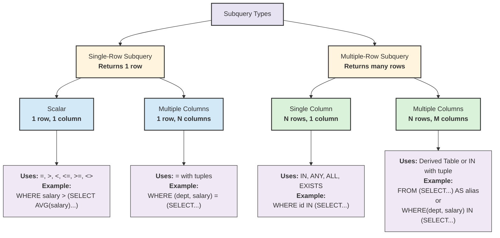

# Advanced Query


---
layout: two-cols-title
---

::title::
[Summary of SQL Queries]{class="text-2xl"}

::left::

```sql
SELECT		<attribute list>
FROM		<table list>
[JOIN ON		<condition>]
[WHERE		<condition>]
[GROUP BY 	<grouping attribute(s)>]
[HAVING		<group condition>]
[ORDER BY 	<attribute list>]
```

::right::

<div class="ns-c-tight">

- SELECT-clause lists the attributes/functions to be retrieved
- FROM-clause specifies all relations (or aliases) needed in the query but not those needed in nested queries
- WHERE-clause specifies the conditions for selection and join of tuples from the relations specified in the FROM-clause
- GROUP BY specifies grouping attributes
- HAVING specifies a condition for selection of groups
- ORDER BY specifies an order for displaying the result of a query

</div>

---
layout: two-cols-title
---

::title::
[Precedence]{class="text-2xl"}

- A query is evaluated by first applying the WHERE-clause, then GROUP BY and HAVING, and finally the SELECT-clause

::left::

```sql
SELECT		<attribute list>
FROM		<table list>
[JOIN ON		<condition>]
[WHERE		<condition>]
[GROUP BY 	<grouping attribute(s)>]
[HAVING		<group condition>]
[ORDER BY 	<attribute list>]
```

::default::

<Precedence/>

---

[Subquery Concept]{class="text-2xl"}


- we want to write a query to identify all students who get **better marks** than that of the student who's [StudentID is 'V002', but we do not know the marks of 'V002']{.text-red-500}

<StickyNote color="amber-light" textAlign="left" width="180px" title="Note" v-drag="[224,412,520,80]">

- ถ้าเรารู้แค่ตารางซ้ายอย่างเดียว จะไม่สามารถตอบคำถามนี้ได้ ต้องมาดูตารางทางขวาเพิ่มเติม
</StickyNote>

---

[Subquery Concept]{class="text-2xl"}

<div class="w-fit mx-auto">

{.max-h-50vh}
</div>

---

[Subquery Concept]{class="text-2xl"}

<div class="w-fit mx-auto">

{.max-h-50vh}
</div>

---

[Subquery Type]{class="text-2xl"}




---

[Subquery Location]{class="text-2xl"}

<div class="w-fit mx-auto">

{.max-h-50vh}
</div>

1. In the SELECT Clause : Used to return a single value or a set of values.
2. In the FROM Clause : Treated as a derived table or inline view.
3. In the WHERE Clause : Used to filter the results.
4. In the HAVING Clause : Used to filter groups.

---

[Single Row Subqueries]{class="text-2xl"}

- In `WHERE` clause

- Find details of 'diane murphy' but not know her employee number.

```sql
select
    firstname || ' ' || lastname,
    employeenumber,
    email
from
    classicmodels.employees
where
    employeenumber = (
        select
            employeenumber
        from
            classicmodels.employees
        where
            firstname || ' ' || lastname ilike 'diane murphy'
    )
```

<CsvTable><pre>
"?column?"	"employeenumber"	"email"
"Diane Murphy"	1002	"dmurphy@classicmodelcars.com"
</pre></CsvTable>

<Box color="amber-light" v-drag="[731,24,150,40]" custom="text-center">
⚠ Page 10 - 11
</Box>

---
layout: two-cols-title
---

::title::
[Single Row Subqueries]{class="text-2xl"}


- Find details of 'diane murphy' but not know her employee number.

```sql
select
    firstname || ' ' || lastname,
    employeenumber,
    email
from
    classicmodels.employees
where
    employeenumber = (
        select employeenumber from classicmodels.employees
        where firstname || ' ' || lastname ilike 'diane murphy'
    )
```

::left::

````md magic-move

```sql
select
    employeenumber
from
    classicmodels.employees
where
    firstname || ' ' || lastname ilike 'diane murphy'
```

```sql
select
    firstname || ' ' || lastname,
    employeenumber,
    email
from
    classicmodels.employees
where
    employeenumber = 1002
```

````
::right::

<div v-show="$slidev.nav.clicks == 0">

<CsvTable><pre>
"employeenumber"
1002
</pre></CsvTable>
</div>

<div v-show="$slidev.nav.clicks == 1">

<CsvTable><pre>
"?column?"	"employeenumber"	"email"
"Diane Murphy"	1002	"dmurphy@classicmodelcars.com"
</pre></CsvTable>
</div>

::default::

---

[Single Row Subqueries]{class="text-2xl"}

- In `WHERE` clause

- What order which has quantity order above average quantity order of order number 10100

```sql
select ordernumber, quantityordered from orderdetails
where quantityordered > (select avg(quantityordered) from orderdetails where ordernumber = 10100)
```

<CsvTable><pre>
"ordernumber"	"quantityordered"
10100	50
10100	49
10101	45
10101	46
10102	39
10102	41
10103	42
</pre></CsvTable>

<Box color="amber-light" v-drag="[731,24,150,40]" custom="text-center">
⚠ Page 12 - 13
</Box>

---
layout: two-cols-title
---

::title::
[Single Row Subqueries]{class="text-2xl"}

- What order which has quantity order above average quantity order of order number 10100

```sql
select ordernumber, quantityordered from orderdetails
where quantityordered > (select avg(quantityordered) from orderdetails where ordernumber = 10100)
```

::left::

````md magic-move

```sql
select avg(quantityordered) from orderdetails 
where ordernumber = 10100
```

```sql
select ordernumber, quantityordered from orderdetails
where quantityordered > 37.7500000000000000
```

````
::right::

<div v-show="$slidev.nav.clicks == 0">

<CsvTable><pre>
"avg"
37.7500000000000000
</pre></CsvTable>
</div>

<div v-show="$slidev.nav.clicks == 1">

<CsvTable><pre>
"ordernumber"	"quantityordered"
10100	50
10100	49
10101	45
10101	46
10102	39
10102	41
10103	42
</pre></CsvTable>
</div>

::default::

---

[Single Row Subqueries]{class="text-2xl"}

- In `HAVING` clause: Used to filter group

- Find average order amount and count of customers and customer number from `payments` table which customer number is 347

```sql
select customernumber, avg(amount), count(customernumber) from payments
group by customernumber
having avg(amount) = (select avg(amount) from payments where customernumber = 347)
```

<CsvTable><pre>
"customernumber"	"avg"	"count"
347	20753.095000000000	2
</pre></CsvTable>

- You also use `WHERE` to filter rows before `GROUP BY` , but in this case we want to filter group

```sql
select customernumber, avg(amount), count(customernumber) from payments
where customernumber = 347
group by customernumber
```


<Box color="amber-light" v-drag="[731,24,150,40]" custom="text-center">
⚠ Page 14 - 15
</Box>

---
layout: two-cols-title
---

::title::
[Single Row Subqueries]{class="text-2xl"}

- Find average order amount and count of customers and customer number from `payments` table which customer number is 347

```sql
select customernumber, avg(amount), count(customernumber) from payments
group by customernumber
having avg(amount) = (select avg(amount) from payments where customernumber = 347)
```

::left::

````md magic-move

```sql
select avg(amount) from payments where customernumber = 347
```

```sql
select customernumber, avg(amount), count(customernumber) 
from payments group by customernumber
having avg(amount) = 20753.095000000000
```

````
::right::

<div v-show="$slidev.nav.clicks == 0">

<CsvTable><pre>
"avg"
20753.095000000000
</pre></CsvTable>
</div>

<div v-show="$slidev.nav.clicks == 1">

<CsvTable><pre>
"customernumber"	"avg"	"count"
347	20753.095000000000	2
</pre></CsvTable>
</div>
::default::

---

[Single Row Subqueries]{class="text-2xl"}

- What orders have average order quantity above overall average order quantity

```sql
SELECT  o.orderNumber, AVG( o.quantityOrdered )
FROM orderdetails  o
GROUP BY o.orderNumber
HAVING AVG(o.quantityOrdered ) > 
    (
               SELECT AVG(d.quantityOrdered) 
               FROM orderdetails as d 
    );
```

<CsvTable><pre>
"ordernumber"	"avg"
10276	37.6428571428571429
10340	42.8750000000000000
10211	35.3333333333333333
10294	45.0000000000000000
10216	43.0000000000000000
10130	36.5000000000000000
10268	36.5454545454545455
10168	35.6666666666666667
10400	39.5555555555555556
</pre></CsvTable>

---

[Exercise]{class="text-2xl"}

1. **Finding Above-Average Products**
Write a query to display the product code, product name, and buy price of all products that have a buy price greater than the average buy price of all products.
2. **High Credit Customers**
Write a query to find all customers whose credit limit is higher than the credit limit of customer number 103. Display the customer number, customer name, and credit limit.
3. **Most Expensive Products**
Write a query to find all products that have an MSRP equal to the maximum MSRP in the database. Display the product code, product name, product line, and MSRP.
4. **Customer with Maximum Credit**
Write a query to display the customer number, customer name, and credit limit of the customer who has the same credit limit as the maximum credit limit in the database.
5. **Office Location Query**
Write a query to find all employees who work in the same officeCode as the office with officeCode '1'. Display the employee number, first name, last name.

---

[Exercise]{class="text-2xl"}

6. **Product Lines with Above-Average Products**
Write a query to find product lines that have an average buy price greater than the overall average buy price of all products. Display the product line and its average buy price.
7. **Customers with More Orders than Customer 103**
Write a query to find customers who have placed more orders than customer number 103. Display the customer number, customer name, and total number of orders.
8. **Offices with More Employees than Office '4'**
Write a query to find offices that have more employees than office code '4'. Display the office code, city, and employee count.
9. **Premium Product Lines**
Write a query to find product lines where the maximum MSRP in that product line is greater than the average MSRP of all products. Display the product line and the maximum MSRP.
10. **Customers with Higher Total Payments than Customer 103**
Write a query to find customers whose total payment amount exceeds the total payment amount of customer 103. Display the customer number, customer name, and total payment amount.

---

[Answer]{class="text-2xl"}

1. **Finding Above-Average Products**

```sql
SELECT productCode, productName, buyPrice
FROM products
WHERE buyPrice > (SELECT AVG(buyPrice) FROM products);
```

2. **High Credit Customers**

```sql
SELECT customerNumber, customerName, creditLimit
FROM customers
WHERE creditLimit > (SELECT creditLimit 
                     FROM customers 
                     WHERE customerNumber = 103);
```

3. **Most Expensive Products**

```sql
SELECT productCode, productName, productLine, MSRP
FROM products
WHERE MSRP = (SELECT MAX(MSRP) FROM products);
```

---

[Answer]{class="text-2xl"}

4. **Customer with Maximum Credit**

```sql
SELECT customerNumber, customerName, creditLimit
FROM customers
WHERE creditLimit = (SELECT MAX(creditLimit) FROM customers);
```

5. **Office Location Query**

```sql
SELECT employeeNumber, firstName, lastName
FROM employees
WHERE officeCode = (SELECT officeCode 
                    FROM offices 
                    WHERE officeCode = '1');
```

6. **Product Lines with Above-Average Products**

```sql
SELECT productLine, AVG(buyPrice) AS avgBuyPrice
FROM products
GROUP BY productLine
HAVING AVG(buyPrice) > (SELECT AVG(buyPrice) FROM products);
```

---

[Answer]{class="text-2xl"}

7. **Customers with More Orders than Customer 103**

```sql
SELECT c.customerNumber, c.customerName, COUNT(o.orderNumber) AS totalOrders
FROM customers c
JOIN orders o ON c.customerNumber = o.customerNumber
GROUP BY c.customerNumber, c.customerName
HAVING COUNT(o.orderNumber) > (SELECT COUNT(*) 
                                FROM orders 
                                WHERE customerNumber = 103);
```

8. **Offices with More Employees than Office '4'**

```sql
SELECT o.officeCode, o.city, COUNT(e.employeeNumber) AS empCount
FROM offices o
JOIN employees e ON o.officeCode = e.officeCode
GROUP BY o.officeCode, o.city
HAVING COUNT(e.employeeNumber) > (SELECT COUNT(*) 
                                   FROM employees 
                                   WHERE officeCode = '4');
```

---

[Answer]{class="text-2xl"}

9. **Premium Product Lines**

```sql
SELECT productLine, MAX(MSRP) AS minMSRP
FROM products
GROUP BY productLine
HAVING MAX(MSRP) > (SELECT AVG(MSRP) FROM products);
```

10. **Customers with Higher Total Payments than Customer 103**

```sql
SELECT c.customerNumber, c.customerName, SUM(p.amount) AS totalPayment
FROM customers c
JOIN payments p ON c.customerNumber = p.customerNumber
GROUP BY c.customerNumber, c.customerName
HAVING SUM(p.amount) > (SELECT SUM(amount) 
                        FROM payments 
                        WHERE customerNumber = 103);
```


---

[Multiple Row Subqueries]{class="text-2xl"}

- In `FROM` clause

- Find what quantity order which has quantity less than 10

```sql
select quantityordered from (select quantityordered from orderdetails where quantityordered < 10)
```

- I want to know what ordernumber, how to solve?

<CsvTable><pre>
"quantityordered"
6
6
</pre></CsvTable>

<div class="text-5xl" v-drag="[490,202,69,55]">
🤨
</div>

<v-click>

```sql
select quantityordered,ordernumber from (select quantityordered,ordernumber from orderdetails where quantityordered < 10)
```


</v-click>


---

[Multiple Row Subqueries]{class="text-2xl"}

- Find what quantity order which has quantity less than 10

```sql
select
    ordernumber,
    productcode,
    quantityordered,
    priceeach,
    orderlinenumber
from
    (
        select
            *
        from
            orderdetails
        where
            quantityordered < 10
    )
```

<CsvTable><pre>
"ordernumber"	"productcode"	"quantityordered"	"priceeach"	"orderlinenumber"
10407	"S18_4409"	6	91.11	3
10409	"S18_2325"	6	104.25	2
</pre></CsvTable>

---
layout: two-cols-title
---

::title::
[Multiple and Single Row Subqueries]{class="text-2xl"}

- Mixed with table and `Subquery`

::left::
```sql
select ordernumber,quantityordered
from orderdetails, 
(SELECT AVG(quantityordered) as avg 
  FROM orderdetails 
  WHERE ordernumber = 10100) as a
where quantityordered> a.avg
```

<div class="w-fit mx-auto">

{.max-h-50vh}
</div>

::right::

<CsvTable><pre>
"ordernumber"	"quantityordered"
10100	50
10100	49
10101	45
10101	46
10102	39
10102	41
10103	42
10103	46
10103	41
</pre></CsvTable>

---
layout: two-cols-title
---

::title::
[Multiple Row Subqueries]{class="text-2xl"}

- In `FROM` clause

- Finding the maximum and minimum Number of order items and the average order items

```sql
SELECT MAX(items), MIN(items), 
FLOOR(AVG(items)) 
FROM ( SELECT orderNumber, 
             COUNT(orderNumber) AS items 
             FROM orderdetails 
             GROUP BY orderNumber) AS lineitems
```

::left::

<div class="w-fit mx-auto">

{.max-h-20vh}
</div>
::right::

<CsvTable><pre>
"max"	"min"	"floor"
18	1	9
</pre></CsvTable>

::default::

<Box color="amber-light" v-drag="[731,24,150,40]" custom="text-center">
⚠ Page 26 - 28
</Box>

---
layout: two-cols-title
---

::title::
[Multiple Row Subqueries]{class="text-2xl"}

::left::

- Why this one?

```sql
SELECT orderNumber, 
             COUNT(orderNumber) AS items 
             FROM orderdetails 
             GROUP BY orderNumber
```

::right::

- Why not this one?

```sql
SELECT orderNumber,
			 MAX(count(orderNumber)),
			 MIN(count(orderNumber)),
			 FLOOR(AVG(count(orderNumber))),
             COUNT(orderNumber) AS items 
             FROM orderdetails 
             GROUP BY orderNumber
```

::default::

```txt
ERROR:  aggregate function calls cannot be nested
LINE 2:     MAX(count(orderNumber)),
                ^ 

SQL state: 42803
Character: 29
```


---
layout: two-cols-title
---

::title::
[Multiple Row Subqueries]{class="text-2xl"}

::left::

```sql
SELECT orderNumber, 
             COUNT(orderNumber) AS items 
             FROM orderdetails 
             GROUP BY orderNumber
```

::right::

<CsvTable><pre>
"ordernumber"	"items"
10343	6
10253	14
10425	13
10218	2
10276	14
10273	15
10340	8
10256	2
10211	15
10294	1
10362	4
10216	1
10201	7
</pre></CsvTable>

::default::

---

[Exercise]{class="text-2xl"}

1. **Customer Order Summary**
Write a query to find the average number of orders per customer. First create a derived table that shows the count of orders for each customer, then calculate the average from that result.

2. **Top Product Lines by Revenue**
Write a query to find product lines and their total revenue, then display only those product lines whose revenue is above 500,000. Use a subquery in the FROM clause to calculate revenue (quantityOrdered * priceEach) for each product line.

3. **Employee Office Summary**
Write a query to show each office's city along with the average number of customers handled by employees in that office. Use a derived table to first count customers per employee.

4. **High-Value Orders**
Write a query to find the customer name and order number for orders that have a total value greater than 50,000. Use a subquery in the FROM clause to calculate the total value (SUM of quantityOrdered * priceEach) for each order.

5. **Product Performance Ranking**
Write a query to display product codes, product names, and their total quantity ordered. Then show only products that are in the top 10 by quantity ordered. Use a derived table to calculate total quantities.
---

[Answer]{class="text-2xl"}

1. **Customer Order Summary**

```sql
SELECT AVG(orderCount) AS avgOrdersPerCustomer
FROM (SELECT customerNumber, COUNT(*) AS orderCount
      FROM orders
      GROUP BY customerNumber) AS customerOrders;
```

2. **Top Product Lines by Revenue**

```sql
SELECT productLine, totalRevenue
FROM (SELECT p.productLine, 
             SUM(od.quantityOrdered * od.priceEach) AS totalRevenue
      FROM products p
      JOIN orderdetails od ON p.productCode = od.productCode
      GROUP BY p.productLine) AS productLineRevenue
WHERE totalRevenue > 500000;
```

---

[Answer]{class="text-2xl"}

3. **Employee Office Summary**

```sql
SELECT o.city, AVG(custCount) AS avgCustomersPerEmployee
FROM offices o
JOIN (SELECT e.officeCode, e.employeeNumber, COUNT(c.customerNumber) AS custCount
      FROM employees e
      LEFT JOIN customers c ON e.employeeNumber = c.salesRepEmployeeNumber
      GROUP BY e.officeCode, e.employeeNumber) AS empCustomers
ON o.officeCode = empCustomers.officeCode
GROUP BY o.city;
```

4. **High-Value Orders**

```sql
SELECT c.customerName, ov.orderNumber, ov.orderTotal
FROM customers c
JOIN (SELECT o.orderNumber, o.customerNumber, 
             SUM(od.quantityOrdered * od.priceEach) AS orderTotal
      FROM orders o
      JOIN orderdetails od ON o.orderNumber = od.orderNumber
      GROUP BY o.orderNumber, o.customerNumber) AS ov
ON c.customerNumber = ov.customerNumber
WHERE ov.orderTotal > 50000;
```

---

[Answer]{class="text-2xl"}

5. **Product Performance Ranking**

```sql
SELECT p.productCode, p.productName, ps.totalQuantity
FROM products p
JOIN (SELECT productCode, SUM(quantityOrdered) AS totalQuantity
      FROM orderdetails
      GROUP BY productCode) AS ps
ON p.productCode = ps.productCode
ORDER BY ps.totalQuantity DESC
LIMIT 10;
```

---

[Challenge]{class="text-2xl"}

1. **Above-Average Order Value Customers**
Write a query to find ***customers*** whose ***average order value*** is greater than the overall average order value across all orders. Display customer number, customer name, and their average order value. Use a derived table to calculate order values.

<IceCream :size="140" mood="happy" color="#FDA7DC" v-drag="[571,229,80,140]" />


<SpeechBubble position="r" color="sky" shape="round" maxWidth="300px" v-drag="[237,219,333,125]">

1. What does it want? 
2. What tables are being used?
</SpeechBubble>

---

[Answer]{class="text-2xl"}

1. **Above-Average Order Value Customers**

```sql
select c.customernumber, c.customername,od.avgordervalue 
from customers c 
left join 
	(select o.customernumber, avg(d.quantityordered * d.priceeach) as avgordervalue 
		from orders o left join orderdetails d on o.ordernumber = d.ordernumber 
			group by customernumber) od 
on od.customernumber = c.customernumber
where od.avgordervalue > (select avg(quantityordered * priceeach) from orderdetails)
```

---

[Challenge]{class="text-2xl"}

2. **Top Performing Product Lines**
Write a query to find product lines whose total revenue exceeds the average revenue per product line. Display the product line name and total revenue. Use a subquery in FROM clause to calculate revenue per product line, and a single-row subquery to find the average.

---

[Answer]{class="text-2xl"}

2. **Top Performing Product Lines**

```sql
select a.productline, a.totalrevenue 
from 
	(select pl.productline,
		sum(od.quantityordered * od.priceeach) as totalrevenue
		 
			from productlines pl 
				left join products p on p.productline = pl.productline 
					left join orderdetails od on p.productcode = od.productcode 
						group by pl.productline) a 
where a.totalrevenue >
(
	select avg(totalrevenue)
	from (select pl2.productline,
		sum(od2.quantityordered * od2.priceeach) as totalrevenue
		 
			from productlines pl2 
				left join products p2 on p2.productline = pl2.productline 
					left join orderdetails od2 on p2.productcode = od2.productcode 
						group by pl2.productline) b 
)
```

---

[Challenge]{class="text-2xl"}

3. **Offices with High-Value Employee Performance**
Write a query to find offices where the total number of customers handled by all employees in that office is greater than the average number of customers per office. Display office code, city, and total customer count.


---

[Answer]{class="text-2xl"}


- แบบที่ 1

```sql
select o2.officecode,o2.city,a.totalcustomer 
from (
	select e2.officecode, count(c2.customernumber) as totalcustomer
		from employees e2 
			left join customers c2 on e2.employeenumber = c2.salesrepemployeenumber 
				group by e2.officecode
) a 
left join offices o2 on a.officecode = o2.officecode
		
where a.totalcustomer > 
	
		(select avg(countcustomer) from (
			select count(c2.customernumber) as countcustomer
				from employees e2 
					left join customers c2 on e2.employeenumber = c2.salesrepemployeenumber 
							left join offices o2 on e2.officecode = o2.officecode
				group by o2.officecode) b)
```

---

[Answer]{class="text-2xl"}

- แบบที่ 2

```sql
SELECT a.officecode, a.city, a.totalcustomer 
FROM (
    SELECT o2.officecode, o2.city, COUNT(c2.customernumber) AS totalcustomer
    FROM employees e2 
        LEFT JOIN customers c2 ON e2.employeenumber = c2.salesrepemployeenumber 
        LEFT JOIN offices o2 ON e2.officecode = o2.officecode
    GROUP BY o2.officecode, o2.city 
) a 
WHERE a.totalcustomer > 
    (SELECT AVG(countcustomer) 
     FROM (
         SELECT COUNT(c3.customernumber) AS countcustomer
         FROM employees e3 
             LEFT JOIN customers c3 ON e3.employeenumber = c3.salesrepemployeenumber 
             LEFT JOIN offices o3 ON e3.officecode = o3.officecode
         GROUP BY o3.officecode) b  
    );
```

---

[Challenge]{class="text-2xl"}

4. **Premium Orders Comparison**

Write a query to find orders that have more order line items than the average number of line items per order. Display the order number, customer name, and number of line items. Use a derived table to count line items per order.

---

[Answer]{class="text-2xl"}

```sql
SELECT c.customerName, oli.orderNumber, oli.itemCount
FROM customers c
JOIN orders o ON c.customerNumber = o.customerNumber
JOIN (SELECT orderNumber, COUNT(*) AS itemCount
      FROM orderdetails
      GROUP BY orderNumber) AS oli
ON o.orderNumber = oli.orderNumber
WHERE oli.itemCount > (SELECT AVG(itemCount)
                       FROM (SELECT COUNT(*) AS itemCount
                             FROM orderdetails
                             GROUP BY orderNumber) AS avgItems);
```

---

[Challenge]{class="text-2xl"}

5. **Product Sales Above Company Average**

Write a query to find products whose total quantity sold is greater than the average total quantity sold per product. Display product code, product name, and total quantity sold. Use a derived table for product quantities.

---

[Answer]{class="text-2xl"}

```sql
SELECT p.productCode, p.productName, ps.totalQty
FROM products p
JOIN (SELECT productCode, SUM(quantityOrdered) AS totalQty
      FROM orderdetails
      GROUP BY productCode) AS ps
ON p.productCode = ps.productCode
WHERE ps.totalQty > (SELECT AVG(totalQty)
                     FROM (SELECT SUM(quantityOrdered) AS totalQty
                           FROM orderdetails
                           GROUP BY productCode) AS avgQty);
```

---

[Multiple Row and Column Subqueries]{class="text-2xl"}

- Using `IN` operator with a Multiple Row Subquery
- Using `NOT IN` operator with a Multiple Row Subquery
- Using `ANY` with a Multiple Row Subquery
- Multiple Column Subqueries
- SQL subqueries using `DISTINCT`

---

[Multiple Row Subquery]{class="text-2xl"}

- Use `IN` operator


```sql
value IN (value1, value2, value3, ...)
```


- The `IN` operator is functionally equivalent to the combination of multiple `OR` operators

```sql
value = value1 OR value = value2 OR value = value3 OR ...
```

- Example

<div class="flex gap-2">

<div class="w-1/4">

```sql
SELECT 1 IN (1,2,3);
```

<CsvTable><pre>
"?column?"
true
</pre></CsvTable>

</div>
<div class="w-1/4">


```sql
SELECT 4 IN (1,2,3);
```

<CsvTable><pre>
"?column?"
false
</pre></CsvTable>

</div>
<div class="w-1/4">

```sql
SELECT NULL IN (1,2,3);
```

<CsvTable><pre>
"?column?"

</pre></CsvTable>
</div>
<div class="w-1/4">

```sql
SELECT 0 IN (1,2,3,NULL);
```

<CsvTable><pre>
"?column?"

</pre></CsvTable>
</div>

</div>

---

[Multiple Row Subquery]{class="text-2xl"}

- Use `IN` operator
- Find all order numbers containing S10_1678, then show all products in those orders

```sql
SELECT productCode, ordernumber
FROM classicmodels.orderdetails
WHERE ordernumber IN 
(SELECT ordernumber FROM classicmodels.orderdetails 
WHERE productCode = 'S10_1678' )
```

<Box color="amber-light" v-drag="[731,24,150,40]" custom="text-center">
⚠ Page 46 - 47
</Box>

---
layout: two-cols-title
---

::title::
[Multiple Row Subquery]{class="text-2xl"}

::left::

````md magic-move

```sql
SELECT ordernumber FROM classicmodels.orderdetails 
WHERE productCode = 'S10_1678' 
```

```sql
SELECT productCode, ordernumber
FROM classicmodels.orderdetails
WHERE ordernumber IN 
(SELECT ordernumber FROM classicmodels.orderdetails 
WHERE productCode = 'S10_1678' )
```

````

::right::

<div v-show="$slidev.nav.clicks == 0">

<CsvTable><pre>
"ordernumber"
10107
10121
10134
10145
10159
10168
10180
10188
10201
</pre></CsvTable>
</div>


<div v-show="$slidev.nav.clicks == 1">

<CsvTable><pre>
"productcode"	"ordernumber"
"S10_1678"	10107
"S10_2016"	10107
"S10_4698"	10107
"S12_2823"	10107
"S18_2625"	10107
"S24_1578"	10107
"S24_2000"	10107
"S32_1374"	10107
"S10_1678"	10121
"S12_2823"	10121
"S24_2360"	10121
"S32_4485"	10121
</pre></CsvTable>
</div>
::default::

---
layout: two-cols-title
---

::title::
[Multiple Row Subquery]{class="text-2xl"}

- List all employees whose customers are in USA

::left::

````md magic-move

```sql
SELECT salesrepemployeenumber 
FROM classicmodels.customers 
where country = 'USA'
```

```sql
SELECT employeenumber, firstname || ' ' || lastname 
fullname, email from employees
WHERE employeenumber in (SELECT salesrepemployeenumber 
FROM classicmodels.customers where country = 'USA')
```

````

::right::

<div v-show="$slidev.nav.clicks == 0">

<CsvTable><pre>
"salesrepemployeenumber"
1166
1165
1165
1323
1286
1216
1165
1286
1188
1323
</pre></CsvTable>
</div>


<div v-show="$slidev.nav.clicks == 1">

<CsvTable><pre>
"employeenumber"	"fullname"	"email"
1165	"Leslie Jennings"	"ljennings@classicmodelcars.com"
1166	"Leslie Thompson"	"lthompson@classicmodelcars.com"
1188	"Julie Firrelli"	"jfirrelli@classicmodelcars.com"
1216	"Steve Patterson"	"spatterson@classicmodelcars.com"
1286	"Foon Yue Tseng"	"ftseng@classicmodelcars.com"
1323	"George Vanauf"	"gvanauf@classicmodelcars.com"
</pre></CsvTable>
</div>
::default::

<div v-show="$slidev.nav.clicks == 1">

- For performance/read ability, which one is better?

```sql
SELECT DISTINCT e.employeenumber, 
       e.firstname || ' ' || e.lastname AS fullname, 
       e.email
FROM employees e
JOIN customers c ON e.employeenumber = c.salesrepemployeenumber
WHERE c.country = 'USA';
```
</div>


---
layout: two-cols-title
---

::title::
[Multiple Row Subquery]{class="text-2xl"}

- Using `NOT IN` operator
- Find the customers who have not placed any orders


::left::

<div class="w-fit mx-auto">

{.max-h-50vh}
</div>

::right::

````md magic-move

```sql
SELECT DISTINCT customerNumber 
FROM orders
```

```sql
SELECT customerName 
FROM customers 
WHERE customerNumber NOT IN (
SELECT DISTINCT customerNumber 
FROM orders
);
```

````

<div v-show="$slidev.nav.clicks == 0">

<CsvTable><pre>
"customernumber"
209
347
455
181
321
205
448
146
201
350
</pre></CsvTable>
</div>
<div v-show="$slidev.nav.clicks == 1">


<CsvTable><pre>
"customername"
"Havel & Zbyszek Co"
"American Souvenirs Inc"
"Porto Imports Co."
"Asian Shopping Network, Co"
"Nat"
"ANG Resellers"
"Messner Shopping Network"
</pre></CsvTable>
</div>

::default::


---
layout: two-cols-title
---

::title::
[Multiple Row Subquery]{class="text-2xl"}

- Using `IN` - easy to understand, select only those values which are specified in `IN` clause

```sql
expression IN (value [, ...])
```

- Using `ANY/SOME(array)` means it should be greater or less than any of the values in the list

```sql
expression operator ANY (array expression)
expression operator SOME (array expression)
```

::left::

````md magic-move

```sql
-- A list of constants.
SELECT 1 IN (1,2,3,4,5)
```

```sql
-- A virtual table/subquery. 
-- Don't forget to wrap VALUES with () 
-- when use with IN
SELECT 1 IN (VALUES (1),(2),(3),(4),(5)); 
```

```sql
SELECT 1 = ANY(VALUES (1),(2),(3),(4),(5));
```

```sql
SELECT 1 > ANY(VALUES (1),(2),(3),(4),(5));
```

```sql
SELECT 1 >= ANY(VALUES (1),(2),(3),(4),(5));
```

```sql
SELECT 3 < ANY(VALUES (1),(2),(3),(4),(5));
```

```sql
SELECT 3 <= ANY(VALUES (1),(2),(3),(4),(5));
```

```sql
SELECT 3 > ANY(VALUES (1),(2),(3),(4),(5));
```

```sql
SELECT 2 > ANY(VALUES (1),(5));
```


```sql
SELECT 2 > ANY(VALUES (5));
```
````

::right::

<div v-show="$slidev.nav.clicks == 0">

<CsvTable><pre>
"?column?"
true
</pre></CsvTable>
</div>

<div v-show="$slidev.nav.clicks == 1">

<CsvTable><pre>
"?column?"
true
</pre></CsvTable>
</div>

<div v-show="$slidev.nav.clicks == 2">

<CsvTable><pre>
"?column?"
true
</pre></CsvTable>
</div>

<div v-show="$slidev.nav.clicks == 3">

<CsvTable><pre>
"?column?"
false
</pre></CsvTable>
</div>


<div v-show="$slidev.nav.clicks == 4">

<CsvTable><pre>
"?column?"
true
</pre></CsvTable>
</div>


<div v-show="$slidev.nav.clicks == 5">

<CsvTable><pre>
"?column?"
true
</pre></CsvTable>
</div>


<div v-show="$slidev.nav.clicks == 6">

<CsvTable><pre>
"?column?"
true
</pre></CsvTable>
</div>


<div v-show="$slidev.nav.clicks == 7">

<CsvTable><pre>
"?column?"
true
</pre></CsvTable>
</div>

<div v-show="$slidev.nav.clicks == 8">

<CsvTable><pre>
"?column?"
true
</pre></CsvTable>
</div>


<div v-show="$slidev.nav.clicks == 9">

[❓]{.text-2xl}

</div>

::default::

https://www.postgresql.org/docs/current/queries-values.html

---

[Multiple Row Subquery]{class="text-2xl"}

- Equivalent

```sql
... WHERE X IN (SELECT Y FROM THE_TABLE)
```

```sql
... WHERE X =ANY (SELECT Y FROM THE_TABLE)
```

and these also

```sql
... WHERE X NOT IN (SELECT Y FROM THE_TABLE)
```

```sql
... WHERE X <>ALL (SELECT Y FROM THE_TABLE)
```

- Another example

<div class="flex gap-2">
<div class="w-1/2">

````md magic-move
```sql
SELECT 10 <> ALL(VALUES (1),(2),(3),(4),(5));
```

```sql
SELECT 10 > ALL(VALUES (1),(2),(3),(4),(5));
```

```sql
SELECT 10 > ALL(VALUES (1),(2),(3),(4),(5),(20));
```
````

</div>

<div class="w-1/2">

<div v-show="$slidev.nav.clicks == 0">
<CsvTable><pre>
"?column?"
true
</pre></CsvTable>
</div>

<div v-show="$slidev.nav.clicks == 1">
<CsvTable><pre>
"?column?"
true
</pre></CsvTable>
</div>

<div v-show="$slidev.nav.clicks == 2">
<CsvTable><pre>
"?column?"
false
</pre></CsvTable>
</div>

</div>
</div>

---
layout: two-cols-title
---

::title::
[Multiple Row Subquery]{class="text-2xl"}

- Using `< ANY`
- Find products cheaper than ANY Classic Cars product

::left::

````md magic-move

```sql

SELECT
    buyPrice
FROM
    products
WHERE
    productLine = 'Classic Cars'
```

```sql
SELECT 
    productCode,
    productName,
    productLine,
    buyPrice
FROM 
    products
WHERE 
    buyPrice < ANY (
        SELECT buyPrice 
        FROM products 
        WHERE productLine = 'Classic Cars'
    )
```
````
::right::

<div v-show="$slidev.nav.clicks == 0">

<CsvTable><pre>
"buyprice"
98.58
85.68
103.42
95.34
95.59
89.14
75.16
83.05
</pre></CsvTable>

</div>

<div v-show="$slidev.nav.clicks == 1">

<CsvTable><pre>
"productcode"	"productname"	"productline"	"buyprice"
"S10_1678"	"1969 Harley Davidson Ultimate Chopper"	"Motorcycles"	48.81
"S10_1949"	"1952 Alpine Renault 1300"	"Classic Cars"	98.58
"S10_2016"	"1996 Moto Guzzi 1100i"	"Motorcycles"	68.99
"S10_4698"	"2003 Harley-Davidson Eagle Drag Bike"	"Motorcycles"	91.02
"S10_4757"	"1972 Alfa Romeo GTA"	"Classic Cars"	85.68
"S12_1099"	"1968 Ford Mustang"	"Classic Cars"	95.34
"S12_1108"	"2001 Ferrari Enzo"	"Classic Cars"	95.59
"S12_1666"	"1958 Setra Bus"	"Trucks and Buses"	77.9
"S12_2823"	"2002 Suzuki XREO"	"Motorcycles"	66.27
"S12_3148"	"1969 Corvair Monza"	"Classic Cars"	89.14
"S12_3380"	"1968 Dodge Charger"	"Classic Cars"	75.16
</pre></CsvTable>

</div>

::default::

---
layout: two-cols-title
---

::title::
[Multiple Row Subquery]{class="text-2xl"}

- Using `= ANY`
- Find employees whose office is NOT in the USA

::left::

````md magic-move

```sql
SELECT
    officeCode
FROM
    offices
WHERE
    country != 'USA'
```

```sql
SELECT 
    e.employeeNumber,
    e.firstName,
    e.lastName,
    e.jobTitle,
    o.city,
    o.country
FROM 
    employees e
    JOIN offices o ON e.officeCode = o.officeCode
WHERE 
    o.officeCode = ANY (
        SELECT officeCode
        FROM offices
        WHERE country != 'USA'
    )
```

````

::right::

<div v-show="$slidev.nav.clicks == 0">
<CsvTable><pre>
"officecode"
"4"
"5"
"6"
"7"
</pre></CsvTable>
</div>

<div v-show="$slidev.nav.clicks == 1">
<CsvTable><pre>

"employeenumber"	"firstname"	"lastname"	"jobtitle"	"city"	"country"
1088	"William"	"Patterson"	"Sales Manager (APAC)"	"Sydney"	"Australia"
1102	"Gerard"	"Bondur"	"Sale Manager (EMEA)"	"Paris"	"France"
1337	"Loui"	"Bondur"	"Sales Rep"	"Paris"	"France"
1370	"Gerard"	"Hernandez"	"Sales Rep"	"Paris"	"France"
1401	"Pamela"	"Castillo"	"Sales Rep"	"Paris"	"France"
1501	"Larry"	"Bott"	"Sales Rep"	"London"	"UK"
1504	"Barry"	"Jones"	"Sales Rep"	"London"	"UK"
1611	"Andy"	"Fixter"	"Sales Rep"	"Sydney"	"Australia"
1612	"Peter"	"Marsh"	"Sales Rep"	"Sydney"	"Australia"
1619	"Tom"	"King"	"Sales Rep"	"Sydney"	"Australia"
1621	"Mami"	"Nishi"	"Sales Rep"	"Tokyo"	"Japan"
1625	"Yoshimi"	"Kato"	"Sales Rep"	"Tokyo"	"Japan"
1702	"Martin"	"Gerard"	"Sales Rep"	"Paris"	"France"
</pre></CsvTable>
</div>

::default::

---
layout: two-cols-title
---

::title::
[Multiple Row Subquery]{class="text-2xl"}

- Using `> ANY`
- Find customers who have made payments greater than ANY payment from USA customers

::left::

````md magic-move

```sql

SELECT
    amount
FROM
    payments p2
    JOIN customers c2 ON 
    p2.customerNumber = c2.customerNumber
WHERE
    c2.country = 'USA'
```

```sql
SELECT 
    c.customerNumber,
    c.customerName,
    c.country,
    p.amount
FROM 
    customers c
    JOIN payments p ON c.customerNumber = p.customerNumber
WHERE 
    p.amount > ANY (
        SELECT amount
        FROM payments p2
        JOIN customers c2 
        ON p2.customerNumber = c2.customerNumber
        WHERE c2.country = 'USA'
    )
```

````


::right::

<div v-show="$slidev.nav.clicks == 0">

<CsvTable><pre>
"amount"
14191.12
32641.98
33347.88
101244.59
85410.87
11044.3
83598.04
47142.7
</pre></CsvTable>
</div>

<div v-show="$slidev.nav.clicks == 1">

<CsvTable><pre>
"customernumber"	"customername"	"country"	"amount"
103	"Atelier graphique"	"France"	6066.78
103	"Atelier graphique"	"France"	14571.44
112	"Signal Gift Stores"	"USA"	14191.12
112	"Signal Gift Stores"	"USA"	32641.98
112	"Signal Gift Stores"	"USA"	33347.88
114	"Australian Collectors, Co."	"Australia"	45864.03
114	"Australian Collectors, Co."	"Australia"	82261.22
114	"Australian Collectors, Co."	"Australia"	7565.08
114	"Australian Collectors, Co."	"Australia"	44894.74
119	"La Rochelle Gifts"	"France"	19501.82
</pre></CsvTable>
</div>

::default::

---
layout: two-cols-title
---

::title::
[Multiple Row Subquery]{class="text-2xl"}

- Using `DISTINCT`

::left::

````md magic-move

```sql

SELECT DISTINCT -- without DISTINCT = 1010 rows
    od2.quantityOrdered
FROM
    orderdetails od2
    JOIN products p2 ON od2.productCode = p2.productCode
WHERE
    p2.productLine = 'Classic Cars'
```

```sql
SELECT 
    od.orderNumber,
    od.productCode,
    p.productName,
    p.productLine,
    od.quantityOrdered
FROM 
    orderdetails od
    JOIN products p ON od.productCode = p.productCode
WHERE 
    od.quantityOrdered > ANY (
        SELECT DISTINCT od2.quantityOrdered
        FROM orderdetails od2
        JOIN products p2 ON od2.productCode = p2.productCode
        WHERE p2.productLine = 'Classic Cars'
    )
```

````

::right::

<div v-show="$slidev.nav.clicks == 0">
<CsvTable><pre>
"quantityordered"
29
34
70
10
90
35
45
39
36
31
50
60
97
66
</pre></CsvTable>

</div>

<div v-show="$slidev.nav.clicks == 1">
<CsvTable><pre>
"ordernumber"	"productcode"	"productname"	"productline"	"quantityordered"
10100	"S18_1749"	"1917 Grand Touring Sedan"	"Vintage Cars"	30
10100	"S18_2248"	"1911 Ford Town Car"	"Vintage Cars"	50
10100	"S18_4409"	"1932 Alfa Romeo 8C2300 Spider Sport"	"Vintage Cars"	22
10100	"S24_3969"	"1936 Mercedes Benz 500k Roadster"	"Vintage Cars"	49
10101	"S18_2325"	"1932 Model A Ford J-Coupe"	"Vintage Cars"	25
10101	"S18_2795"	"1928 Mercedes-Benz SSK"	"Vintage Cars"	26
10101	"S24_1937"	"1939 Chevrolet Deluxe Coupe"	"Vintage Cars"	45
10101	"S24_2022"	"1938 Cadillac V-16 Presidential Limousine"	"Vintage Cars"	46
10102	"S18_1342"	"1937 Lincoln Berline"	"Vintage Cars"	39
</pre></CsvTable>

</div>

::default::

---

[Exercise]{class="text-2xl"}

- Using IN

1. Find all customers who have had at least one payment

```sql
-- Write a query to find customerName and city for customers 
-- whose customerNumber is IN the payments table
```

2. List products that have been ordered

```sql
-- Find productName and productLine for all products 
-- whose productCode appears IN the orderdetails table
```

3. Find employees who work in offices located in the USA

```sql
-- Display firstName, lastName, and jobTitle of employees 
-- whose officeCode is IN offices with country = 'USA'
```

4. Find orders placed by customers from Germany

```sql
-- List orderNumber and orderDate for orders 
-- whose customerNumber is IN customers with country = 'Germany'
```

---

[Exercise]{class="text-2xl"}

- Using NOT IN

5. Find customers who have never placed an order

```sql
-- List customerName and country for customers 
-- whose customerNumber is NOT IN the orders table
```

6. List products that have never been ordered

```sql
-- Find productName and buyPrice for products 
-- whose productCode is NOT IN the orderdetails table
```

7. Find employees who are not sales representatives

```sql
-- Display employeeNumber, firstName, and lastName for employees
-- whose jobTitle is NOT IN ('Sales Rep', 'Sales Manager')
```

8. Find product lines that don't have any products priced above $100

```sql
-- List DISTINCT productLine names 
-- that are NOT IN the set of productLines with products having buyPrice > 100
```

---

[Exercise]{class="text-2xl"}

- Using ANY

9. Find products more expensive than ANY product in the 'Classic Cars' product line

```sql
-- List productName and buyPrice for products with buyPrice greater than 
-- ANY product in the 'Classic Cars' productLine
-- (This will show products more expensive than the cheapest Classic Car)
```

10. Find customers from countries that have ANY office

```sql
-- Display customerName and country for customers whose country equals 
-- ANY country that appears in the offices table
```

11. Find products cheaper than ANY 'Planes' product

```sql
-- List productName, productLine, and buyPrice for products 
-- with buyPrice less than ANY product in the 'Planes' productLine
-- (excluding Planes themselves)
```

---

[Exercise]{class="text-2xl"}

12. Find customers who bought products from multiple distinct product lines

```sql
-- List customerName for customers who have ordered products from 
-- at least 3 DISTINCT productLines
-- Hint: Use a subquery with COUNT(DISTINCT productLine) and HAVING clause
```

13. Find the distinct cities where we have both customers and offices

```sql
-- List DISTINCT cities that appear in both the customers table 
-- and the offices table using IN with a DISTINCT subquery
```

14. Find all distinct countries where we have customers but no offices

```sql
-- List DISTINCT country names from customers 
-- that are NOT IN the distinct countries from offices table
```

15. Find employees who manage offices in countries with more than 5 distinct customers

```sql
-- Display firstName, lastName, and city (from offices) for employees 
-- whose officeCode is IN offices where the office's country has 
-- more than 5 DISTINCT customers
-- Hint: You'll need multiple subqueries with DISTINCT and GROUP BY
```

---

[Answer]{class="text-2xl"}

1. Customers who have made payments

```sql
SELECT customerName, city
FROM customers
WHERE customerNumber IN (
    SELECT DISTINCT customerNumber 
    FROM payments
);
```

2. Products that have been ordered

```sql
SELECT productName, productLine
FROM products
WHERE productCode IN (
    SELECT DISTINCT productCode 
    FROM orderdetails
);
```

---

[Answer]{class="text-2xl"}

3. Employees in USA offices

```sql
SELECT firstName, lastName, jobTitle
FROM employees
WHERE officeCode IN (
    SELECT officeCode 
    FROM offices 
    WHERE country = 'USA'
);
```

4. Orders from German customers

```sql
SELECT orderNumber, orderDate
FROM orders
WHERE customerNumber IN (
    SELECT customerNumber 
    FROM customers 
    WHERE country = 'Germany'
);
```

---

[Answer]{class="text-2xl"}

5. Customers who never ordered

```sql
SELECT customerName, country
FROM customers
WHERE customerNumber NOT IN (
    SELECT DISTINCT customerNumber 
    FROM orders
);
```

6. Products never ordered

```sql
SELECT productName, buyPrice
FROM products
WHERE productCode NOT IN (
    SELECT DISTINCT productCode 
    FROM orderdetails
);
``` 

---

[Answer]{class="text-2xl"}

7. Non-sales employees

```sql
SELECT employeeNumber, firstName, lastName
FROM employees
WHERE jobTitle NOT IN ('Sales Rep', 'Sales Manager');
```

8. Find product lines that don't have any products priced above $100

```sql
SELECT DISTINCT productLine
FROM products
WHERE productLine NOT IN (
    SELECT DISTINCT productLine
    FROM products
    WHERE buyPrice > 100
);
```
---

[Answer]{class="text-2xl"}

9. Products more expensive than any Classic Car

```sql
SELECT productName, buyPrice
FROM products
WHERE buyPrice > ANY (
    SELECT buyPrice 
    FROM products 
    WHERE productLine = 'Classic Cars'
)
AND productLine != 'Classic Cars';
```

10. Customers in countries with offices

```sql
SELECT customerName, country
FROM customers
WHERE country = ANY (
    SELECT DISTINCT country 
    FROM offices
);
-- Alternative: WHERE country IN (SELECT DISTINCT country FROM offices);
```

---

[Answer]{class="text-2xl"}

11. Products cheaper than any Planes product

```sql
SELECT productName, productLine, buyPrice
FROM products
WHERE buyPrice < ANY (
    SELECT buyPrice 
    FROM products 
    WHERE productLine = 'Planes'
)
AND productLine != 'Planes';
```

12. Customers with products from 3+ product lines

```sql
SELECT c.customerName
FROM customers c
WHERE customerNumber IN (
    SELECT o.customerNumber
    FROM orders o
    JOIN orderdetails od ON o.orderNumber = od.orderNumber
    JOIN products p ON od.productCode = p.productCode
    GROUP BY o.customerNumber
    HAVING COUNT(DISTINCT p.productLine) >= 3
);
```

---

[Answer]{class="text-2xl"}

13. Cities with both customers and offices

```sql
SELECT DISTINCT city
FROM customers
WHERE city IN (
    SELECT DISTINCT city 
    FROM offices
);
```

14. Countries with customers but no offices

```sql
SELECT DISTINCT country
FROM customers
WHERE country NOT IN (
    SELECT DISTINCT country 
    FROM offices
);
```

---

[Answer]{class="text-2xl"}

15. Employees managing offices in countries with 5+ customers

```sql
SELECT e.firstName, e.lastName, o.city
FROM employees e
JOIN offices o ON e.officeCode = o.officeCode
WHERE o.officeCode IN (
    SELECT officeCode
    FROM offices
    WHERE country IN (
        SELECT country
        FROM customers
        GROUP BY country
        HAVING COUNT(DISTINCT customerNumber) > 5
    )
);
```


---

[Exercise]{class="text-2xl"}

- Scalar Subqueries (Single Row Return)

1. Find products more expensive than the average product price

```sql
-- List productName, productLine, and buyPrice for products 
-- whose buyPrice is greater than the average buyPrice of all products
-- Hint: Use a subquery that returns AVG(buyPrice)
```

2. Find customers whose total payment amount exceeds the average customer payment

```sql
-- Display customerName and total payment amount for customers 
-- whose total payments are greater than the average total payment per customer
-- Hint: Use a scalar subquery with AVG in the HAVING clause
```

3. Find the employee who reports to the president (employee with no manager)

```sql
-- List firstName, lastName, and jobTitle for the employee 
-- whose employeeNumber equals the reportsTo value that appears most frequently
-- Or: Find employees who report to the employee with the highest employeeNumber
```

---

[Exercise]{class="text-2xl"}

- Subqueries in FROM Clause
4. Find the top 3 customers by total order value

```sql
-- Use a subquery in FROM clause to calculate total order value per customer
-- (sum of quantityOrdered * priceEach from orderdetails)
-- Then select customerName and totalOrderValue, ordered by value DESC, limit 3
-- Hint: Join the derived table with customers table
```

5. Find product lines with average product price above $50

```sql
-- Create a derived table that calculates AVG(buyPrice) per productLine
-- Then select productLine and avgPrice where avgPrice > 50
-- Use the subquery in FROM clause
```

6. List offices with their employee count, showing only offices with more than 2 employees

```sql
-- Use a subquery in FROM clause to count employees per officeCode
-- Join with offices table to show city, country, and employee count
-- Filter for offices with more than 2 employees
```

---

[Exercise]{class="text-2xl"}

- Mixed Concepts (Combining Multiple Subquery Types)

7. Find customers who ordered products more expensive than the average product price

```sql
-- List DISTINCT customerName for customers whose orders include products
-- with buyPrice > (scalar subquery returning average buyPrice)
-- Hint: Use IN with a subquery that filters products by average price
```

8. Find employees in offices that have above-average number of employees

```sql
-- Use a subquery in FROM clause to count employees per office
-- Use another scalar subquery to find average employee count
-- List firstName, lastName, city for employees in offices with above-average count
```


---

[Exercise]{class="text-2xl"}

```sql
SELECT CASE 
        WHEN -1 > 0 
        THEN 'more'
        ELSE 'less than'
    END as RESULT
```

9. Compare each product line's average price to the overall average

```sql
-- Create a derived table showing productLine and its AVG(buyPrice)
-- Select productLine, avgPrice, and show whether it's above or below 
-- the overall average (use a scalar subquery for comparison)
-- Hint: Use CASE WHEN in the SELECT with scalar subquery
```

---

[Exercise]{class="text-2xl"}

10. Find customers whose number of orders is in the top 25% of all customers

```sql
-- Use a subquery in FROM clause to count orders per customer
-- Use a scalar subquery to find the 75th percentile of order counts
-- List customerName and orderCount for customers >= this threshold
-- Hint: Use PERCENTILE or calculate with LIMIT and OFFSET
```

---

[Answer]{class="text-2xl"}

1. Products more expensive than average

```sql
SELECT productName, productLine, buyPrice
FROM products
WHERE buyPrice > (
    SELECT AVG(buyPrice) 
    FROM products
);
```

2. Customers with above-average total payments

```sql
SELECT c.customerName, SUM(p.amount) AS totalPayment
FROM customers c
JOIN payments p ON c.customerNumber = p.customerNumber
GROUP BY c.customerNumber, c.customerName
HAVING SUM(p.amount) > (
    SELECT AVG(customerTotal)
    FROM (
        SELECT SUM(amount) AS customerTotal
        FROM payments
        GROUP BY customerNumber
    ) AS avgPayments
);
```

---

[Answer]{class="text-2xl"}

3. Employees reporting to the president (or top manager)

```sql
SELECT firstName, lastName, jobTitle
FROM employees
WHERE reportsTo = (
    SELECT employeeNumber
    FROM employees
    WHERE reportsTo IS NULL
);
```

4. Top 3 customers by order value

```sql
SELECT c.customerName, orderValues.totalValue
FROM customers c
JOIN (
    SELECT o.customerNumber, 
           SUM(od.quantityOrdered * od.priceEach) AS totalValue
    FROM orders o
    JOIN orderdetails od ON o.orderNumber = od.orderNumber
    GROUP BY o.customerNumber
) AS orderValues ON c.customerNumber = orderValues.customerNumber
ORDER BY orderValues.totalValue DESC
LIMIT 3;
```

---

[Answer]{class="text-2xl"}

5. Product lines with average price above $50

```sql
SELECT productLine, avgPrice
FROM (
    SELECT productLine, AVG(buyPrice) AS avgPrice
    FROM products
    GROUP BY productLine
) AS linePrices
WHERE avgPrice > 50;
```

6. Offices with more than 2 employees

```sql
SELECT o.city, o.country, empCount.numEmployees
FROM offices o
JOIN (
    SELECT officeCode, COUNT(*) AS numEmployees
    FROM employees
    GROUP BY officeCode
) AS empCount ON o.officeCode = empCount.officeCode
WHERE empCount.numEmployees > 2;
```

---

[Answer]{class="text-2xl"}

7. Customers who ordered above-average priced products

```sql
SELECT DISTINCT c.customerName
FROM customers c
WHERE c.customerNumber IN (
    SELECT o.customerNumber
    FROM orders o
    JOIN orderdetails od ON o.orderNumber = od.orderNumber
    JOIN products p ON od.productCode = p.productCode
    WHERE p.buyPrice > (
        SELECT AVG(buyPrice) 
        FROM products
    )
);
```

---

[Answer]{class="text-2xl"}

8. Employees in offices with above-average employee count

```sql
SELECT e.firstName, e.lastName, o.city
FROM employees e
JOIN offices o ON e.officeCode = o.officeCode
WHERE e.officeCode IN (
    SELECT officeCode
    FROM (
        SELECT officeCode, COUNT(*) AS empCount
        FROM employees
        GROUP BY officeCode
    ) AS officeCounts
    WHERE empCount > (
        SELECT AVG(empCount)
        FROM (
            SELECT COUNT(*) AS empCount
            FROM employees
            GROUP BY officeCode
        ) AS avgCalc
    )
);
```

---

[Answer]{class="text-2xl"}

9. Product line average vs overall average

```sql
SELECT 
    productLine,
    avgPrice,
    CASE 
        WHEN avgPrice > (SELECT AVG(buyPrice) FROM products) 
        THEN 'Above Average'
        ELSE 'Below Average'
    END AS priceCategory
FROM (
    SELECT productLine, AVG(buyPrice) AS avgPrice
    FROM products
    GROUP BY productLine
) AS linePrices;
```

---

[Answer]{class="text-2xl"}

10. Customers in top 25% by order count

```sql
SELECT c.customerName, orderCounts.numOrders
FROM customers c
JOIN (
    SELECT customerNumber, COUNT(*) AS numOrders
    FROM orders
    GROUP BY customerNumber
) AS orderCounts ON c.customerNumber = orderCounts.customerNumber
WHERE orderCounts.numOrders >= (
    SELECT numOrders
    FROM (
        SELECT COUNT(*) AS numOrders
        FROM orders
        GROUP BY customerNumber
        ORDER BY numOrders DESC
        LIMIT 1 OFFSET (
            SELECT (COUNT(DISTINCT customerNumber) * 0.25)::INT
            FROM orders
        )
    ) AS threshold
)
ORDER BY orderCounts.numOrders DESC;
```


---
layout: two-cols-title
---

::title::
[SQL Correlated Subqueries]{class="text-2xl"}

- Correlated Subqueries retrieve data from a table referenced in the outer query. 
- They are termed "correlated" because the subquery's execution is influenced by the outer query's rows. 
- when using correlated subqueries, it's essential to employ a table alias (or correlation name) to clarify the table reference intended for use within the subquery.


::left::

<div class="w-fit mx-auto">

{.max-h-50vh}
</div>

::right::

<div class="w-fit mx-auto">

{.max-h-50vh}
</div>

::default::

---

[Basic outer & inner Correlated Subquery]{class="text-2xl"}


<div class="w-fit mx-auto">

{.max-h-50vh}
</div>

---

[Correlated Subquery Example]{class="text-2xl"}

<div class="w-fit mx-auto">

{.max-h-50vh}
</div>

---
layout: two-cols-title
---

::title::
[Correlated Subquery Example]{class="text-2xl"}

 - Selects payments where the amount is greater than the average payment for that specific customer


::left::

````md magic-move

```sql
SELECT p.customerNumber, p.checkNumber, p.amount, 
    p.customerNumber as customer
FROM payments p
WHERE p.amount > (
    -- Subquery: Calculates the average 
    -- payment amount for payments made
    -- by the customer of the current row 
    -- in the outer query
    SELECT AVG(p2.amount)
    FROM payments p2
    WHERE p2.customerNumber 
    = p.customerNumber -- average per customer
)
ORDER BY p.customerNumber;
```

```sql

SELECT
    AVG(p2.amount)
FROM
    payments p2
WHERE
    p2.customerNumber 
    = 103 -- Example average of customer 103
```

````

::right::

<div v-show="$slidev.nav.clicks == 0">

<CsvTable><pre>
"customernumber"	"checknumber"	"amount"	"customer"
103	"JM555205"	14571.44	103
112	"HQ55022"	32641.98	112
112	"ND748579"	33347.88	112
114	"GG31455"	45864.03	114
114	"MA765515"	82261.22	114
119	"LN373447"	47924.19	119
119	"NG94694"	49523.67	119
121	"DB889831"	50218.95	121
121	"MA302151"	34638.14	121
124	"AE215433"	101244.59	124
124	"BG255406"	85410.87	124
124	"ET64396"	83598.04	124
124	"KI131716"	111654.4	124
</pre></CsvTable>
</div>


<div v-show="$slidev.nav.clicks == 1">

<CsvTable><pre>
"avg"
7438.1200000000000000
</pre></CsvTable>
</div>

::default::

---

[Correlated Subquery]{class="text-2xl"}

- Using `EXISTS`

```sql
EXISTS(subquery)
```

- The `EXISTS` operator is used to [test for the existence of any record in a subquery.]{.text-red-500} 

- The `EXISTS` operator returns `TRUE` [if the subquery returns one or more records.]{.text-red-500}


<StickyNote color="amber-light" textAlign="left" width="180px" title="Tips" v-drag="[185,404,605,64]">
Exist is better than IN and ANY because it is NULL safety, not return NULL just True and False
</StickyNote>

---

[Correlated Subquery - EXISTS Example]{class="text-2xl"}


<div class="w-fit mx-auto">

{.max-h-45vh}
</div>

---
layout: two-cols-title
---

::title::
[Correlated Subquery - EXISTS Example]{class="text-2xl"}

::left::

```sql
SELECT * FROM employees
WHERE EXISTS (
	SELECT * FROM employees as e
	WHERE e.employeenumber = 1002
)
```
::right::

```sql
SELECT * FROM employees
WHERE EXISTS (
	SELECT 1 FROM employees as e
	WHERE e.employeenumber = 1002
)
```
::default::

<CsvTable><pre>
"employeenumber"	"lastname"	"firstname"	"extension"	"email"	"reportsto"	"jobtitle"	"officecode"
1002	"Murphy"	"Diane"	"x5800"	"dmurphy@classicmodelcars.com"		"President"	"1"
1056	"Patterson"	"Mary"	"x4611"	"mpatterso@classicmodelcars.com"	1002	"VP Sales"	"1"
1076	"Firrelli"	"Jeff"	"x9273"	"jfirrelli@classicmodelcars.com"	1002	"VP Marketing"	"1"
1088	"Patterson"	"William"	"x4871"	"wpatterson@classicmodelcars.com"	1056	"Sales Manager (APAC)"	"6"
1102	"Bondur"	"Gerard"	"x5408"	"gbondur@classicmodelcars.com"	1056	"Sale Manager (EMEA)"	"4"
1143	"Bow"	"Anthony"	"x5428"	"abow@classicmodelcars.com"	1056	"Sales Manager (NA)"	"1"
1165	"Jennings"	"Leslie"	"x3291"	"ljennings@classicmodelcars.com"	1143	"Sales Rep"	"1"
1166	"Thompson"	"Leslie"	"x4065"	"lthompson@classicmodelcars.com"	1143	"Sales Rep"	"1"
1188	"Firrelli"	"Julie"	"x2173"	"jfirrelli@classicmodelcars.com"	1143	"Sales Rep"	"2"
1216	"Patterson"	"Steve"	"x4334"	"spatterson@classicmodelcars.com"	1143	"Sales Rep"	"2"
1286	"Tseng"	"Foon Yue"	"x2248"	"ftseng@classicmodelcars.com"	1143	"Sales Rep"	"3"
1323	"Vanauf"	"George"	"x4102"	"gvanauf@classicmodelcars.com"	1143	"Sales Rep"	"3"
1337	"Bondur"	"Loui"	"x6493"	"lbondur@classicmodelcars.com"	1102	"Sales Rep"	"4"
</pre></CsvTable>

<StickyNote color="amber-light" textAlign="left" width="180px" title="Note" v-drag="[737,92,180,88]">

- If there are some rows, return TRUE
</StickyNote>

---
layout: two-cols-title
---

::title::
[Correlated Subquery - EXISTS Example]{class="text-2xl"}

::left::

```sql
SELECT * FROM employees
WHERE EXISTS (
	SELECT * FROM employees as e
	WHERE e.employeenumber = 1001
)
```

::right::

```sql
SELECT * FROM employees
WHERE EXISTS (
	SELECT 1 FROM employees as e
	WHERE e.employeenumber = 1001
)
```

::default::

<CsvTable><pre>
"employeenumber"	"lastname"	"firstname"	"extension"	"email"	"officecode"	"reportsto"	"jobtitle"</pre></CsvTable>

<StickyNote color="amber-light" textAlign="left" width="180px" title="Note" v-drag="[737,92,180,92]">

- If there are no rows, return FALSE
</StickyNote>

---

[Correlated Subquery - EXISTS Example]{class="text-2xl"}

<div class="w-fit mx-auto">

{.max-h-50vh}
</div>

https://www.programiz.com/sql/online-compiler?preset=Customers1,%20Orders1&ref=a3eaa786

---
layout: two-cols-title
---

::title::
[Correlated Subquery]{class="text-2xl"}
- Using `NOT EXISTS` 

::left::

```sql
SELECT * FROM employees
WHERE NOT EXISTS (
	SELECT * FROM employees as e
	WHERE e.employeenumber = 1001
)
```

::right::

```sql
SELECT * FROM employees
WHERE NOT EXISTS (
	SELECT 1 FROM employees as e
	WHERE e.employeenumber = 1001
)
```

::default::

<CsvTable><pre>
"employeenumber"	"lastname"	"firstname"	"extension"	"email"	"reportsto"	"jobtitle"	"officecode"
1002	"Murphy"	"Diane"	"x5800"	"dmurphy@classicmodelcars.com"		"President"	"1"
1056	"Patterson"	"Mary"	"x4611"	"mpatterso@classicmodelcars.com"	1002	"VP Sales"	"1"
1076	"Firrelli"	"Jeff"	"x9273"	"jfirrelli@classicmodelcars.com"	1002	"VP Marketing"	"1"
1088	"Patterson"	"William"	"x4871"	"wpatterson@classicmodelcars.com"	1056	"Sales Manager (APAC)"	"6"
1102	"Bondur"	"Gerard"	"x5408"	"gbondur@classicmodelcars.com"	1056	"Sale Manager (EMEA)"	"4"
1143	"Bow"	"Anthony"	"x5428"	"abow@classicmodelcars.com"	1056	"Sales Manager (NA)"	"1"
</pre></CsvTable>


---
layout: two-cols-title
---

::title::
[Correlated Subquery - NOT EXISTS Example]{class="text-2xl"}

::left::

```sql
SELECT * FROM employees as e
WHERE NOT EXISTS (
	SELECT 1 FROM customers as c
	WHERE e.employeenumber = c.salesrepemployeenumber
)
```

::right::
<CsvTable><pre>
"employeenumber"	"lastname"	"firstname"	"extension"	"email"	"reportsto"	"jobtitle"	"officecode"
1076	"Firrelli"	"Jeff"	"x9273"	"jfirrelli@classicmodelcars.com"	1002	"VP Marketing"	"1"
1143	"Bow"	"Anthony"	"x5428"	"abow@classicmodelcars.com"	1056	"Sales Manager (NA)"	"1"
1056	"Patterson"	"Mary"	"x4611"	"mpatterso@classicmodelcars.com"	1002	"VP Sales"	"1"
1102	"Bondur"	"Gerard"	"x5408"	"gbondur@classicmodelcars.com"	1056	"Sale Manager (EMEA)"	"4"
1625	"Kato"	"Yoshimi"	"x102"	"ykato@classicmodelcars.com"	1621	"Sales Rep"	"5"
1002	"Murphy"	"Diane"	"x5800"	"dmurphy@classicmodelcars.com"		"President"	"1"
1619	"King"	"Tom"	"x103"	"tking@classicmodelcars.com"	1088	"Sales Rep"	"6"
1088	"Patterson"	"William"	"x4871"	"wpatterson@classicmodelcars.com"	1056	"Sales Manager (APAC)"	"6"
</pre></CsvTable>

::default::

---

[Correlated Subquery - EXISTS Example]{class="text-2xl"}

```sql
SELECT customernumber, customername,state, country
FROM customers c
WHERE country = 'USA'
AND creditlimit > 10000
AND EXISTS (
SELECT * FROM employees e
WHERE e.employeenumber = c.salesrepemployeenumber
)
```

<CsvTable><pre>
"customernumber"	"customername"	"state"	"country"
112	"Signal Gift Stores"	"NV"	"USA"
124	"Mini Gifts Distributors Ltd."	"CA"	"USA"
129	"Mini Wheels Co."	"CA"	"USA"
131	"Land of Toys Inc."	"NY"	"USA"
151	"Muscle Machine Inc"	"NY"	"USA"
157	"Diecast Classics Inc."	"PA"	"USA"
161	"Technics Stores Inc."	"CA"	"USA"
173	"Cambridge Collectables Co."	"MA"	"USA"
175	"Gift Depot Inc."	"CT"	"USA"
181	"Vitachrome Inc."	"NY"	"USA"
198	"Auto-Moto Classics Inc."	"MA"	"USA"
</pre></CsvTable>

---
layout: two-cols-title
---

::title::
[Correlated Subquery Example]{class="text-2xl"}

- find customers who placed at least one sales order with the total value greater than 60K 

::left::

````md magic-move

```sql
SELECT
    customerNumber,
    customerName
FROM
    customers
WHERE
    EXISTS (
        SELECT
            orderNumber,
            SUM(priceEach * quantityOrdered)
        FROM
            orderdetails
            INNER JOIN orders USING (orderNumber)
        WHERE
            customerNumber = customers.customerNumber
        GROUP BY
            orderNumber
        HAVING
            SUM(priceEach * quantityOrdered) > 60000
    );
```

```sql
-- USING IN OPERATOR
SELECT customerNumber, customerName 
FROM customers 
WHERE  customerNumber IN (
           SELECT orders.customerNumber 
           FROM orderdetails 
           INNER JOIN orders on orderdetails.orderNumber 
           = orders.orderNumber
           GROUP BY orders.orderNumber 
           HAVING SUM(priceEach * quantityOrdered) > 60000
    );

```

````

::right::

<div class="w-fit mx-auto">

{.max-h-30vh}
</div>

<CsvTable><pre>
"customernumber"	"customername"
148	"Dragon Souveniers, Ltd."
259	"Toms Spezialit"
298	"Vida Sport, Ltd"
</pre></CsvTable>

::default::

---
layout: two-cols-title
---

::title::
[EXISTS VS. IN OPERATOR]{class="text-2xl"}

::left::

```sql
SELECT customerNumber, customerName 
FROM customers c 
WHERE  EXISTS (
	select 1 FROM orders o 
	WHERE o.customernumber 
	= c.customernumber
);
```

<CsvTable><pre>
"customernumber"	"customername"
103	"Atelier graphique"
112	"Signal Gift Stores"
114	"Australian Collectors, Co."
119	"La Rochelle Gifts"
121	"Baane Mini Imports"
124	"Mini Gifts Distributors Ltd."
125	"Havel & Zbyszek Co"
128	"Blauer See Auto, Co."
129	"Mini Wheels Co."
131	"Land of Toys Inc."
</pre></CsvTable>

<Box v-drag="[100,507,173,40]">
Table CUSTOMERS 
</Box>

<StickyNote color="amber-light" textAlign="left" width="180px" title="EXISTS" v-drag="[300,84,172,143]">

- Checks if any rows exist that satisfy the subquery condition (returns TRUE/FALSE)
</StickyNote>

::right::

```sql
SELECT customerNumber, customerName 
FROM customers c 
WHERE  customerNumber IN (
	select o.customernumber FROM
	orders o
);
```

<CsvTable><pre>
"customernumber"	"status"
363	"Shipped"
128	"Shipped"
181	"Shipped"
121	"Shipped"
141	"Shipped"
145	"Shipped"
278	"Shipped"
131	"Shipped"
385	"Shipped"
486	"Shipped"
</pre></CsvTable>

<Box v-drag="[511,496,150,40]">
Table ORDERS 
</Box>

<StickyNote color="green-light" textAlign="left" width="180px" title="IN" v-drag="[734,84,180,121]">

- Checks if a value matches any value in a list or subquery result
</StickyNote>
::default::

---

[IN VS. EXISTS OPERATOR]{class="text-2xl"}

<div class="w-fit mx-auto">

{.max-h-50vh}
</div>


---
layout: two-cols-title
---

::title::
[NULL VALUE]{class="text-2xl"}

- What is the output?

::left::

```sql
select *
from orders as o 
where exists (select NULL);
```

::right::

```sql
select *
from orders as o 
where o.ordernumber IN ( NULL);
```

::default::

---

[Nested Subqueries]{class="text-2xl"}

- Execution order: innermost → outermost

```sql {7|4-8|*}{lines:true}
SELECT name, salary -- Level 1
FROM employees
WHERE salary > (
    SELECT AVG(salary) -- Level 2
    FROM employees
    WHERE dept_id = (
        SELECT id FROM departments WHERE name = 'HR' -- Level 3
    )
)
```

<div>
    Level 3: Find id of HR department → 5
</div>

<div v-click.at="+1">
    Level 2: Find the average salary of HR department → $50,000
</div>

<div v-click.at="+2">
    Level 1: List employees whose salary is greater than HR's average (> $50,000)
</div>


---
layout: two-cols-title
---

::title::
[Nested Subquries Example]{class="text-2xl"}

- Example 1: Products ordered by customers in USA

::left::

```sql {10-12|7-13|4-14|*}{lines:true}
SELECT productName, productLine -- Level 1
FROM products
WHERE productCode IN (
    SELECT productCode -- Level 2
    FROM orderdetails
    WHERE orderNumber IN (
        SELECT orderNumber -- Level 3
        FROM orders
        WHERE customerNumber IN (
            SELECT customerNumber -- Level 4
            FROM customers
            WHERE country = 'USA'
        )
    )
);
```


::right::

<div>
    Level 4: Find all USA customers → 103, 112, 114...
</div>

<div v-click.at="+1">
    Level 3: Find orders by those customers → 10123, 10298...
</div>

<div v-click.at="+2">
    Level 2: Find products in those orders → S10_1678, S18_1749...
</div>

<div v-click.at="+3">
    Level 1: Get product details
</div>
::default::


---
layout: two-cols-title
---

::title::
[Nested Subquries Example]{class="text-2xl"}
- Example 2: Employees managing salespeople with high-value customers

::left::

```sql {10-12|7-13|4-14|*}{lines:true}
SELECT firstName, lastName, jobTitle -- Level 1
FROM employees
WHERE employeeNumber IN (
    SELECT reportsTo -- Level 2
    FROM employees
    WHERE employeeNumber IN (
        SELECT salesRepEmployeeNumber -- Level 3
        FROM customers
        WHERE customerNumber IN (
            SELECT customerNumber -- Level 4
            FROM payments
            WHERE amount > 100000
        )
    )
);
```

::right::

<div>
    Level 4: Find customers with payments > $100k
</div>

<div v-click.at="+1">
    Level 3: Find their sales reps
</div>

<div v-click.at="+2">
    Level 2: Find who those reps report to (managers)
</div>

<div v-click.at="+3">
    Level 1: Get manager details
</div>

::default::

---
layout: two-cols-title
---

::title::
[Subqueries]{class="text-2xl"}

- In `FROM` clause
- Find which order has the most products ordered

::left::

```sql
SELECT lineitems.orderNumber,lineitems.items
FROM ( 
    SELECT orderNumber,                  
              COUNT(orderNumber) AS items              
    FROM orderdetails              
    GROUP BY orderNumber 
) AS lineitems
WHERE lineitems.items=(    
        SELECT max(lineitems2.items)	
        FROM ( 
            SELECT orderNumber,               
                COUNT(orderNumber) AS items              
            FROM orderdetails                       
            GROUP BY orderNumber
        ) AS lineitems2 
)
```

::right::

<div class="flex gap-2">

<div class="w-1/2">
<div class="w-fit mx-auto">

{.max-h-30vh}
</div>
</div>

<div class="w-1/2">

<CsvTable><pre>
"ordernumber"	"items"
10168	18
10332	18
10316	18
10398	18
10360	18
10159	18
10165	18
10386	18
10106	18
10275	18
10222	18
</pre></CsvTable>
</div>
</div>

::default::


---
layout: two-cols-title
---

::title::
[ROW_NUMBER() Function]{class="text-2xl"}

```sql
ROW_NUMBER() OVER (
    [PARTITION BY column1, column2, ...]
    ORDER BY column3 [ASC|DESC]
)
```

- The `ROW_NUMBER()` is a `window function` that assigns a sequential integer to each row within the partition of a result set. The row number starts with 1 for the first row in each partition. 

::left::

```sql
Select od.orderNumber,od.priceEach 
from orderdetails as od
order by od.orderNumber  desc;
```

<CsvTable><pre>
"ordernumber"	"priceeach"
10425	94.92
10425	50.32
10425	83.79
10425	31.82
10425	127.79
10425	53.75
10425	107.76
</pre></CsvTable>

::right::

```sql
select  od.orderNumber,od.priceEach,  
     row_number() over(order by 
     od.orderNumber desc ) as rownumber 
from orderdetails as od;
```

<CsvTable><pre>
"ordernumber"	"priceeach"	"rownumber"
10425	94.92	1
10425	50.32	2
10425	83.79	3
10425	31.82	4
10425	127.79	5
10425	53.75	6
</pre></CsvTable>

::default::

---
layout: two-cols-title
---

::title::
[ROW_NUMBER() Function]{class="text-2xl"}

::left::

```sql
select od.orderNumber,od.priceEach 
from   orderdetails as od
order by od.orderNumber ,
               od.priceEach desc;
```

<CsvTable><pre>
"ordernumber"	"priceeach"
10100	136
10100	75.46
10100	55.09
10100	35.29
10101	167.06
10101	108.06
10101	44.35
10101	32.53
10102	95.55
10102	43.13
</pre></CsvTable>

::right::

<div class="flex gap-2">

<div class="w-3/4">

```sql
select  od.orderNumber,od.priceEach, 
row_number() 
over(order by od.orderNumber , 
od.priceEach desc ) as rownumber 
from orderdetails as od;
```

<CsvTable><pre>
"ordernumber"	"priceeach"	"rownumber"
10100	136	1
10100	75.46	2
10100	55.09	3
10100	35.29	4
10101	167.06	5
10101	108.06	6
10101	44.35	7
10101	32.53	8
10102	95.55	9
10102	43.13	10
</pre></CsvTable>

</div>

<div class="w-1/4">

<div class="w-fit mx-auto">

{.max-h-50vh}
</div>
</div>

</div>

::default::

---

[ROW_NUMBER() Function]{class="text-2xl"}

- Assign row numbers to order details, partitioned by orderNumber and ordered by priceEach descending

```sql
select  *, 
row_number() over(partition by od.orderNumber order by od.priceEach desc) as rownumber 
from orderdetails as od

```

<CsvTable><pre>
"ordernumber"	"productcode"	"quantityordered"	"priceeach"	"orderlinenumber"	"rownumber"
10100	"S18_1749"	30	136	3	1
10100	"S18_4409"	22	75.46	4	2
10100	"S18_2248"	50	55.09	2	3
10100	"S24_3969"	49	35.29	1	4
10101	"S18_2795"	26	167.06	1	1
10101	"S18_2325"	25	108.06	4	2
10101	"S24_2022"	46	44.35	2	3
10101	"S24_1937"	45	32.53	3	4
10102	"S18_1342"	39	95.55	2	1
10102	"S18_1367"	41	43.13	1	2
</pre></CsvTable>

---

[ROW_NUMBER() Function]{class="text-2xl"}

- Show the most expensive product in each order

```sql
select * 
from 
  (select  *, 
        row_number() over(partition by od.orderNumber order by od.priceEach desc) as rownumber 
     from orderdetails as od) as od2
where od2.rownumber=1
```

<CsvTable><pre>
"ordernumber"	"productcode"	"quantityordered"	"priceeach"	"orderlinenumber"	"rownumber"
10100	"S18_1749"	30	136	3	1
10101	"S18_2795"	26	167.06	1	1
10102	"S18_1342"	39	95.55	2	1
10103	"S10_1949"	26	214.3	11	1
10104	"S18_3232"	23	165.95	13	1
10105	"S12_1108"	41	205.72	15	1
10106	"S18_1662"	36	134.04	12	1
10107	"S10_4698"	27	172.36	4	1
10108	"S12_1099"	33	165.38	6	1
10109	"S18_3232"	46	160.87	5	1
</pre></CsvTable>

---

[WITH Clause]{class="text-2xl"}

```sql
WITH <temp_table_CTE_name1> (column_1, column_2,…,column_n)
AS (
     SELECT ... (CTE quey 1)
     )
   , [<temp_table_CTE_name2> (column_1, column_2,…,column_n)
AS (
     SELECT ...
       FROM temp_table_expression_name1 (CTE quey 2)
        ...
     )]

--Outer Main query with temporary table CTE
SELECT expression_A, expression_B, ...
FROM temp_table_expression_name
```

- The SQL WITH clause is reference is considered as the temporary because the result is not permanently stored in the database system,
- The SQL WITH dataset acts as the temporary view or table that is only available till the duration of the scope of execution of SELECT, INSERT, UPDATE, DELETE, or MERGE statements,
- It is not supported by all database management system

---
layout: two-cols-title
---

::title::
[WITH Clause]{class="text-2xl"}

- `CTE` : For show order details of high order

<StickyNote color="amber-light" textAlign="left" width="180px" title="Note" v-drag="[477,54,241,62]">
Common Table Expressions (CTE)
</StickyNote>

::left::

```sql
WITH
    cte_order AS (
        SELECT
            orderNumber,
            COUNT(orderNumber) AS items
        FROM
            orderdetails
        GROUP BY
            orderNumber
    )
SELECT
    *
FROM
    cte_order
where
    cte_order.items = (
        select
            max(items)
        from
            cte_order
    );

```

::right::

<div class="flex gap-2">
<div class="w-1/2">

<CsvTable><pre>
"ordernumber"	"items"
10168	18
10332	18
10316	18
10398	18
10360	18
10159	18
10165	18
10386	18
10106	18
10275	18
10222	18
</pre></CsvTable>
</div>
<div class="w-1/2">

<div class="w-fit mx-auto">

{.max-h-50vh}
</div>
</div>
</div>

::default::

---
layout: two-cols-title
---

::title::
[Subqueries in a FROM clause]{class="text-2xl"}

- For show order details of high order

::left::

```sql
SELECT lineitems.orderNumber,lineitems.items
FROM ( SELECT orderNumber,                  
              COUNT(orderNumber) AS items    
             FROM orderdetails              
             GROUP BY orderNumber ) AS lineitems
 WHERE    lineitems.items=(    
          SELECT max(lineitems2.items)	
          FROM ( SELECT orderNumber,         
                   COUNT(orderNumber) AS items 
                 FROM orderdetails          
          GROUP BY orderNumber) AS lineitems2 )
```

::right::

<div class="flex gap-2">
<div class="w-1/2">

<CsvTable><pre>
"ordernumber"	"items"
10168	18
10332	18
10316	18
10398	18
10360	18
10159	18
10165	18
10386	18
10106	18
10275	18
10222	18
</pre></CsvTable>
</div>
<div class="w-1/2">

<div class="w-fit mx-auto">

{.max-h-50vh}
</div>
</div>
</div>

::default::
