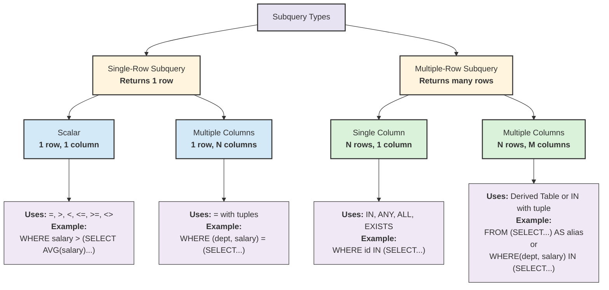

# Advanced Query


---
layout: two-cols-title
---

::title::
[Summary of SQL Queries]{class="text-2xl"}

::left::

```sql
SELECT		<attribute list>
FROM		<table list>
[JOIN ON		<condition>]
[WHERE		<condition>]
[GROUP BY 	<grouping attribute(s)>]
[HAVING		<group condition>]
[ORDER BY 	<attribute list>]
```

::right::

<div class="ns-c-tight">

- SELECT-clause lists the attributes/functions to be retrieved
- FROM-clause specifies all relations (or aliases) needed in the query but not those needed in nested queries
- WHERE-clause specifies the conditions for selection and join of tuples from the relations specified in the FROM-clause
- GROUP BY specifies grouping attributes
- HAVING specifies a condition for selection of groups
- ORDER BY specifies an order for displaying the result of a query

</div>

---
layout: two-cols-title
---

::title::
[Precedence]{class="text-2xl"}

- A query is evaluated by first applying the WHERE-clause, then GROUP BY and HAVING, and finally the SELECT-clause

::left::

```sql
SELECT		<attribute list>
FROM		<table list>
[JOIN ON		<condition>]
[WHERE		<condition>]
[GROUP BY 	<grouping attribute(s)>]
[HAVING		<group condition>]
[ORDER BY 	<attribute list>]
```

::default::

<Precedence/>

---

[Subquery Concept]{class="text-2xl"}


- we want to write a query to identify all students who get **better marks** than that of the student who's [StudentID is 'V002', but we do not know the marks of 'V002']{.text-red-500}

---

[Subquery Concept]{class="text-2xl"}

<div class="w-fit mx-auto">

{.max-h-50vh}
</div>

---

[Subquery Concept]{class="text-2xl"}

<div class="w-fit mx-auto">

{.max-h-50vh}
</div>

---

[Subquery Type]{class="text-2xl"}




---

[Subquery Location]{class="text-2xl"}

<div class="w-fit mx-auto">

{.max-h-50vh}
</div>

1. In the SELECT Clause : Used to return a single value or a set of values.
2. In the FROM Clause : Treated as a derived table or inline view.
3. In the WHERE Clause : Used to filter the results.
4. In the HAVING Clause : Used to filter groups.

---


[Single Row Subqueries]{class="text-2xl"}

- In `WHERE` clause

- Find details of 'diane murphy' but not know her employee number.

```sql
select
    firstname || ' ' || lastname,
    employeenumber,
    email
from
    classicmodels.employees
where
    employeenumber = (
        select
            employeenumber
        from
            classicmodels.employees
        where
            firstname || ' ' || lastname ilike 'diane murphy'
    )
```

<CsvTable><pre>
"?column?"	"employeenumber"	"email"
"Diane Murphy"	1002	"dmurphy@classicmodelcars.com"
</pre></CsvTable>


---
layout: two-cols-title
---

::title::
[Single Row Subqueries]{class="text-2xl"}


- Find details of 'diane murphy' but not know her employee number.

```sql
select
    firstname || ' ' || lastname,
    employeenumber,
    email
from
    classicmodels.employees
where
    employeenumber = (
        select employeenumber from classicmodels.employees
        where firstname || ' ' || lastname ilike 'diane murphy'
    )
```

::left::

````md magic-move

```sql
select
    employeenumber
from
    classicmodels.employees
where
    firstname || ' ' || lastname ilike 'diane murphy'
```

```sql
select
    firstname || ' ' || lastname,
    employeenumber,
    email
from
    classicmodels.employees
where
    employeenumber = 1002
```

````
::right::

<div v-show="$slidev.nav.clicks == 0">

<CsvTable><pre>
"employeenumber"
1002
</pre></CsvTable>
</div>

<div v-show="$slidev.nav.clicks == 1">

<CsvTable><pre>
"?column?"	"employeenumber"	"email"
"Diane Murphy"	1002	"dmurphy@classicmodelcars.com"
</pre></CsvTable>
</div>

::default::

---

[Single Row Subqueries]{class="text-2xl"}

- In `WHERE` clause

- What order which has quantity order above average quantity order of order number 10100

```sql
select ordernumber, quantityordered from orderdetails
where quantityordered > (select avg(quantityordered) from orderdetails where ordernumber = 10100)
```

<CsvTable><pre>
"ordernumber"	"quantityordered"
10100	50
10100	49
10101	45
10101	46
10102	39
10102	41
10103	42
</pre></CsvTable>

---
layout: two-cols-title
---

::title::
[Single Row Subqueries]{class="text-2xl"}

- What order which has quantity order above average quantity order of order number 10100

```sql
select ordernumber, quantityordered from orderdetails
where quantityordered > (select avg(quantityordered) from orderdetails where ordernumber = 10100)
```

::left::

````md magic-move

```sql
select avg(quantityordered) from orderdetails 
where ordernumber = 10100
```

```sql
select ordernumber, quantityordered from orderdetails
where quantityordered > 37.7500000000000000
```

````
::right::

<div v-show="$slidev.nav.clicks == 0">

<CsvTable><pre>
"avg"
37.7500000000000000
</pre></CsvTable>
</div>

<div v-show="$slidev.nav.clicks == 1">

<CsvTable><pre>
"ordernumber"	"quantityordered"
10100	50
10100	49
10101	45
10101	46
10102	39
10102	41
10103	42
</pre></CsvTable>
</div>

::default::

---

[Single Row Subqueries]{class="text-2xl"}

- In `HAVING` clause: Used to filter group

- Find average order amount and count of customers and customer number from `payments` table which customer number is 347

```sql
select customernumber, avg(amount), count(customernumber) from payments
group by customernumber
having avg(amount) = (select avg(amount) from payments where customernumber = 347)
```

<CsvTable><pre>
"customernumber"	"avg"	"count"
347	20753.095000000000	2
</pre></CsvTable>

- You also use `WHERE` to filter rows before `GROUP BY` , but in this case we want to filter group

```sql
select customernumber, avg(amount), count(customernumber) from payments
where customernumber = 347
group by customernumber
```

---
layout: two-cols-title
---

::title::
[Single Row Subqueries]{class="text-2xl"}

- Find average order amount and count of customers and customer number from `payments` table which customer number is 347

```sql
select customernumber, avg(amount), count(customernumber) from payments
group by customernumber
having avg(amount) = (select avg(amount) from payments where customernumber = 347)
```

::left::

````md magic-move

```sql
select avg(amount) from payments where customernumber = 347
```

```sql
select customernumber, avg(amount), count(customernumber) 
from payments group by customernumber
having avg(amount) = 20753.095000000000
```

````
::right::

<div v-show="$slidev.nav.clicks == 0">

<CsvTable><pre>
"avg"
20753.095000000000
</pre></CsvTable>
</div>

<div v-show="$slidev.nav.clicks == 1">

<CsvTable><pre>
"customernumber"	"avg"	"count"
347	20753.095000000000	2
</pre></CsvTable>
</div>
::default::

---

[Single Row Subqueries]{class="text-2xl"}

- What orders have average order quantity above overall average order quantity

```sql
SELECT  o.orderNumber, AVG( o.quantityOrdered )
FROM orderdetails  o
GROUP BY o.orderNumber
HAVING AVG(o.quantityOrdered ) > 
    (
               SELECT AVG(d.quantityOrdered) 
               FROM orderdetails as d 
    );
```

<CsvTable><pre>
"ordernumber"	"avg"
10276	37.6428571428571429
10340	42.8750000000000000
10211	35.3333333333333333
10294	45.0000000000000000
10216	43.0000000000000000
10130	36.5000000000000000
10268	36.5454545454545455
10168	35.6666666666666667
10400	39.5555555555555556
</pre></CsvTable>

---

[Multiple Row Subqueries]{class="text-2xl"}

- In `FROM` clause

- Find what quantity order which has quantity less than 10

```sql
select quantityordered from (select quantityordered from orderdetails where quantityordered < 10)
```

- I want to know what ordernumber, how to solve?

<CsvTable><pre>
"quantityordered"
6
6
</pre></CsvTable>

<div class="text-5xl" v-drag="[490,202,69,55]">
🤨
</div>

---

[Multiple Row Subqueries]{class="text-2xl"}

- Find what quantity order which has quantity less than 10

```sql
select
    ordernumber,
    productcode,
    quantityordered,
    priceeach,
    orderlinenumber
from
    (
        select
            *
        from
            orderdetails
        where
            quantityordered < 10
    )
```

<CsvTable><pre>
"ordernumber"	"productcode"	"quantityordered"	"priceeach"	"orderlinenumber"
10407	"S18_4409"	6	91.11	3
10409	"S18_2325"	6	104.25	2
</pre></CsvTable>

---
layout: two-cols-title
---

::title::
[Single Row Subqueries]{class="text-2xl"}

- Mixed with table and `Subquery`

::left::
```sql
select ordernumber,quantityordered
from orderdetails, 
(SELECT AVG(quantityordered) as avg 
  FROM orderdetails 
  WHERE ordernumber = 10100) as a
where quantityordered> a.avg
```

<div class="w-fit mx-auto">

{.max-h-50vh}
</div>

::right::

<CsvTable><pre>
"ordernumber"	"quantityordered"
10100	50
10100	49
10101	45
10101	46
10102	39
10102	41
10103	42
10103	46
10103	41
</pre></CsvTable>

---
layout: two-cols-title
---

::title::
[Multiple Row Subqueries]{class="text-2xl"}

- In `FROM` clause

- Finding the maximum and minimum Number of order items and the average order items

```sql
SELECT MAX(items), MIN(items), 
FLOOR(AVG(items)) 
FROM ( SELECT orderNumber, 
             COUNT(orderNumber) AS items 
             FROM orderdetails 
             GROUP BY orderNumber) AS lineitems
```

::left::

<div class="w-fit mx-auto">

{.max-h-20vh}
</div>
::right::

<CsvTable><pre>
"max"	"min"	"floor"
18	1	9
</pre></CsvTable>

::default::

---
layout: two-cols-title
---

::title::
[Multiple Row Subqueries]{class="text-2xl"}

::left::

- Why this one?

```sql
SELECT orderNumber, 
             COUNT(orderNumber) AS items 
             FROM orderdetails 
             GROUP BY orderNumber
```

::right::

- Why not this one?

```sql
SELECT orderNumber,
			 MAX(count(orderNumber)),
			 MIN(count(orderNumber)),
			 FLOOR(AVG(count(orderNumber))),
             COUNT(orderNumber) AS items 
             FROM orderdetails 
             GROUP BY orderNumber
```

::default::


---
layout: two-cols-title
---

::title::
[Multiple Row Subqueries]{class="text-2xl"}

::left::

```sql
SELECT orderNumber, 
             COUNT(orderNumber) AS items 
             FROM orderdetails 
             GROUP BY orderNumber
```

::right::

<CsvTable><pre>
"ordernumber"	"items"
10343	6
10253	14
10425	13
10218	2
10276	14
10273	15
10340	8
10256	2
10211	15
10294	1
10362	4
10216	1
10201	7
</pre></CsvTable>

::default::


---

[Multiple Row and Column Subqueries]{class="text-2xl"}

- Using `IN` operator with a Multiple Row Subquery
- Using `NOT IN` operator with a Multiple Row Subquery
- Using `ANY` with a Multiple Row Subquery
- Multiple Column Subqueries
- SQL subqueries using `DISTINCT`

---

[Multiple Row Subquery]{class="text-2xl"}

- Use `IN` operator


```sql
value IN (value1, value2, value3, ...)
```


- The `IN` operator is functionally equivalent to the combination of multiple `OR` operators

```sql
value = value1 OR value = value2 OR value = value3 OR ...
```

- Example

<div class="flex gap-2">

<div class="w-1/4">

```sql
SELECT 1 IN (1,2,3);
```

<CsvTable><pre>
"?column?"
true
</pre></CsvTable>

</div>
<div class="w-1/4">


```sql
SELECT 4 IN (1,2,3);
```

<CsvTable><pre>
"?column?"
false
</pre></CsvTable>

</div>
<div class="w-1/4">

```sql
SELECT NULL IN (1,2,3);
```

<CsvTable><pre>
"?column?"

</pre></CsvTable>
</div>
<div class="w-1/4">

```sql
SELECT 0 IN (1,2,3,NULL);
```

<CsvTable><pre>
"?column?"

</pre></CsvTable>
</div>

</div>

---

[Multiple Row Subquery]{class="text-2xl"}

- Use `IN` operator
- Find all order numbers containing S10_1678, then show all products in those orders

```sql
SELECT productCode, ordernumber
FROM classicmodels.orderdetails
WHERE ordernumber IN 
(SELECT ordernumber FROM classicmodels.orderdetails 
WHERE productCode = 'S10_1678' )
```

---
layout: two-cols-title
---

::title::
[Multiple Row Subquery]{class="text-2xl"}

::left::

````md magic-move

```sql
SELECT ordernumber FROM classicmodels.orderdetails 
WHERE productCode = 'S10_1678' 
```

```sql
SELECT productCode, ordernumber
FROM classicmodels.orderdetails
WHERE ordernumber IN 
(SELECT ordernumber FROM classicmodels.orderdetails 
WHERE productCode = 'S10_1678' )
```

````

::right::

<div v-show="$slidev.nav.clicks == 0">

<CsvTable><pre>
"ordernumber"
10107
10121
10134
10145
10159
10168
10180
10188
10201
</pre></CsvTable>
</div>


<div v-show="$slidev.nav.clicks == 1">

<CsvTable><pre>
"productcode"	"ordernumber"
"S10_1678"	10107
"S10_2016"	10107
"S10_4698"	10107
"S12_2823"	10107
"S18_2625"	10107
"S24_1578"	10107
"S24_2000"	10107
"S32_1374"	10107
"S10_1678"	10121
"S12_2823"	10121
"S24_2360"	10121
"S32_4485"	10121
</pre></CsvTable>
</div>
::default::

---
layout: two-cols-title
---

::title::
[Multiple Row Subquery]{class="text-2xl"}

- List all employees whose customers are in USA

::left::

````md magic-move

```sql
SELECT salesrepemployeenumber 
FROM classicmodels.customers 
where country = 'USA'
```

```sql
SELECT employeenumber, firstname || ' ' || lastname 
fullname, email from employees
WHERE employeenumber in (SELECT salesrepemployeenumber 
FROM classicmodels.customers where country = 'USA')
```

````

::right::

<div v-show="$slidev.nav.clicks == 0">

<CsvTable><pre>
"salesrepemployeenumber"
1166
1165
1165
1323
1286
1216
1165
1286
1188
1323
</pre></CsvTable>
</div>


<div v-show="$slidev.nav.clicks == 1">

<CsvTable><pre>
"employeenumber"	"fullname"	"email"
1165	"Leslie Jennings"	"ljennings@classicmodelcars.com"
1166	"Leslie Thompson"	"lthompson@classicmodelcars.com"
1188	"Julie Firrelli"	"jfirrelli@classicmodelcars.com"
1216	"Steve Patterson"	"spatterson@classicmodelcars.com"
1286	"Foon Yue Tseng"	"ftseng@classicmodelcars.com"
1323	"George Vanauf"	"gvanauf@classicmodelcars.com"
</pre></CsvTable>
</div>
::default::

<div v-show="$slidev.nav.clicks == 1">

- For performance/read ability, which one is better?

```sql
SELECT DISTINCT e.employeenumber, 
       e.firstname || ' ' || e.lastname AS fullname, 
       e.email
FROM employees e
JOIN customers c ON e.employeenumber = c.salesrepemployeenumber
WHERE c.country = 'USA';
```
</div>


---
layout: two-cols-title
---

::title::
[Multiple Row Subquery]{class="text-2xl"}

- Using `NOT IN` operator
- Find the customers who have not placed any orders


::left::

<div class="w-fit mx-auto">

{.max-h-50vh}
</div>

::right::

````md magic-move

```sql
SELECT DISTINCT customerNumber 
FROM orders
```

```sql
SELECT customerName 
FROM customers 
WHERE customerNumber NOT IN (
SELECT DISTINCT customerNumber 
FROM orders
);
```

````

<div v-show="$slidev.nav.clicks == 0">

<CsvTable><pre>
"customernumber"
209
347
455
181
321
205
448
146
201
350
</pre></CsvTable>
</div>
<div v-show="$slidev.nav.clicks == 1">


<CsvTable><pre>
"customername"
"Havel & Zbyszek Co"
"American Souvenirs Inc"
"Porto Imports Co."
"Asian Shopping Network, Co"
"Nat"
"ANG Resellers"
"Messner Shopping Network"
</pre></CsvTable>
</div>

::default::


---
layout: two-cols-title
---

::title::
[Multiple Row Subquery]{class="text-2xl"}

- Using `IN` - easy to understand, select only those values which are specified in `IN` clause

```sql
expression IN (value [, ...])
```

- Using `ANY/SOME(array)` means it should be greater or less than any of the values in the list

```sql
expression operator ANY (array expression)
expression operator SOME (array expression)
```

::left::

````md magic-move

```sql
SELECT 1 IN (1,2,3,4,5)
```

```sql
SELECT 1 IN (VALUES (1,2,3,4,5))
```

```sql
SELECT 1 = ANY(VALUES (1),(2),(3),(4),(5));
```

```sql
SELECT 1 > ANY(VALUES (1),(2),(3),(4),(5));
```

```sql
SELECT 1 >= ANY(VALUES (1),(2),(3),(4),(5));
```

```sql
SELECT 3 < ANY(VALUES (1),(2),(3),(4),(5));
```

```sql
SELECT 3 <= ANY(VALUES (1),(2),(3),(4),(5));
```

```sql
SELECT 3 > ANY(VALUES (1),(2),(3),(4),(5));
```

```sql
SELECT 2 > ANY(VALUES (1),(5));
```


```sql
SELECT 2 > ANY(VALUES (5));
```
````

::right::

<div v-show="$slidev.nav.clicks == 0">

<CsvTable><pre>
"?column?"
true
</pre></CsvTable>
</div>

<div v-show="$slidev.nav.clicks == 1">

<CsvTable><pre>
"?column?"
true
</pre></CsvTable>
</div>

<div v-show="$slidev.nav.clicks == 2">

<CsvTable><pre>
"?column?"
true
</pre></CsvTable>
</div>

<div v-show="$slidev.nav.clicks == 3">

<CsvTable><pre>
"?column?"
false
</pre></CsvTable>
</div>


<div v-show="$slidev.nav.clicks == 4">

<CsvTable><pre>
"?column?"
true
</pre></CsvTable>
</div>


<div v-show="$slidev.nav.clicks == 5">

<CsvTable><pre>
"?column?"
true
</pre></CsvTable>
</div>


<div v-show="$slidev.nav.clicks == 6">

<CsvTable><pre>
"?column?"
true
</pre></CsvTable>
</div>


<div v-show="$slidev.nav.clicks == 7">

<CsvTable><pre>
"?column?"
true
</pre></CsvTable>
</div>

<div v-show="$slidev.nav.clicks == 8">

<CsvTable><pre>
"?column?"
true
</pre></CsvTable>
</div>


<div v-show="$slidev.nav.clicks == 9">

[❓]{.text-2xl}

</div>

::default::

---

[Multiple Row Subquery]{class="text-2xl"}

- Equivalent

```sql
... WHERE X IN (SELECT Y FROM THE_TABLE)
```

```sql
... WHERE X =ANY (SELECT Y FROM THE_TABLE)
```

and these also

```sql
... WHERE X NOT IN (SELECT Y FROM THE_TABLE)
```

```sql
... WHERE X <>ALL (SELECT Y FROM THE_TABLE)
```

- Another example

<div class="flex gap-2">
<div class="w-1/2">

````md magic-move
```sql
SELECT 10 <> ALL(VALUES (1),(2),(3),(4),(5));
```

```sql
SELECT 10 > ALL(VALUES (1),(2),(3),(4),(5));
```

```sql
SELECT 10 > ALL(VALUES (1),(2),(3),(4),(5),(20));
```
````

</div>

<div class="w-1/2">

<div v-show="$slidev.nav.clicks == 0">
<CsvTable><pre>
"?column?"
true
</pre></CsvTable>
</div>

<div v-show="$slidev.nav.clicks == 1">
<CsvTable><pre>
"?column?"
true
</pre></CsvTable>
</div>

<div v-show="$slidev.nav.clicks == 2">
<CsvTable><pre>
"?column?"
false
</pre></CsvTable>
</div>

</div>
</div>

---
layout: two-cols-title
---

::title::
[Multiple Row Subquery]{class="text-2xl"}

- Using `< ANY`
- Find products cheaper than ANY Classic Cars product

::left::

````md magic-move

```sql

SELECT
    buyPrice
FROM
    products
WHERE
    productLine = 'Classic Cars'
```

```sql
SELECT 
    productCode,
    productName,
    productLine,
    buyPrice
FROM 
    products
WHERE 
    buyPrice < ANY (
        SELECT buyPrice 
        FROM products 
        WHERE productLine = 'Classic Cars'
    )
```
````
::right::

<div v-show="$slidev.nav.clicks == 0">

<CsvTable><pre>
"buyprice"
98.58
85.68
103.42
95.34
95.59
89.14
75.16
83.05
</pre></CsvTable>

</div>

<div v-show="$slidev.nav.clicks == 1">

<CsvTable><pre>
"productcode"	"productname"	"productline"	"buyprice"
"S10_1678"	"1969 Harley Davidson Ultimate Chopper"	"Motorcycles"	48.81
"S10_1949"	"1952 Alpine Renault 1300"	"Classic Cars"	98.58
"S10_2016"	"1996 Moto Guzzi 1100i"	"Motorcycles"	68.99
"S10_4698"	"2003 Harley-Davidson Eagle Drag Bike"	"Motorcycles"	91.02
"S10_4757"	"1972 Alfa Romeo GTA"	"Classic Cars"	85.68
"S12_1099"	"1968 Ford Mustang"	"Classic Cars"	95.34
"S12_1108"	"2001 Ferrari Enzo"	"Classic Cars"	95.59
"S12_1666"	"1958 Setra Bus"	"Trucks and Buses"	77.9
"S12_2823"	"2002 Suzuki XREO"	"Motorcycles"	66.27
"S12_3148"	"1969 Corvair Monza"	"Classic Cars"	89.14
"S12_3380"	"1968 Dodge Charger"	"Classic Cars"	75.16
</pre></CsvTable>

</div>

::default::

---
layout: two-cols-title
---

::title::
[Multiple Row Subquery]{class="text-2xl"}

- Using `= ANY`
- Find employees whose office is NOT in the USA

::left::

````md magic-move

```sql
SELECT
    officeCode
FROM
    offices
WHERE
    country != 'USA'
```

```sql
SELECT 
    e.employeeNumber,
    e.firstName,
    e.lastName,
    e.jobTitle,
    o.city,
    o.country
FROM 
    employees e
    JOIN offices o ON e.officeCode = o.officeCode
WHERE 
    o.officeCode = ANY (
        SELECT officeCode
        FROM offices
        WHERE country != 'USA'
    )
```

````

::right::

<div v-show="$slidev.nav.clicks == 0">
<CsvTable><pre>
"officecode"
"4"
"5"
"6"
"7"
</pre></CsvTable>
</div>

<div v-show="$slidev.nav.clicks == 1">
<CsvTable><pre>

"employeenumber"	"firstname"	"lastname"	"jobtitle"	"city"	"country"
1088	"William"	"Patterson"	"Sales Manager (APAC)"	"Sydney"	"Australia"
1102	"Gerard"	"Bondur"	"Sale Manager (EMEA)"	"Paris"	"France"
1337	"Loui"	"Bondur"	"Sales Rep"	"Paris"	"France"
1370	"Gerard"	"Hernandez"	"Sales Rep"	"Paris"	"France"
1401	"Pamela"	"Castillo"	"Sales Rep"	"Paris"	"France"
1501	"Larry"	"Bott"	"Sales Rep"	"London"	"UK"
1504	"Barry"	"Jones"	"Sales Rep"	"London"	"UK"
1611	"Andy"	"Fixter"	"Sales Rep"	"Sydney"	"Australia"
1612	"Peter"	"Marsh"	"Sales Rep"	"Sydney"	"Australia"
1619	"Tom"	"King"	"Sales Rep"	"Sydney"	"Australia"
1621	"Mami"	"Nishi"	"Sales Rep"	"Tokyo"	"Japan"
1625	"Yoshimi"	"Kato"	"Sales Rep"	"Tokyo"	"Japan"
1702	"Martin"	"Gerard"	"Sales Rep"	"Paris"	"France"
</pre></CsvTable>
</div>

::default::

---
layout: two-cols-title
---

::title::
[Multiple Row Subquery]{class="text-2xl"}

- Using `> ANY`
- Find customers who have made payments greater than ANY payment from USA customers

::left::

````md magic-move

```sql

SELECT
    amount
FROM
    payments p2
    JOIN customers c2 ON 
    p2.customerNumber = c2.customerNumber
WHERE
    c2.country = 'USA'
```

```sql
SELECT 
    c.customerNumber,
    c.customerName,
    c.country,
    p.amount
FROM 
    customers c
    JOIN payments p ON c.customerNumber = p.customerNumber
WHERE 
    p.amount > ANY (
        SELECT amount
        FROM payments p2
        JOIN customers c2 
        ON p2.customerNumber = c2.customerNumber
        WHERE c2.country = 'USA'
    )
```

````


::right::

<div v-show="$slidev.nav.clicks == 0">

<CsvTable><pre>
"amount"
14191.12
32641.98
33347.88
101244.59
85410.87
11044.3
83598.04
47142.7
</pre></CsvTable>
</div>

<div v-show="$slidev.nav.clicks == 1">

<CsvTable><pre>
"customernumber"	"customername"	"country"	"amount"
103	"Atelier graphique"	"France"	6066.78
103	"Atelier graphique"	"France"	14571.44
112	"Signal Gift Stores"	"USA"	14191.12
112	"Signal Gift Stores"	"USA"	32641.98
112	"Signal Gift Stores"	"USA"	33347.88
114	"Australian Collectors, Co."	"Australia"	45864.03
114	"Australian Collectors, Co."	"Australia"	82261.22
114	"Australian Collectors, Co."	"Australia"	7565.08
114	"Australian Collectors, Co."	"Australia"	44894.74
119	"La Rochelle Gifts"	"France"	19501.82
</pre></CsvTable>
</div>

::default::

---
layout: two-cols-title
---

::title::
[Multiple Row Subquery]{class="text-2xl"}

- Using `DISTINCT`

::left::

````md magic-move

```sql

SELECT DISTINCT -- without DISTINCT = 1010 rows
    od2.quantityOrdered
FROM
    orderdetails od2
    JOIN products p2 ON od2.productCode = p2.productCode
WHERE
    p2.productLine = 'Classic Cars'
```

```sql
SELECT 
    od.orderNumber,
    od.productCode,
    p.productName,
    p.productLine,
    od.quantityOrdered
FROM 
    orderdetails od
    JOIN products p ON od.productCode = p.productCode
WHERE 
    od.quantityOrdered > ANY (
        SELECT DISTINCT od2.quantityOrdered
        FROM orderdetails od2
        JOIN products p2 ON od2.productCode = p2.productCode
        WHERE p2.productLine = 'Classic Cars'
    )
```

````

::right::

<div v-show="$slidev.nav.clicks == 0">
<CsvTable><pre>
"quantityordered"
29
34
70
10
90
35
45
39
36
31
50
60
97
66
</pre></CsvTable>

</div>

<div v-show="$slidev.nav.clicks == 1">
<CsvTable><pre>
"ordernumber"	"productcode"	"productname"	"productline"	"quantityordered"
10100	"S18_1749"	"1917 Grand Touring Sedan"	"Vintage Cars"	30
10100	"S18_2248"	"1911 Ford Town Car"	"Vintage Cars"	50
10100	"S18_4409"	"1932 Alfa Romeo 8C2300 Spider Sport"	"Vintage Cars"	22
10100	"S24_3969"	"1936 Mercedes Benz 500k Roadster"	"Vintage Cars"	49
10101	"S18_2325"	"1932 Model A Ford J-Coupe"	"Vintage Cars"	25
10101	"S18_2795"	"1928 Mercedes-Benz SSK"	"Vintage Cars"	26
10101	"S24_1937"	"1939 Chevrolet Deluxe Coupe"	"Vintage Cars"	45
10101	"S24_2022"	"1938 Cadillac V-16 Presidential Limousine"	"Vintage Cars"	46
10102	"S18_1342"	"1937 Lincoln Berline"	"Vintage Cars"	39
</pre></CsvTable>

</div>

::default::

---
layout: two-cols-title
---

::title::
[SQL Correlated Subqueries]{class="text-2xl"}

- Correlated Subqueries retrieve data from a table referenced in the outer query. 
- They are termed "correlated" because the subquery's execution is influenced by the outer query's rows. 
- when using correlated subqueries, it's essential to employ a table alias (or correlation name) to clarify the table reference intended for use within the subquery.


::left::

<div class="w-fit mx-auto">

{.max-h-50vh}
</div>

::right::

<div class="w-fit mx-auto">

{.max-h-50vh}
</div>

::default::

---

[Basic outer & inner Correlated Subquery]{class="text-2xl"}


<div class="w-fit mx-auto">

{.max-h-50vh}
</div>