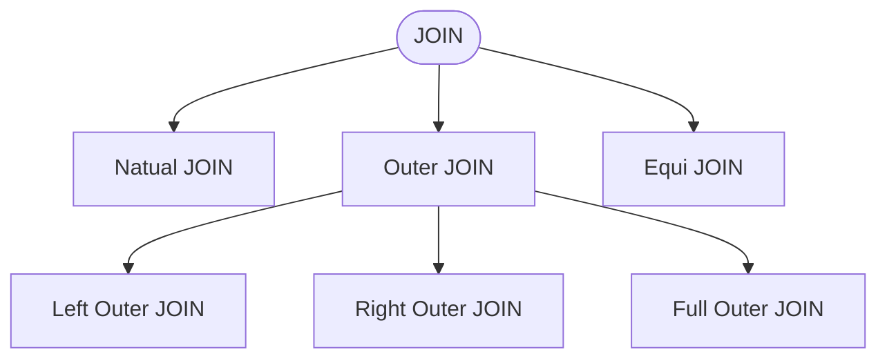

# Setup PostgreSQL

---
layout: full
---

[Download PostgreSQL]{class="text-2xl"}

<div v-drag="[876,391,100,100]">

<QRCode value="https://luckkrit.github.io/cos3103/slides/2_68/sql_dml/images/2_68/sql_dml/setup_pg1.gif" :size="100" />
</div>

{class="mx-auto w-[750px]"}

https://luckkrit.github.io/cos3103/slides/2_68/sql_dml/images/2_68/sql_dml/setup_pg1.gif

---
layout: full
---

[Setup Postgresql Pt.1]{class="text-2xl"}

<div v-drag="[876,391,100,100]">

<QRCode value="https://luckkrit.github.io/cos3103/slides/2_68/sql_dml/images/2_68/sql_dml/setup_pg1.gif" :size="100" />
</div>

{class="mx-auto w-[500px]"}

https://luckkrit.github.io/cos3103/slides/2_68/sql_dml/images/2_68/sql_dml/setup_pg1.gif

---
layout: full
---

[Setup Postgresql Pt.2]{class="text-2xl"}

<div v-drag="[876,391,100,100]">

<QRCode value="https://luckkrit.github.io/cos3103/slides/2_68/sql_dml/images/2_68/sql_dml/setup_pg2.gif" :size="100" />
</div>

{class="mx-auto w-[600px]"}
https://luckkrit.github.io/cos3103/slides/2_68/sql_dml/images/2_68/sql_dml/setup_pg2.gif


---
layout: full
---

[Setup Postgresql Pt.3]{class="text-2xl"}

<div v-drag="[876,391,100,100]">

<QRCode value="https://luckkrit.github.io/cos3103/slides/2_68/sql_dml/images/2_68/sql_dml/setup_pg3.gif" :size="100" />
</div>

{class="mx-auto w-[500px]"}
https://luckkrit.github.io/cos3103/slides/2_68/sql_dml/images/2_68/sql_dml/setup_pg3.gif


---

[PostGIS Extension]{class="text-2xl"}

- Enable PostGIS Extension

```sql
CREATE EXTENSION postgis;
```

[Classic Models Schema]{class="text-2xl"}

- Download: https://luckkrit.github.io/cos3103/sql/postgresql-classicmodels.sql

<div v-drag="[764,199,100,100]">

<QRCode value="https://luckkrit.github.io/cos3103/sql/postgresql-classicmodels.sql" :size="100" />
</div>

[Search Path]{class="text-2xl"}

- Add classicmodels to Searcg Path

```sql
SET search_path TO public, classicmodels;
```

---
layout: section
transition: fade
---


# Basic SQL
- DML

---

## SQL Command Type


{class="mx-auto w-[400px]"}

<Box v-drag="[444,150,71,205]" shape="r-d-3-100" color="red-light" width="200px"  />

<Box v-drag="[597,150,71,110]" shape="r-d-3-100" color="red-light" width="200px"  />


<AdmonitionType type="info" width="300px">
Some book : DML = DML+DQL
</AdmonitionType>

---
layout: two-cols-title
---

::title::

## DML vs. DDL vs. DQL

::left::

<div class="ns-c-tight text-stone-500">

- Data Definition Language (DDL)
    - `CREATE TABLE TABLE_NAME (COLUMN_NAME DATATYPES[,....]);`
    - `DROP TABLE ;`
    - `ALTER TABLE table_name ADD column_name COLUMN-definition;`
    - `TRUNCATE TABLE table_name;`

- Data Manipulation Language (DML)
    - `INSERT INTO TABLE_NAME (col1, col2, col3,.... col N) VALUES (value1, value2, value3, .... valueN);`
    - `UPDATE table_name SET [column_name1= value1,...column_nameN = valueN] [WHERE CONDITION]`
    - `TRUNCATE TABLE table_name;`

</div>

::right::

- Data Query Language (DQL)
    - `SELECT FirstName FROM Student WHERE RollNo > 15;`
 
---
layout: full
---

{class="w-[700px] mx-auto"}

---

[List of tables]{class="text-2xl"}

- **Customers**: stores customer’s data.
- **Products**: stores a list of scale model cars.
- **ProductLines**: stores a list of product line categories.
- **Orders**: stores sales orders placed by customers.
- **OrderDetails**: stores sales order line items for each sales order.
- **Payments**: stores payments made by customers based on their accounts.
- **Employees**: stores all employee information as well as the organization structure such as who reports to whom.
- **Offices**: stores sales office data.


---
layout: two-cols-title
---

::title::
[Summary of SQL Queries]{class="text-2xl"}

::left::

```sql
SELECT		<attribute list>
FROM		<table list>
[JOIN ON		<condition>]
[WHERE		<condition>]
[GROUP BY 	<grouping attribute(s)>]
[HAVING		<group condition>]
[ORDER BY 	<attribute list>]
```

::right::

<div class="ns-c-tight">

- SELECT-clause lists the attributes/functions to be retrieved
- FROM-clause specifies all relations (or aliases) needed in the query but not those needed in nested queries
- WHERE-clause specifies the conditions for selection and join of tuples from the relations specified in the FROM-clause
- GROUP BY specifies grouping attributes
- HAVING specifies a condition for selection of groups
- ORDER BY specifies an order for displaying the result of a query

</div>

---
layout: two-cols-title
---

::title::
[Precedence]{class="text-2xl"}

- A query is evaluated by first applying the WHERE-clause, then GROUP BY and HAVING, and finally the SELECT-clause

::left::

```sql
SELECT		<attribute list>
FROM		<table list>
[JOIN ON		<condition>]
[WHERE		<condition>]
[GROUP BY 	<grouping attribute(s)>]
[HAVING		<group condition>]
[ORDER BY 	<attribute list>]
```

::default::

<Precedence/>

---

[Select-From-where and Relational algebra]{class="text-2xl"}

- Basic form of the SQL retrieval queries:

```sql
SELECT 	<attribute list>           

FROM 	<table list>

WHERE	<condition>
```

<Box shape="s-s-5-0" color="amber-light" v-drag="[300,132,103,40]">Project (∏)</Box>
<Box shape="s-s-5-0" color="amber-light" v-drag="[299,196,93,40]">Select (σ)</Box>

- &lt;attribute list&gt; is a **list of attribute names** whose values are to be retrieved by the query
- &lt;table list&gt; is a **list of the relation names** required to process the query
- &lt;condition&gt; is a **conditional (Boolean) expression** that identifies the tuples to be retrieved by the query

---

[Example]{class="text-2xl"}

```sql
SELECT * FROM EMPLOYEE;
```

First, we execute `FROM EMPLOYEE`, which retrieves this data:
    
| EMPLOYEE_ID | FIRST_NAME | LAST_NAME | SALARY  | DEPARTMENT  |
|-------------|------------|-----------|---------|-------------|
| 100         | James      | Smith     | 78,000  | ACCOUNTING  |
| 101         | Mary       | Sexton    | 82,000  | IT          |
| 102         | Chun       | Yen       | 80,500  | ACCOUNTING  |
| 103         | Agnes      | Miller    | 95,000  | IT          |
| 104         | Dmitry     | Komer     | 120,000 | SALES       |

<Precedence :steps="['FROM',]" />

<Box shape="s-s-5-0" color="amber-light" v-drag="[603,118,124,49]">


$\sigma (\text{employee})$
</Box>

---

[Example]{class="text-2xl"}

```sql
SELECT * FROM EMPLOYEE WHERE DEPARTMENT = 'IT';

```

Secondly, we execute `WHERE DEPARTMENT = 'IT'`, which narrows it down to this:
    
| EMPLOYEE_ID | FIRST_NAME | LAST_NAME | SALARY | DEPARTMENT |
|-------------|------------|-----------|--------|------------|
| 101         | Mary       | Sexton    | 82,000 | IT         |
| 103         | Agnes      | Miller    | 95,000 | IT         |

<Precedence :steps="['FROM','WHERE']" />

<Box shape="s-s-5-0" color="amber-light" v-drag="[727,5,246,69]">

$\sigma_{\text{department}=\text{'IT'}} (\text{employee})$
</Box>

---

[Example]{class="text-2xl"}

```sql
SELECT FIRST_NAME, LAST_NAME FROM EMPLOYEE WHERE DEPARTMENT = 'IT';
```

Finally, we apply `SELECT FIRST_NAME, LAST_NAME` producing the final result of the query:


| FIRST_NAME | LAST_NAME |
|------------|-----------|
| Mary       | Sexton    |
| Agnes      | Miller    |


<Precedence :steps="['FROM','WHERE','SELECT']" />

<Box shape="s-s-5-0" color="amber-light" v-drag="[463,19,420,51]">


$\Pi_{\text{FirstName}, \text{LastName}} \left( \sigma_{\text{department}=\text{'IT'}} (\text{employee}) \right)$
</Box>


---
layout: two-cols-title
---

::title::
[SELECT Clause]{class="text-2xl"}

::left::
```sql
SELECT <attribute list>
```

- Attribute list may include
    - `*` (wildcard)
    - Keywords such as `AS` and `DISTINCT`
    - Arithmetic expression
    - String functions
    - Boolean expression

::right::

```sql
SELECT 1+1;
```

---

[Wildcard(*) in SELECT-Clause]{class="text-2xl"}

- Retrieve the values for all columns of the selected tuples

```sql
SELECT * FROM classicmodels.customers;
```

<Box shape="s-s-5-0" color="amber-light" v-drag="[505,120,137,51]">


$\sigma (\text{customers})$
</Box>

<CsvTable><pre>
"customernumber"	"customername"	"contactlastname"	"contactfirstname"	"phone"	"addressline1"	"addressline2"	"city"	"state"	"postalcode"	"country"	"salesrepemployeenumber"	"creditlimit"	"customerlocation"
103	"Atelier graphique"	"Schmitt"	"Carine "	"40.32.2555"	"54, rue Royale"		"Nantes"		"44000"	"France"	1370	21000	"0101000020E61000006D31E47DC19B47405DA5BBEB6CE8F8BF"
112	"Signal Gift Stores"	"King"	"Jean"	"7025551838"	"8489 Strong St."		"Las Vegas"	"NV"	"83030"	"USA"	1166	71800	"0101000020E6100000014F5AB8AC0E42406F0ED76A0FCB5CC0"
114	"Australian Collectors, Co."	"Ferguson"	"Peter"	"03 9520 4555"	"636 St Kilda Road"	"Level 3"	"Melbourne"	"Victoria"	"3004"	"Australia"	1611	117300	"0101000020E61000008F84228216E842C0E31698BAD01E6240"
119	"La Rochelle Gifts"	"Labrune"	"Janine "	"40.67.8555"	"67, rue des Cinquante Otages"		"Nantes"		"44000"	"France"	1370	118200	"0101000020E61000006D31E47DC19B47405DA5BBEB6CE8F8BF"
121	"Baane Mini Imports"	"Bergulfsen"	"Jonas "	"07-98 9555"	"Erling Skakkes gate 78"		"Stavern"		"4110"	"Norway"	1504	81700	"0101000020E6100000644227DFC77F4D4012D4957439122440"
124	"Mini Gifts Distributors Ltd."	"Nelson"	"Susan"	"4155551450"	"5677 Strong St."		"San Rafael"	"CA"	"97562"	"USA"	1165	210500	"0101000020E6100000214322C89CFC424055940156FDA15EC0"
125	"Havel & Zbyszek Co"	"Piestrzeniewicz"	"Zbyszek "	"(26) 642-7555"	"ul. Filtrowa 68"		"Warszawa"		"01-012"	"Poland"		0	"0101000020E610000037589302661D4A4096928A6B21033540"
128	"Blauer See Auto, Co."	"Keitel"	"Roland"	"+49 69 66 90 2555"	"Lyonerstr. 34"		"Frankfurt"		"60528"	"Germany"	1504	59700	"0101000020E61000001E0FC704460E49405878F2446B5C2140"
129	"Mini Wheels Co."	"Murphy"	"Julie"	"6505555787"	"5557 North Pendale Street"		"San Francisco"	"CA"	"94217"	"USA"	1165	64600	"0101000020E6100000529ACDE330E34240425E0F26C59D5EC0"
</pre></CsvTable>

---

[SELECT Multiple Column in SELECT-Clause]{class="text-2xl"}

- Retreive the values for specified columns of the selected tuples

```sql
SELECT customername,phone FROM classicmodels.customers;
```

<Box shape="s-s-5-0" color="amber-light" v-drag="[505,120,279,51]">


$\Pi_{\text{customername}, \text{phone}} \left( \text{customers} \right)$
</Box>

<!--  -->

<CsvTable><pre>
"customername"	"phone"
"Atelier graphique"	"40.32.2555"
"Signal Gift Stores"	"7025551838"
"Australian Collectors, Co."	"03 9520 4555"
"La Rochelle Gifts"	"40.67.8555"
"Baane Mini Imports"	"07-98 9555"
"Mini Gifts Distributors Ltd."	"4155551450"
"Havel & Zbyszek Co"	"(26) 642-7555"
</pre></CsvTable>


---
layout: two-cols-title
---

::title::
[DISTINCT in SELECT-Clause]{class="text-2xl"}

- Eliminate duplicate tuples in query result

::left::

```sql
SELECT jobtitle FROM classicmodels.employees;
```

<!-- {class="w-[180px]"} -->
<CsvTable><pre>
"jobtitle"
"President"
"VP Sales"
"VP Marketing"
"Sales Manager (APAC)"
"Sale Manager (EMEA)"
"Sales Manager (NA)"
"Sales Rep"
"Sales Rep"
"Sales Rep"
"Sales Rep"
</pre></CsvTable>

::right::

```sql
SELECT distinct jobtitle FROM classicmodels.employees;
```

<!-- {class="w-[180px]"} -->
<CsvTable><pre>
"jobtitle"
"VP Sales"
"Sales Manager (APAC)"
"Sale Manager (EMEA)"
"VP Marketing"
"Sales Rep"
"Sales Manager (NA)"
"President"
</pre></CsvTable>

---
layout: two-cols-title
---

::title::
[Arithmetic Expression in SELECT-Clause]{class="text-2xl"}

::left::

```sql
SELECT checkNumber , paymentDate , amount 
FROM   classicmodels.payments
```

<!--  -->
<CsvTable><pre>
"checknumber"	"paymentdate"	"amount"
"HQ336336"	"2004-10-19 00:00:00"	6066.78
"JM555205"	"2003-06-05 00:00:00"	14571.44
"OM314933"	"2004-12-18 00:00:00"	1676.14
"BO864823"	"2004-12-17 00:00:00"	14191.12
"HQ55022"	"2003-06-06 00:00:00"	32641.98
"ND748579"	"2004-08-20 00:00:00"	33347.88
"GG31455"	"2003-05-20 00:00:00"	45864.03
"MA765515"	"2004-12-15 00:00:00"	82261.22
"NP603840"	"2003-05-31 00:00:00"	7565.08
"NR27552"	"2004-03-10 00:00:00"	44894.74
</pre></CsvTable>

::right::

```sql
SELECT checkNumber , paymentDate , amount+10000 
FROM   classicmodels.payments LIMIT  5
```

<!--  -->

<CsvTable><pre>
"checknumber"	"paymentdate"	"?column?"
"HQ336336"	"2004-10-19 00:00:00"	16066.78
"JM555205"	"2003-06-05 00:00:00"	24571.44
"OM314933"	"2004-12-18 00:00:00"	11676.14
"BO864823"	"2004-12-17 00:00:00"	24191.12
"HQ55022"	"2003-06-06 00:00:00"	42641.98
</pre></CsvTable>

---
layout: two-cols-title
---

::title::
[String functions in SELECT-Clause]{class="text-2xl"}

::left::

```sql
SELECT customername ,  upper(customername)
FROM  classicmodels.customers;
```

<!--  -->
<CsvTable><pre>
"customername"	"upper"
"Atelier graphique"	"ATELIER GRAPHIQUE"
"Signal Gift Stores"	"SIGNAL GIFT STORES"
"Australian Collectors, Co."	"AUSTRALIAN COLLECTORS, CO."
"La Rochelle Gifts"	"LA ROCHELLE GIFTS"
"Baane Mini Imports"	"BAANE MINI IMPORTS"
"Mini Gifts Distributors Ltd."	"MINI GIFTS DISTRIBUTORS LTD."
"Havel & Zbyszek Co"	"HAVEL & ZBYSZEK CO"
"Blauer See Auto, Co."	"BLAUER SEE AUTO, CO."
"Mini Wheels Co."	"MINI WHEELS CO."
"Land of Toys Inc."	"LAND OF TOYS INC."
"Euro+ Shopping Channel"	"EURO+ SHOPPING CHANNEL"
</pre></CsvTable>

::right::

```sql
SELECT customername ,  lower(customername)  
FROM  classicmodels.customers;
```

<!--  -->
<CsvTable><pre>
"customername"	"lower"
"Atelier graphique"	"atelier graphique"
"Signal Gift Stores"	"signal gift stores"
"Australian Collectors, Co."	"australian collectors, co."
"La Rochelle Gifts"	"la rochelle gifts"
"Baane Mini Imports"	"baane mini imports"
"Mini Gifts Distributors Ltd."	"mini gifts distributors ltd."
"Havel & Zbyszek Co"	"havel & zbyszek co"
"Blauer See Auto, Co."	"blauer see auto, co."
"Mini Wheels Co."	"mini wheels co."
"Land of Toys Inc."	"land of toys inc."
"Euro+ Shopping Channel"	"euro+ shopping channel"
"Volvo Model Replicas, Co"	"volvo model replicas, co"
"Danish Wholesale Imports"	"danish wholesale imports"
</pre></CsvTable>

---
layout: two-cols-title
---

::title::
[String functions in SELECT-Clause]{class="text-2xl"}

::left::

```sql
SELECT customername , 
reverse(customername)
FROM classicmodels.customers;
```

<!--  -->
<CsvTable><pre>
"customername"	"reverse"
"Atelier graphique"	"euqihparg reiletA"
"Signal Gift Stores"	"serotS tfiG langiS"
"Australian Collectors, Co."	".oC ,srotcelloC nailartsuA"
"La Rochelle Gifts"	"stfiG ellehcoR aL"
"Baane Mini Imports"	"stropmI iniM enaaB"
"Mini Gifts Distributors Ltd."	".dtL srotubirtsiD stfiG iniM"
"Havel & Zbyszek Co"	"oC kezsybZ & levaH"
"Blauer See Auto, Co."	".oC ,otuA eeS reualB"
"Mini Wheels Co."	".oC sleehW iniM"
"Land of Toys Inc."	".cnI syoT fo dnaL"
"Euro+ Shopping Channel"	"lennahC gnippohS +oruE"
</pre></CsvTable>

::right::

```sql
SELECT contactlastname,contactfirstname, 
concat( contactlastname,' ', contactfirstname)    
FROM classicmodels.customers;
```

<!--  -->
<CsvTable><pre>
"contactlastname"	"contactfirstname"	"concat"
"Schmitt"	"Carine "	"Schmitt Carine "
"King"	"Jean"	"King Jean"
"Ferguson"	"Peter"	"Ferguson Peter"
"Labrune"	"Janine "	"Labrune Janine "
"Bergulfsen"	"Jonas "	"Bergulfsen Jonas "
"Nelson"	"Susan"	"Nelson Susan"
"Piestrzeniewicz"	"Zbyszek "	"Piestrzeniewicz Zbyszek "
"Keitel"	"Roland"	"Keitel Roland"
"Murphy"	"Julie"	"Murphy Julie"
"Lee"	"Kwai"	"Lee Kwai"
"Freyre"	"Diego "	"Freyre Diego "
"Berglund"	"Christina "	"Berglund Christina "
</pre></CsvTable>

---
layout: two-cols-title
---

::title::
[String functions in SELECT-Clause]{class="text-2xl"}

::left::

```sql
SELECT customername , rpad(customername,30,'-')
FROM classicmodels.customers;
```

<!-- {class="w-[350px]"} -->

<CsvTable><pre>
"customername"	"rpad"
"Atelier graphique"	"Atelier graphique-------------"
"Signal Gift Stores"	"Signal Gift Stores------------"
"Australian Collectors, Co."	"Australian Collectors, Co.----"
"La Rochelle Gifts"	"La Rochelle Gifts-------------"
"Baane Mini Imports"	"Baane Mini Imports------------"
"Mini Gifts Distributors Ltd."	"Mini Gifts Distributors Ltd.--"
"Havel & Zbyszek Co"	"Havel & Zbyszek Co------------"
"Blauer See Auto, Co."	"Blauer See Auto, Co.----------"
"Mini Wheels Co."	"Mini Wheels Co.---------------"
"Land of Toys Inc."	"Land of Toys Inc.-------------"
"Euro+ Shopping Channel"	"Euro+ Shopping Channel--------"
"Volvo Model Replicas, Co"	"Volvo Model Replicas, Co------"
"Danish Wholesale Imports"	"Danish Wholesale Imports------"
"Saveley & Henriot, Co."	"Saveley & Henriot, Co.--------"
"Dragon Souveniers, Ltd."	"Dragon Souveniers, Ltd.-------"
</pre></CsvTable>

::right::

```sql
SELECT customername , lpad(customername,30,'-')
FROM classicmodels.customers;
```

<!-- {class="w-[350px]"} -->

<CsvTable><pre>
"customername"	"lpad"
"Atelier graphique"	"-------------Atelier graphique"
"Signal Gift Stores"	"------------Signal Gift Stores"
"Australian Collectors, Co."	"----Australian Collectors, Co."
"La Rochelle Gifts"	"-------------La Rochelle Gifts"
"Baane Mini Imports"	"------------Baane Mini Imports"
"Mini Gifts Distributors Ltd."	"--Mini Gifts Distributors Ltd."
"Havel & Zbyszek Co"	"------------Havel & Zbyszek Co"
"Blauer See Auto, Co."	"----------Blauer See Auto, Co."
"Mini Wheels Co."	"---------------Mini Wheels Co."
"Land of Toys Inc."	"-------------Land of Toys Inc."
"Euro+ Shopping Channel"	"--------Euro+ Shopping Channel"
"Volvo Model Replicas, Co"	"------Volvo Model Replicas, Co"
"Danish Wholesale Imports"	"------Danish Wholesale Imports"
"Saveley & Henriot, Co."	"--------Saveley & Henriot, Co."
"Dragon Souveniers, Ltd."	"-------Dragon Souveniers, Ltd."
</pre></CsvTable>

::default::

For more string functions, go to https://www.postgresql.org/docs/18/functions-string.html

---
layout: two-cols-title
---


::title::
[Boolean Expression in SELECT-Clause]

::left::

```sql
SELECT creditLimit , creditLimit > 100000
FROM classicmodels.customers
LIMIT 10
```

::right::

<!--  -->
<CsvTable><pre>
"creditlimit"	"?column?"
21000	false
71800	false
117300	true
118200	true
81700	false
210500	true
0	false
59700	false
64600	false
114900	true
</pre></CsvTable>

---

[Exercise]{class="text-2xl"}


1. **DISTINCT**

Display all unique countries from the customers table (use DISTINCT to avoid duplicates).

2. **Arithmetic Operations**

From the orderdetails table, display orderNumber, productCode, quantityOrdered, priceEach, and calculate the line total (quantityOrdered * priceEach). Name the calculated column as lineTotal.

3. **String Functions**

From the employees table, display:

- firstName and lastName as separate columns
- A column called fullName that combines firstName and lastName with a space between them (use CONCAT or ||)
- A column called emailUsername that shows only the part before @ in the email (use SUBSTRING or SPLIT_PART)


---

[Exercise]{class="text-2xl"}

4. **More String Functions**

From the products table, display:
- productName in uppercase (use UPPER)
- productName in lowercase (use LOWER)
- The length of productName (use LENGTH)

5. **Boolean Expression as Column**

From the products table, display productName, buyPrice, MSRP, and create a boolean column called isProfitable that checks if MSRP is greater than buyPrice (this will show true/false).

---

[Answer]{class="text-2xl"}

```sql
-- 1.
select distinct(country) from classicmodels.customers;

-- 2.
select orderNumber, productCode, quantityOrdered, priceEach, 
(quantityOrdered * priceEach) as lineTotal from classicmodels.orderdetails;

-- 3.
select firstName, lastName, concat(firstName,' ',lastName) as fullName,
 split_part(email,'@',1) from classicmodels.employees;
-- 4.
select upper(productName), lower(productName), length(productName) 
from classicmodels.products;

-- 5.
select productName, buyPrice, MSRP, (MSRP > buyPrice) as isProfitable 
from classicmodels.products;

```

---

[CASTING]{class="text-2xl"}

- `CAST` function, to transform a value from its stored data type
to another type. From `integer` to `text` is possible, but `text` that contains letters of the alphabet as a number is not

```sql
select CAST(officeCode as integer) from employees 
```

- `CAST Shortcut Notation` 

```sql
select officeCode::integer from employees
```


---
layout: two-cols-title
---

::title::
[WHERE-Clause]{class="text-2xl"}

::left::
```sql
WHERE <condition>
```

- Selection condition is a Boolean expression
    - Simple selection condition:
    - `<attribute> operator <constant>`
    - `<attribute> operator <attribute>`
    - `<attribute> operator <set> or <attribute> operator <relation> `

- Complex conditions:
    - `<condition> AND <condition>`
    - `<condition> OR <condition>`
    - `NOT <condition>`

::right::

```sql
select firstName, officeCode from employees 
where officeCode::integer > 3 and officeCode::integer <= 5;
```

<!--  -->
<CsvTable><pre>
"firstname"	"officecode"
"Gerard"	"4"
"Loui"	"4"
"Gerard"	"4"
"Pamela"	"4"
"Mami"	"5"
"Yoshimi"	"5"
"Martin"	"4"
</pre></CsvTable>

---

[Alias for Columns and Table]{class="text-2xl"}

```sql
SELECT  E.firstName as FNAME, E.officeCode as ONAME
FROM    employees   as E
WHERE (E.officeCode)::INTEGER > 3 
       and (E.officeCode)::INTEGER <=5
```

<!--  -->
<CsvTable><pre>
"fname"	"oname"
"Gerard"	"4"
"Loui"	"4"
"Gerard"	"4"
"Pamela"	"4"
"Mami"	"5"
"Yoshimi"	"5"
"Martin"	"4"
</pre></CsvTable>

---
layout: two-cols-title
---

::title::

[Boolean Expression in WHERE-Clause]{class="text-2xl"}

::left::

- `<attribute> operator <constant>`
- `<attribute> operator <attribute>`
- Operator: `=`, `>`, `<`, `>=`, `<=`, `<>` (not equal to)
- Applicable to `integers`, `floats`, `strings`, `dates`, etc. (except for `NULL`)

::right::

- Finding customerNumber between 900-1200 and their extension are
 not equal  to ‘x101’

```sql
SELECT * 
FROM classicmodels.employees as e
where e.employeeNumber >= 900 
    and e.employeeNumber <= 1200       
    and e.extension <> 'x101' 
```

<!--  -->
<CsvTable><pre>
"employeenumber"	"lastname"	"firstname"	"extension"	"email"	"reportsto"	"jobtitle"	"officecode"
1002	"Murphy"	"Diane"	"x5800"	"dmurphy@classicmodelcars.com"		"President"	"1"
1056	"Patterson"	"Mary"	"x4611"	"mpatterso@classicmodelcars.com"	1002	"VP Sales"	"1"
1076	"Firrelli"	"Jeff"	"x9273"	"jfirrelli@classicmodelcars.com"	1002	"VP Marketing"	"1"
1088	"Patterson"	"William"	"x4871"	"wpatterson@classicmodelcars.com"	1056	"Sales Manager (APAC)"	"6"
1102	"Bondur"	"Gerard"	"x5408"	"gbondur@classicmodelcars.com"	1056	"Sale Manager (EMEA)"	"4"
1143	"Bow"	"Anthony"	"x5428"	"abow@classicmodelcars.com"	1056	"Sales Manager (NA)"	"1"
1165	"Jennings"	"Leslie"	"x3291"	"ljennings@classicmodelcars.com"	1143	"Sales Rep"	"1"
1166	"Thompson"	"Leslie"	"x4065"	"lthompson@classicmodelcars.com"	1143	"Sales Rep"	"1"
1188	"Firrelli"	"Julie"	"x2173"	"jfirrelli@classicmodelcars.com"	1143	"Sales Rep"	"2"
</pre></CsvTable>


---

[Substring Comparison in WHERE-Clause]{class="text-2xl"}


- Find employees who live in “Houston, TX”.

- Use the `LIKE` operator to compare partial strings

- Two reserved characters are used: 
    - `%` matches an arbitrary number of characters
    - `_` matches a single arbitrary character 

---

[Substring Comparison in WHERE-Clause]{class="text-2xl"}

- **Query**:  Retrieve all employees whose address is in Houston, Texas.

```sql
SELECT 	FNAME, LNAME
FROM		EMPLOYEE
WHERE		ADDRESS LIKE '%Houston, TX%';
```


<ArrowDraw color="red" v-drag="[690,337,107,40,180]" />
<ArrowDraw color="red" v-drag="[392,364,107,40]" />
<ArrowDraw color="red" v-drag="[394,323,107,40]" />
<ArrowDraw color="red" v-drag="[400,247,107,40,5]" />
<ArrowDraw color="red" v-drag="[673,222,107,40,180]" />

---

[Substring Comparison in WHERE-Clause]{class="text-2xl"}

- **Query**:  Retrieve all employees who were born during the 1950s.

```sql
SELECT 	FNAME, LNAME
FROM		EMPLOYEE
WHERE		BDATE LIKE '195_-__-__';
```


<ArrowDraw color="red" v-drag="[487,228,98,69,180]" />

---
layout: two-cols-title
---

::title::
[Example]{class="text-2xl"}

```sql
SELECT * 
FROM classicmodels.employees as e
where e.jobTitle like '%Manager%'
```

<!--  -->

<CsvTable>

<pre>
"employeenumber"	"lastname"	"firstname"	"extension"	"email"	"reportsto"	"jobtitle"	"officecode"
1088	"Patterson"	"William"	"x4871"	"wpatterson@classicmodelcars.com"	1056	"Sales Manager (APAC)"	"6"
1102	"Bondur"	"Gerard"	"x5408"	"gbondur@classicmodelcars.com"	1056	"Sale Manager (EMEA)"	"4"
1143	"Bow"	"Anthony"	"x5428"	"abow@classicmodelcars.com"	1056	"Sales Manager (NA)"	"1"
</pre>
</CsvTable>

::left::

```sql
SELECT employeeNumber, lastName, firstName 
FROM employees 
-- WHERE firstName LIKE 'a%' or firstName LIKE 'A%';
WHERE firstName ILIKE 'a%';
```

<!--  -->

<CsvTable><pre>
"employeenumber"	"lastname"	"firstname"
1143	"Bow"	"Anthony"
1611	"Fixter"	"Andy"
</pre></CsvTable>

::right::

```sql
SELECT employeeNumber, lastName, firstName 
FROM employees WHERE lastName NOT ILIKE 'B%';
```

<CsvTable>
<pre>
"employeenumber"	"lastname"	"firstname"
1002	"Murphy"	"Diane"
1056	"Patterson"	"Mary"
1076	"Firrelli"	"Jeff"
1088	"Patterson"	"William"
1165	"Jennings"	"Leslie"
1166	"Thompson"	"Leslie"
1188	"Firrelli"	"Julie"
1216	"Patterson"	"Steve"
1286	"Tseng"	"Foon Yue"
1323	"Vanauf"	"George"
1370	"Hernandez"	"Gerard"
1401	"Castillo"	"Pamela"
</pre>
</CsvTable>

---
layout: two-cols-title
---

::title::
[IS NULL operator]{class="text-2xl"}

1. If the value is `NULL`, the expression returns true. Otherwise, it returns false. 
2. Cannot use equality (`=`) comparison to check for null values

::left::
```sql
SELECT 1 IS NOT NULL, -- true       
       0 IS NOT NULL, -- true     
    NULL IS NOT NULL; -- false

```


::right::

<CsvTable><pre>

"?column?"	"?column?-2"	"?column?-3"
true	true	false
</pre></CsvTable>


---
layout: two-cols-title
---

::title::
[Example]{class="text-2xl"}

::left::

```sql
SELECT customerName, country, salesrepemployeenumber 
FROM customers 
WHERE salesrepemployeenumber IS NULL; 
```

<CsvTable><pre>
"customername"	"country"	"salesrepemployeenumber"
"Havel & Zbyszek Co"	"Poland"	
"Porto Imports Co."	"Portugal"	
"Asian Shopping Network, Co"	"Singapore"	
"Nat"	"Germany"	
"ANG Resellers"	"Spain"	
"Messner Shopping Network"	"Germany"	
</pre></CsvTable>

::right::
```sql
SELECT customerName, country, salesrepemployeenumber 
FROM  customers 
WHERE salesrepemployeenumber IS NOT NULL; 

```

<CsvTable><pre>
"customername"	"country"	"salesrepemployeenumber"
"Atelier graphique"	"France"	1370
"Signal Gift Stores"	"USA"	1166
"Australian Collectors, Co."	"Australia"	1611
"La Rochelle Gifts"	"France"	1370
"Baane Mini Imports"	"Norway"	1504
"Mini Gifts Distributors Ltd."	"USA"	1165
"Blauer See Auto, Co."	"Germany"	1504
"Mini Wheels Co."	"USA"	1165
</pre></CsvTable>

---

[Arithmetic Expression in WHERE-Clause]{class="text-2xl"}

- `between` comparison operator

```sql
SELECT * 
FROM classicmodels.orderdetails
where priceEach between 150 and 200

```

<CsvTable><pre>
"ordernumber"	"productcode"	"quantityordered"	"priceeach"	"orderlinenumber"
10101	"S18_2795"	26	167.06	1
10104	"S18_3232"	23	165.95	13
10107	"S10_4698"	27	172.36	4
10108	"S12_1099"	33	165.38	6
10109	"S18_3232"	46	160.87	5
10110	"S18_1749"	42	153	7
10110	"S18_2795"	31	163.69	1
10112	"S10_1949"	29	197.16	1
10114	"S18_3232"	48	169.34	4
10117	"S12_1108"	33	195.33	9
10117	"S12_3891"	39	173.02	8
10119	"S18_1662"	43	151.38	3
10120	"S10_4698"	46	158.8	2
10122	"S12_1099"	42	155.66	10
</pre></CsvTable>

---

[Arithmetic Expression in WHERE-Clause]{class="text-2xl"}

```sql
SELECT quantityOrdered , 
              priceEach ,  
             (priceEach*quantityOrdered)-(priceEach*quantityOrdered)*0.1 
FROM  classicmodels.orderdetails
WHERE  (priceEach*quantityOrdered) < 800 AND
            (priceEach*quantityOrdered) > 700 ;

```

<CsvTable><pre>
"quantityordered"	"priceeach"	"?column?"
22	36.29	718.542
22	33.19	657.162
20	39.8	716.40
20	39.02	702.360
</pre></CsvTable>

---
layout: two-cols-title
---

::title::
[SQL function problem]{class="text-2xl"}

- function will not evaluate `NULL` or skip it. 

::left::
```sql
SELECT 
    employeenumber, 
    concat(firstname,' ',lastname) fullname, reportsto
FROM employees;
```

<CsvTable><pre>
"employeenumber"	"fullname"	"reportsto"
1002	"Diane Murphy"	
1056	"Mary Patterson"	1002
1076	"Jeff Firrelli"	1002
1088	"William Patterson"	1056
1102	"Gerard Bondur"	1056
1143	"Anthony Bow"	1056
1165	"Leslie Jennings"	1143
</pre></CsvTable>

::right::


```sql
SELECT 
    COUNT(*) as total_employees,
    COUNT(reportsTo) as total_reportsTo,
	SUM(reportsTo) as sum_reportsTo,
    AVG(reportsTo) as avg_reportsTo,
	SUM(reportsTo)/COUNT(reportsTo)::numeric
FROM employees;
```

<CsvTable><pre>
"total_employees"	"total_reportsto"	"sum_reportsto"	"avg_reportsto"	"?column?"
23	22	24583	1117.4090909090909091	1117.4090909090909091
</pre></CsvTable>


::default::


---

[IN Operator]{class="text-2xl"}

- `v IN W`

- The comparison operator IN compares a value v with a set of values W, and evaluates to TRUE if v is one of the elements in W.  This is SET membership test.


- Examples:
    - 3 in {1,2,3} TRUE
    - 0 in {1,2,3} FALSE

---
layout: two-cols-title
---

::title::
[IN Operator]{class="text-2xl"}

```sql
value IN (value1, value2, value3,...)
```

- The `IN` operator is functionally equivalent to the combination of multiple `OR` operators:

```sql
value = value1 OR value = value2 OR value = value3 OR ...
```

::left::

```sql
SELECT 1 IN (1,2,3);
```

```sql
SELECT 4 IN (1,2,3);
```

```sql
SELECT NULL IN (1,2,3);
```

```sql
SELECT 0 IN (1,2,3,NULL);
```


::right::

<CsvTable><pre>
"?column?"
true
</pre></CsvTable>

<CsvTable><pre>
"?column?"
true
</pre></CsvTable>

<CsvTable><pre>
"?column?"

</pre></CsvTable>

<CsvTable><pre>
"?column?"

</pre></CsvTable>


---

[Example]{class="text-2xl"}

- Retrieve the contact of all employees who work on salesRepEmployeeNumber 1370, 1501, or 1504 

```sql
SELECT contactLastName,   
        salesRepEmployeeNumber
FROM    classicmodels.customers
where   salesRepEmployeeNumber 
			in (1370 ,1501 ,1504 )
```

<CsvTable><pre>
"contactlastname"	"salesrepemployeenumber"
"Schmitt"	1370
"Labrune"	1370
"Bergulfsen"	1504
"Keitel"	1504
"Freyre"	1370
"Berglund"	1504
"Oeztan"	1504
"Ranc"	1370
"Karttunen"	1501
"Ashworth"	1501
"Cassidy"	1504
</pre></CsvTable>

---

[Example]{class="text-2xl"}

- Retrieve the contact of all employees who does not work on salesRepEmployeeNumber 1370, 1501, or 1504 

```sql
SELECT contactLastName,   
        salesRepEmployeeNumber
FROM    classicmodels.customers
where   salesRepEmployeeNumber 
        not in (1370 ,1501 ,1504 ) 
```

<CsvTable><pre>
"contactlastname"	"salesrepemployeenumber"
"King"	1166
"Ferguson"	1611
"Nelson"	1165
"Murphy"	1165
"Lee"	1323
"Petersen"	1401
"Saveley"	1337
"Natividad"	1621
"Young"	1286
"Leong"	1216
</pre></CsvTable>

---
layout: two-cols-title
---

::title::
[Example]{class="text-2xl"}

::left::
```sql
SELECT officeCode, city, phone, country 
FROM offices WHERE country IN ('USA' , 'France');

```

<CsvTable><pre>
"officecode"	"city"	"phone"	"country"
"1"	"San Francisco"	"+1 650 219 4782"	"USA"
"2"	"Boston"	"+1 215 837 0825"	"USA"
"3"	"NYC"	"+1 212 555 3000"	"USA"
"4"	"Paris"	"+33 14 723 4404"	"France"
</pre></CsvTable>

::right::

```sql
SELECT officeCode, city, phone, country
FROM offices 
WHERE country = 'USA' OR country = 'France';
```

<CsvTable><pre>
"officecode"	"city"	"phone"	"country"
"1"	"San Francisco"	"+1 650 219 4782"	"USA"
"2"	"Boston"	"+1 215 837 0825"	"USA"
"3"	"NYC"	"+1 212 555 3000"	"USA"
"4"	"Paris"	"+33 14 723 4404"	"France"
</pre></CsvTable>


---
layout: two-cols-title
---

::title::
[Example]{class="text-2xl"}

- Retrieve the contact of all employees who work on salesRepEmployeeNumber 1370, 1501, or 1504 

::left::

```sql
SELECT contactLastName,  salesRepEmployeeNumber
FROM  classicmodels.customers
where   salesRepEmployeeNumber = 1370 or    
        salesRepEmployeeNumber = 1501 or  
        salesRepEmployeeNumber =  1504
```

<CsvTable><pre>
"contactlastname"	"salesrepemployeenumber"
"Schmitt"	1370
"Labrune"	1370
"Bergulfsen"	1504
"Keitel"	1504
"Freyre"	1370
"Berglund"	1504
"Oeztan"	1504
"Ranc"	1370
"Karttunen"	1501
"Ashworth"	1501
"Cassidy"	1504
"Devon"	1501
"Citeaux"	1370
</pre></CsvTable>

::right::

```sql
SELECT contactLastName,  salesRepEmployeeNumber
FROM  classicmodels.customers
where  salesRepEmployeeNumber in (1370 ,1501 ,1504 )
```

<CsvTable><pre>
"contactlastname"	"salesrepemployeenumber"
"Schmitt"	1370
"Labrune"	1370
"Bergulfsen"	1504
"Keitel"	1504
"Freyre"	1370
"Berglund"	1504
"Oeztan"	1504
"Ranc"	1370
"Karttunen"	1501
"Ashworth"	1501
"Cassidy"	1504
"Devon"	1501
"Citeaux"	1370
</pre></CsvTable>

---

[Exercise]{class="text-2xl"}

1. Find all products where the buyPrice is greater than 50.

2. Find all orders placed between January 1, 2004 and December 31, 2004.

3. Find all customers located in USA, France, or Germany.

4. Find all employees whose job title contains the word "Sales" AND whose office code is either 1 or 2.

5. Find all products from product line 'Classic Cars' where the quantity in stock is less than 1000 OR the buy price is greater than 75.

---

[Answer]{class="text-2xl"}

```sql
-- 1.
SELECT productCode, productName, buyPrice FROM products
WHERE buyPrice > 50;

-- 2.
SELECT orderNumber, orderDate, customerNumber FROM orders
WHERE orderDate BETWEEN '2004-01-01' AND '2004-12-31';

-- 3.
SELECT customerNumber, customerName, country FROM customers
WHERE country IN ('USA', 'France', 'Germany');

-- 4.
SELECT employeeNumber, firstName, lastName, jobTitle, officeCode FROM employees
WHERE jobTitle LIKE '%Sales%' 
  AND officeCode IN ('1', '2');

-- 5.
SELECT productCode, productName, productLine, quantityInStock, buyPrice FROM products
WHERE productLine = 'Classic Cars' 
  AND (quantityInStock < 1000 OR buyPrice > 75);
```


---
layout: two-cols-title
---

::title::
[FROM Clause (multiple tables)]{class="text-2xl"}

::left::
```sql
SELECT 	<attribute list>
FROM 	<table list>
```

- Table list may include
    - Names of 1 or more tables
    - Subquery for joined tables


::right::

<div class="w-[200px] mx-auto">


</div>


---

[Cartesian product (X)]{class="text-2xl"}

- 7 Rows

```sql
SELECT * FROM classicmodels.offices;
```


<CsvTable><pre>
"officecode"	"city"	"phone"	"addressline1"	"addressline2"	"state"	"country"	"postalcode"	"territory"	"officelocation"
"1"	"San Francisco"	"+1 650 219 4782"	"100 Market Street"	"Suite 300"	"CA"	"USA"	"94080"	"NA"	"0101000020E61000003A58FFE730E34240D3DA34B6D79A5EC0"
"2"	"Boston"	"+1 215 837 0825"	"1550 Court Place"	"Suite 102"	"MA"	"USA"	"02107"	"NA"	"0101000020E6100000B16F2711E12D4540C40B2252D3C351C0"
"3"	"NYC"	"+1 212 555 3000"	"523 East 53rd Street"	"apt. 5A"	"NY"	"USA"	"10022"	"NA"	"0101000020E610000056664AEB6F5B44402DEA93DC618052C0"
"4"	"Paris"	"+33 14 723 4404"	"43 Rue Jouffroy D'abbans"			"France"	"75017"	"EMEA"	"0101000020E6100000FE47A643A76D4840B891B245D2CE0240"
"5"	"Tokyo"	"+81 33 224 5000"	"4-1 Kioicho"		"Chiyoda-Ku"	"Japan"	"102-8578"	"Japan"	"0101000020E6100000027E8D2441D841404E0E9F7422766140"
"6"	"Sydney"	"+61 2 9264 2451"	"5-11 Wentworth Avenue"	"Floor #2"	"NSW"	"Australia"	"2010"	"APAC"	"0101000020E6100000E4BCFF8F13EE40C06D1ADB6BC1E66240"
"7"	"London"	"+44 20 7877 2041"	"25 Old Broad Street"	"Level 7"		"UK"	"EC2N 1HN"	"EMEA"	"0101000020E6100000B68311FB04C049402FF7C9518028C0BF"
</pre></CsvTable>


---

[Cartesian product (X)]{class="text-2xl"}

- 7 Rows

```sql
SELECT * FROM classicmodels.productlines;
```

<CsvTable><pre>
"productline"	"textdescription"	"htmldescription"	"image"
"Classic Cars"	"Attention car enthusiasts: Make your wildest car ownership dreams come true. Whether you are looking for classic muscle cars, dream sports cars or movie-inspired miniatures, you will find great choices in this category. These replicas feature superb attention to detail and craftsmanship and offer features such as working steering system, opening forward compartment, opening rear trunk with removable spare wheel, 4-wheel independent spring suspension, and so on. The models range in size from 1:10 to 1:24 scale and include numerous limited edition and several out-of-production vehicles. All models include a certificate of authenticity from their manufacturers and come fully assembled and ready for display in the home or office."		
"Motorcycles"	"Our motorcycles are state of the art replicas of classic as well as contemporary motorcycle legends such as Harley Davidson, Ducati and Vespa. Models contain stunning details such as official logos, rotating wheels, working kickstand, front suspension, gear-shift lever, footbrake lever, and drive chain. Materials used include diecast and plastic. The models range in size from 1:10 to 1:50 scale and include numerous limited edition and several out-of-production vehicles. All models come fully assembled and ready for display in the home or office. Most include a certificate of authenticity."		
"Planes"	"Unique, diecast airplane and helicopter replicas suitable for collections, as well as home, office or classroom decorations. Models contain stunning details such as official logos and insignias, rotating jet engines and propellers, retractable wheels, and so on. Most come fully assembled and with a certificate of authenticity from their manufacturers."		
"Ships"	"The perfect holiday or anniversary gift for executives, clients, friends, and family. These handcrafted model ships are unique, stunning works of art that will be treasured for generations! They come fully assembled and ready for display in the home or office. We guarantee the highest quality, and best value."		
"Trains"	"Model trains are a rewarding hobby for enthusiasts of all ages. Whether you're looking for collectible wooden trains, electric streetcars or locomotives, you'll find a number of great choices for any budget within this category. The interactive aspect of trains makes toy trains perfect for young children. The wooden train sets are ideal for children under the age of 5."		
"Trucks and Buses"	"The Truck and Bus models are realistic replicas of buses and specialized trucks produced from the early 1920s to present. The models range in size from 1:12 to 1:50 scale and include numerous limited edition and several out-of-production vehicles. Materials used include tin, diecast and plastic. All models include a certificate of authenticity from their manufacturers and are a perfect ornament for the home and office."		
"Vintage Cars"	"Our Vintage Car models realistically portray automobiles produced from the early 1900s through the 1940s. Materials used include Bakelite, diecast, plastic and wood. Most of the replicas are in the 1:18 and 1:24 scale sizes, which provide the optimum in detail and accuracy. Prices range from $30.00 up to $180.00 for some special limited edition replicas. All models include a certificate of authenticity from their manufacturers and come fully assembled and ready for display in the home or office."		
</pre></CsvTable>

---

[Cartesian product (X)]{class="text-2xl"}

- 49 Rows

```sql
SELECT *  FROM offices , productlines
```


<CsvTable><pre>
"officecode"	"city"	"phone"	"addressline1"	"addressline2"	"state"	"country"	"postalcode"	"territory"	"officelocation"	"productline"	"textdescription"	"htmldescription"	"image"
"1"	"San Francisco"	"+1 650 219 4782"	"100 Market Street"	"Suite 300"	"CA"	"USA"	"94080"	"NA"	"0101000020E61000003A58FFE730E34240D3DA34B6D79A5EC0"	"Classic Cars"	"Attention car enthusiasts: Make your wildest car ownership dreams come true. Whether you are looking for classic muscle cars, dream sports cars or movie-inspired miniatures, you will find great choices in this category. These replicas feature superb attention to detail and craftsmanship and offer features such as working steering system, opening forward compartment, opening rear trunk with removable spare wheel, 4-wheel independent spring suspension, and so on. The models range in size from 1:10 to 1:24 scale and include numerous limited edition and several out-of-production vehicles. All models include a certificate of authenticity from their manufacturers and come fully assembled and ready for display in the home or office."		
"2"	"Boston"	"+1 215 837 0825"	"1550 Court Place"	"Suite 102"	"MA"	"USA"	"02107"	"NA"	"0101000020E6100000B16F2711E12D4540C40B2252D3C351C0"	"Classic Cars"	"Attention car enthusiasts: Make your wildest car ownership dreams come true. Whether you are looking for classic muscle cars, dream sports cars or movie-inspired miniatures, you will find great choices in this category. These replicas feature superb attention to detail and craftsmanship and offer features such as working steering system, opening forward compartment, opening rear trunk with removable spare wheel, 4-wheel independent spring suspension, and so on. The models range in size from 1:10 to 1:24 scale and include numerous limited edition and several out-of-production vehicles. All models include a certificate of authenticity from their manufacturers and come fully assembled and ready for display in the home or office."		
"3"	"NYC"	"+1 212 555 3000"	"523 East 53rd Street"	"apt. 5A"	"NY"	"USA"	"10022"	"NA"	"0101000020E610000056664AEB6F5B44402DEA93DC618052C0"	"Classic Cars"	"Attention car enthusiasts: Make your wildest car ownership dreams come true. Whether you are looking for classic muscle cars, dream sports cars or movie-inspired miniatures, you will find great choices in this category. These replicas feature superb attention to detail and craftsmanship and offer features such as working steering system, opening forward compartment, opening rear trunk with removable spare wheel, 4-wheel independent spring suspension, and so on. The models range in size from 1:10 to 1:24 scale and include numerous limited edition and several out-of-production vehicles. All models include a certificate of authenticity from their manufacturers and come fully assembled and ready for display in the home or office."		
"4"	"Paris"	"+33 14 723 4404"	"43 Rue Jouffroy D'abbans"			"France"	"75017"	"EMEA"	"0101000020E6100000FE47A643A76D4840B891B245D2CE0240"	"Classic Cars"	"Attention car enthusiasts: Make your wildest car ownership dreams come true. Whether you are looking for classic muscle cars, dream sports cars or movie-inspired miniatures, you will find great choices in this category. These replicas feature superb attention to detail and craftsmanship and offer features such as working steering system, opening forward compartment, opening rear trunk with removable spare wheel, 4-wheel independent spring suspension, and so on. The models range in size from 1:10 to 1:24 scale and include numerous limited edition and several out-of-production vehicles. All models include a certificate of authenticity from their manufacturers and come fully assembled and ready for display in the home or office."		
"5"	"Tokyo"	"+81 33 224 5000"	"4-1 Kioicho"		"Chiyoda-Ku"	"Japan"	"102-8578"	"Japan"	"0101000020E6100000027E8D2441D841404E0E9F7422766140"	"Classic Cars"	"Attention car enthusiasts: Make your wildest car ownership dreams come true. Whether you are looking for classic muscle cars, dream sports cars or movie-inspired miniatures, you will find great choices in this category. These replicas feature superb attention to detail and craftsmanship and offer features such as working steering system, opening forward compartment, opening rear trunk with removable spare wheel, 4-wheel independent spring suspension, and so on. The models range in size from 1:10 to 1:24 scale and include numerous limited edition and several out-of-production vehicles. All models include a certificate of authenticity from their manufacturers and come fully assembled and ready for display in the home or office."		
"6"	"Sydney"	"+61 2 9264 2451"	"5-11 Wentworth Avenue"	"Floor #2"	"NSW"	"Australia"	"2010"	"APAC"	"0101000020E6100000E4BCFF8F13EE40C06D1ADB6BC1E66240"	"Classic Cars"	"Attention car enthusiasts: Make your wildest car ownership dreams come true. Whether you are looking for classic muscle cars, dream sports cars or movie-inspired miniatures, you will find great choices in this category. These replicas feature superb attention to detail and craftsmanship and offer features such as working steering system, opening forward compartment, opening rear trunk with removable spare wheel, 4-wheel independent spring suspension, and so on. The models range in size from 1:10 to 1:24 scale and include numerous limited edition and several out-of-production vehicles. All models include a certificate of authenticity from their manufacturers and come fully assembled and ready for display in the home or office."		
"7"	"London"	"+44 20 7877 2041"	"25 Old Broad Street"	"Level 7"		"UK"	"EC2N 1HN"	"EMEA"	"0101000020E6100000B68311FB04C049402FF7C9518028C0BF"	"Classic Cars"	"Attention car enthusiasts: Make your wildest car ownership dreams come true. Whether you are looking for classic muscle cars, dream sports cars or movie-inspired miniatures, you will find great choices in this category. These replicas feature superb attention to detail and craftsmanship and offer features such as working steering system, opening forward compartment, opening rear trunk with removable spare wheel, 4-wheel independent spring suspension, and so on. The models range in size from 1:10 to 1:24 scale and include numerous limited edition and several out-of-production vehicles. All models include a certificate of authenticity from their manufacturers and come fully assembled and ready for display in the home or office."		
"1"	"San Francisco"	"+1 650 219 4782"	"100 Market Street"	"Suite 300"	"CA"	"USA"	"94080"	"NA"	"0101000020E61000003A58FFE730E34240D3DA34B6D79A5EC0"	"Motorcycles"	"Our motorcycles are state of the art replicas of classic as well as contemporary motorcycle legends such as Harley Davidson, Ducati and Vespa. Models contain stunning details such as official logos, rotating wheels, working kickstand, front suspension, gear-shift lever, footbrake lever, and drive chain. Materials used include diecast and plastic. The models range in size from 1:10 to 1:50 scale and include numerous limited edition and several out-of-production vehicles. All models come fully assembled and ready for display in the home or office. Most include a certificate of authenticity."		
"2"	"Boston"	"+1 215 837 0825"	"1550 Court Place"	"Suite 102"	"MA"	"USA"	"02107"	"NA"	"0101000020E6100000B16F2711E12D4540C40B2252D3C351C0"	"Motorcycles"	"Our motorcycles are state of the art replicas of classic as well as contemporary motorcycle legends such as Harley Davidson, Ducati and Vespa. Models contain stunning details such as official logos, rotating wheels, working kickstand, front suspension, gear-shift lever, footbrake lever, and drive chain. Materials used include diecast and plastic. The models range in size from 1:10 to 1:50 scale and include numerous limited edition and several out-of-production vehicles. All models come fully assembled and ready for display in the home or office. Most include a certificate of authenticity."		
"3"	"NYC"	"+1 212 555 3000"	"523 East 53rd Street"	"apt. 5A"	"NY"	"USA"	"10022"	"NA"	"0101000020E610000056664AEB6F5B44402DEA93DC618052C0"	"Motorcycles"	"Our motorcycles are state of the art replicas of classic as well as contemporary motorcycle legends such as Harley Davidson, Ducati and Vespa. Models contain stunning details such as official logos, rotating wheels, working kickstand, front suspension, gear-shift lever, footbrake lever, and drive chain. Materials used include diecast and plastic. The models range in size from 1:10 to 1:50 scale and include numerous limited edition and several out-of-production vehicles. All models come fully assembled and ready for display in the home or office. Most include a certificate of authenticity."		
"4"	"Paris"	"+33 14 723 4404"	"43 Rue Jouffroy D'abbans"			"France"	"75017"	"EMEA"	"0101000020E6100000FE47A643A76D4840B891B245D2CE0240"	"Motorcycles"	"Our motorcycles are state of the art replicas of classic as well as contemporary motorcycle legends such as Harley Davidson, Ducati and Vespa. Models contain stunning details such as official logos, rotating wheels, working kickstand, front suspension, gear-shift lever, footbrake lever, and drive chain. Materials used include diecast and plastic. The models range in size from 1:10 to 1:50 scale and include numerous limited edition and several out-of-production vehicles. All models come fully assembled and ready for display in the home or office. Most include a certificate of authenticity."		
"5"	"Tokyo"	"+81 33 224 5000"	"4-1 Kioicho"		"Chiyoda-Ku"	"Japan"	"102-8578"	"Japan"	"0101000020E6100000027E8D2441D841404E0E9F7422766140"	"Motorcycles"	"Our motorcycles are state of the art replicas of classic as well as contemporary motorcycle legends such as Harley Davidson, Ducati and Vespa. Models contain stunning details such as official logos, rotating wheels, working kickstand, front suspension, gear-shift lever, footbrake lever, and drive chain. Materials used include diecast and plastic. The models range in size from 1:10 to 1:50 scale and include numerous limited edition and several out-of-production vehicles. All models come fully assembled and ready for display in the home or office. Most include a certificate of authenticity."		
"6"	"Sydney"	"+61 2 9264 2451"	"5-11 Wentworth Avenue"	"Floor #2"	"NSW"	"Australia"	"2010"	"APAC"	"0101000020E6100000E4BCFF8F13EE40C06D1ADB6BC1E66240"	"Motorcycles"	"Our motorcycles are state of the art replicas of classic as well as contemporary motorcycle legends such as Harley Davidson, Ducati and Vespa. Models contain stunning details such as official logos, rotating wheels, working kickstand, front suspension, gear-shift lever, footbrake lever, and drive chain. Materials used include diecast and plastic. The models range in size from 1:10 to 1:50 scale and include numerous limited edition and several out-of-production vehicles. All models come fully assembled and ready for display in the home or office. Most include a certificate of authenticity."		
"7"	"London"	"+44 20 7877 2041"	"25 Old Broad Street"	"Level 7"		"UK"	"EC2N 1HN"	"EMEA"	"0101000020E6100000B68311FB04C049402FF7C9518028C0BF"	"Motorcycles"	"Our motorcycles are state of the art replicas of classic as well as contemporary motorcycle legends such as Harley Davidson, Ducati and Vespa. Models contain stunning details such as official logos, rotating wheels, working kickstand, front suspension, gear-shift lever, footbrake lever, and drive chain. Materials used include diecast and plastic. The models range in size from 1:10 to 1:50 scale and include numerous limited edition and several out-of-production vehicles. All models come fully assembled and ready for display in the home or office. Most include a certificate of authenticity."		
"1"	"San Francisco"	"+1 650 219 4782"	"100 Market Street"	"Suite 300"	"CA"	"USA"	"94080"	"NA"	"0101000020E61000003A58FFE730E34240D3DA34B6D79A5EC0"	"Planes"	"Unique, diecast airplane and helicopter replicas suitable for collections, as well as home, office or classroom decorations. Models contain stunning details such as official logos and insignias, rotating jet engines and propellers, retractable wheels, and so on. Most come fully assembled and with a certificate of authenticity from their manufacturers."		
"2"	"Boston"	"+1 215 837 0825"	"1550 Court Place"	"Suite 102"	"MA"	"USA"	"02107"	"NA"	"0101000020E6100000B16F2711E12D4540C40B2252D3C351C0"	"Planes"	"Unique, diecast airplane and helicopter replicas suitable for collections, as well as home, office or classroom decorations. Models contain stunning details such as official logos and insignias, rotating jet engines and propellers, retractable wheels, and so on. Most come fully assembled and with a certificate of authenticity from their manufacturers."		
"3"	"NYC"	"+1 212 555 3000"	"523 East 53rd Street"	"apt. 5A"	"NY"	"USA"	"10022"	"NA"	"0101000020E610000056664AEB6F5B44402DEA93DC618052C0"	"Planes"	"Unique, diecast airplane and helicopter replicas suitable for collections, as well as home, office or classroom decorations. Models contain stunning details such as official logos and insignias, rotating jet engines and propellers, retractable wheels, and so on. Most come fully assembled and with a certificate of authenticity from their manufacturers."		
"4"	"Paris"	"+33 14 723 4404"	"43 Rue Jouffroy D'abbans"			"France"	"75017"	"EMEA"	"0101000020E6100000FE47A643A76D4840B891B245D2CE0240"	"Planes"	"Unique, diecast airplane and helicopter replicas suitable for collections, as well as home, office or classroom decorations. Models contain stunning details such as official logos and insignias, rotating jet engines and propellers, retractable wheels, and so on. Most come fully assembled and with a certificate of authenticity from their manufacturers."		
"5"	"Tokyo"	"+81 33 224 5000"	"4-1 Kioicho"		"Chiyoda-Ku"	"Japan"	"102-8578"	"Japan"	"0101000020E6100000027E8D2441D841404E0E9F7422766140"	"Planes"	"Unique, diecast airplane and helicopter replicas suitable for collections, as well as home, office or classroom decorations. Models contain stunning details such as official logos and insignias, rotating jet engines and propellers, retractable wheels, and so on. Most come fully assembled and with a certificate of authenticity from their manufacturers."		
"6"	"Sydney"	"+61 2 9264 2451"	"5-11 Wentworth Avenue"	"Floor #2"	"NSW"	"Australia"	"2010"	"APAC"	"0101000020E6100000E4BCFF8F13EE40C06D1ADB6BC1E66240"	"Planes"	"Unique, diecast airplane and helicopter replicas suitable for collections, as well as home, office or classroom decorations. Models contain stunning details such as official logos and insignias, rotating jet engines and propellers, retractable wheels, and so on. Most come fully assembled and with a certificate of authenticity from their manufacturers."		
"7"	"London"	"+44 20 7877 2041"	"25 Old Broad Street"	"Level 7"		"UK"	"EC2N 1HN"	"EMEA"	"0101000020E6100000B68311FB04C049402FF7C9518028C0BF"	"Planes"	"Unique, diecast airplane and helicopter replicas suitable for collections, as well as home, office or classroom decorations. Models contain stunning details such as official logos and insignias, rotating jet engines and propellers, retractable wheels, and so on. Most come fully assembled and with a certificate of authenticity from their manufacturers."		
"1"	"San Francisco"	"+1 650 219 4782"	"100 Market Street"	"Suite 300"	"CA"	"USA"	"94080"	"NA"	"0101000020E61000003A58FFE730E34240D3DA34B6D79A5EC0"	"Ships"	"The perfect holiday or anniversary gift for executives, clients, friends, and family. These handcrafted model ships are unique, stunning works of art that will be treasured for generations! They come fully assembled and ready for display in the home or office. We guarantee the highest quality, and best value."		
"2"	"Boston"	"+1 215 837 0825"	"1550 Court Place"	"Suite 102"	"MA"	"USA"	"02107"	"NA"	"0101000020E6100000B16F2711E12D4540C40B2252D3C351C0"	"Ships"	"The perfect holiday or anniversary gift for executives, clients, friends, and family. These handcrafted model ships are unique, stunning works of art that will be treasured for generations! They come fully assembled and ready for display in the home or office. We guarantee the highest quality, and best value."		
"3"	"NYC"	"+1 212 555 3000"	"523 East 53rd Street"	"apt. 5A"	"NY"	"USA"	"10022"	"NA"	"0101000020E610000056664AEB6F5B44402DEA93DC618052C0"	"Ships"	"The perfect holiday or anniversary gift for executives, clients, friends, and family. These handcrafted model ships are unique, stunning works of art that will be treasured for generations! They come fully assembled and ready for display in the home or office. We guarantee the highest quality, and best value."		
"4"	"Paris"	"+33 14 723 4404"	"43 Rue Jouffroy D'abbans"			"France"	"75017"	"EMEA"	"0101000020E6100000FE47A643A76D4840B891B245D2CE0240"	"Ships"	"The perfect holiday or anniversary gift for executives, clients, friends, and family. These handcrafted model ships are unique, stunning works of art that will be treasured for generations! They come fully assembled and ready for display in the home or office. We guarantee the highest quality, and best value."		
"5"	"Tokyo"	"+81 33 224 5000"	"4-1 Kioicho"		"Chiyoda-Ku"	"Japan"	"102-8578"	"Japan"	"0101000020E6100000027E8D2441D841404E0E9F7422766140"	"Ships"	"The perfect holiday or anniversary gift for executives, clients, friends, and family. These handcrafted model ships are unique, stunning works of art that will be treasured for generations! They come fully assembled and ready for display in the home or office. We guarantee the highest quality, and best value."		
"6"	"Sydney"	"+61 2 9264 2451"	"5-11 Wentworth Avenue"	"Floor #2"	"NSW"	"Australia"	"2010"	"APAC"	"0101000020E6100000E4BCFF8F13EE40C06D1ADB6BC1E66240"	"Ships"	"The perfect holiday or anniversary gift for executives, clients, friends, and family. These handcrafted model ships are unique, stunning works of art that will be treasured for generations! They come fully assembled and ready for display in the home or office. We guarantee the highest quality, and best value."		
"7"	"London"	"+44 20 7877 2041"	"25 Old Broad Street"	"Level 7"		"UK"	"EC2N 1HN"	"EMEA"	"0101000020E6100000B68311FB04C049402FF7C9518028C0BF"	"Ships"	"The perfect holiday or anniversary gift for executives, clients, friends, and family. These handcrafted model ships are unique, stunning works of art that will be treasured for generations! They come fully assembled and ready for display in the home or office. We guarantee the highest quality, and best value."		
"1"	"San Francisco"	"+1 650 219 4782"	"100 Market Street"	"Suite 300"	"CA"	"USA"	"94080"	"NA"	"0101000020E61000003A58FFE730E34240D3DA34B6D79A5EC0"	"Trains"	"Model trains are a rewarding hobby for enthusiasts of all ages. Whether you're looking for collectible wooden trains, electric streetcars or locomotives, you'll find a number of great choices for any budget within this category. The interactive aspect of trains makes toy trains perfect for young children. The wooden train sets are ideal for children under the age of 5."		
"2"	"Boston"	"+1 215 837 0825"	"1550 Court Place"	"Suite 102"	"MA"	"USA"	"02107"	"NA"	"0101000020E6100000B16F2711E12D4540C40B2252D3C351C0"	"Trains"	"Model trains are a rewarding hobby for enthusiasts of all ages. Whether you're looking for collectible wooden trains, electric streetcars or locomotives, you'll find a number of great choices for any budget within this category. The interactive aspect of trains makes toy trains perfect for young children. The wooden train sets are ideal for children under the age of 5."		
"3"	"NYC"	"+1 212 555 3000"	"523 East 53rd Street"	"apt. 5A"	"NY"	"USA"	"10022"	"NA"	"0101000020E610000056664AEB6F5B44402DEA93DC618052C0"	"Trains"	"Model trains are a rewarding hobby for enthusiasts of all ages. Whether you're looking for collectible wooden trains, electric streetcars or locomotives, you'll find a number of great choices for any budget within this category. The interactive aspect of trains makes toy trains perfect for young children. The wooden train sets are ideal for children under the age of 5."		
"4"	"Paris"	"+33 14 723 4404"	"43 Rue Jouffroy D'abbans"			"France"	"75017"	"EMEA"	"0101000020E6100000FE47A643A76D4840B891B245D2CE0240"	"Trains"	"Model trains are a rewarding hobby for enthusiasts of all ages. Whether you're looking for collectible wooden trains, electric streetcars or locomotives, you'll find a number of great choices for any budget within this category. The interactive aspect of trains makes toy trains perfect for young children. The wooden train sets are ideal for children under the age of 5."		
"5"	"Tokyo"	"+81 33 224 5000"	"4-1 Kioicho"		"Chiyoda-Ku"	"Japan"	"102-8578"	"Japan"	"0101000020E6100000027E8D2441D841404E0E9F7422766140"	"Trains"	"Model trains are a rewarding hobby for enthusiasts of all ages. Whether you're looking for collectible wooden trains, electric streetcars or locomotives, you'll find a number of great choices for any budget within this category. The interactive aspect of trains makes toy trains perfect for young children. The wooden train sets are ideal for children under the age of 5."		
"6"	"Sydney"	"+61 2 9264 2451"	"5-11 Wentworth Avenue"	"Floor #2"	"NSW"	"Australia"	"2010"	"APAC"	"0101000020E6100000E4BCFF8F13EE40C06D1ADB6BC1E66240"	"Trains"	"Model trains are a rewarding hobby for enthusiasts of all ages. Whether you're looking for collectible wooden trains, electric streetcars or locomotives, you'll find a number of great choices for any budget within this category. The interactive aspect of trains makes toy trains perfect for young children. The wooden train sets are ideal for children under the age of 5."		
"7"	"London"	"+44 20 7877 2041"	"25 Old Broad Street"	"Level 7"		"UK"	"EC2N 1HN"	"EMEA"	"0101000020E6100000B68311FB04C049402FF7C9518028C0BF"	"Trains"	"Model trains are a rewarding hobby for enthusiasts of all ages. Whether you're looking for collectible wooden trains, electric streetcars or locomotives, you'll find a number of great choices for any budget within this category. The interactive aspect of trains makes toy trains perfect for young children. The wooden train sets are ideal for children under the age of 5."		
"1"	"San Francisco"	"+1 650 219 4782"	"100 Market Street"	"Suite 300"	"CA"	"USA"	"94080"	"NA"	"0101000020E61000003A58FFE730E34240D3DA34B6D79A5EC0"	"Trucks and Buses"	"The Truck and Bus models are realistic replicas of buses and specialized trucks produced from the early 1920s to present. The models range in size from 1:12 to 1:50 scale and include numerous limited edition and several out-of-production vehicles. Materials used include tin, diecast and plastic. All models include a certificate of authenticity from their manufacturers and are a perfect ornament for the home and office."		
"2"	"Boston"	"+1 215 837 0825"	"1550 Court Place"	"Suite 102"	"MA"	"USA"	"02107"	"NA"	"0101000020E6100000B16F2711E12D4540C40B2252D3C351C0"	"Trucks and Buses"	"The Truck and Bus models are realistic replicas of buses and specialized trucks produced from the early 1920s to present. The models range in size from 1:12 to 1:50 scale and include numerous limited edition and several out-of-production vehicles. Materials used include tin, diecast and plastic. All models include a certificate of authenticity from their manufacturers and are a perfect ornament for the home and office."		
"3"	"NYC"	"+1 212 555 3000"	"523 East 53rd Street"	"apt. 5A"	"NY"	"USA"	"10022"	"NA"	"0101000020E610000056664AEB6F5B44402DEA93DC618052C0"	"Trucks and Buses"	"The Truck and Bus models are realistic replicas of buses and specialized trucks produced from the early 1920s to present. The models range in size from 1:12 to 1:50 scale and include numerous limited edition and several out-of-production vehicles. Materials used include tin, diecast and plastic. All models include a certificate of authenticity from their manufacturers and are a perfect ornament for the home and office."		
"4"	"Paris"	"+33 14 723 4404"	"43 Rue Jouffroy D'abbans"			"France"	"75017"	"EMEA"	"0101000020E6100000FE47A643A76D4840B891B245D2CE0240"	"Trucks and Buses"	"The Truck and Bus models are realistic replicas of buses and specialized trucks produced from the early 1920s to present. The models range in size from 1:12 to 1:50 scale and include numerous limited edition and several out-of-production vehicles. Materials used include tin, diecast and plastic. All models include a certificate of authenticity from their manufacturers and are a perfect ornament for the home and office."		
"5"	"Tokyo"	"+81 33 224 5000"	"4-1 Kioicho"		"Chiyoda-Ku"	"Japan"	"102-8578"	"Japan"	"0101000020E6100000027E8D2441D841404E0E9F7422766140"	"Trucks and Buses"	"The Truck and Bus models are realistic replicas of buses and specialized trucks produced from the early 1920s to present. The models range in size from 1:12 to 1:50 scale and include numerous limited edition and several out-of-production vehicles. Materials used include tin, diecast and plastic. All models include a certificate of authenticity from their manufacturers and are a perfect ornament for the home and office."		
"6"	"Sydney"	"+61 2 9264 2451"	"5-11 Wentworth Avenue"	"Floor #2"	"NSW"	"Australia"	"2010"	"APAC"	"0101000020E6100000E4BCFF8F13EE40C06D1ADB6BC1E66240"	"Trucks and Buses"	"The Truck and Bus models are realistic replicas of buses and specialized trucks produced from the early 1920s to present. The models range in size from 1:12 to 1:50 scale and include numerous limited edition and several out-of-production vehicles. Materials used include tin, diecast and plastic. All models include a certificate of authenticity from their manufacturers and are a perfect ornament for the home and office."		
"7"	"London"	"+44 20 7877 2041"	"25 Old Broad Street"	"Level 7"		"UK"	"EC2N 1HN"	"EMEA"	"0101000020E6100000B68311FB04C049402FF7C9518028C0BF"	"Trucks and Buses"	"The Truck and Bus models are realistic replicas of buses and specialized trucks produced from the early 1920s to present. The models range in size from 1:12 to 1:50 scale and include numerous limited edition and several out-of-production vehicles. Materials used include tin, diecast and plastic. All models include a certificate of authenticity from their manufacturers and are a perfect ornament for the home and office."		
"1"	"San Francisco"	"+1 650 219 4782"	"100 Market Street"	"Suite 300"	"CA"	"USA"	"94080"	"NA"	"0101000020E61000003A58FFE730E34240D3DA34B6D79A5EC0"	"Vintage Cars"	"Our Vintage Car models realistically portray automobiles produced from the early 1900s through the 1940s. Materials used include Bakelite, diecast, plastic and wood. Most of the replicas are in the 1:18 and 1:24 scale sizes, which provide the optimum in detail and accuracy. Prices range from $30.00 up to $180.00 for some special limited edition replicas. All models include a certificate of authenticity from their manufacturers and come fully assembled and ready for display in the home or office."		
"2"	"Boston"	"+1 215 837 0825"	"1550 Court Place"	"Suite 102"	"MA"	"USA"	"02107"	"NA"	"0101000020E6100000B16F2711E12D4540C40B2252D3C351C0"	"Vintage Cars"	"Our Vintage Car models realistically portray automobiles produced from the early 1900s through the 1940s. Materials used include Bakelite, diecast, plastic and wood. Most of the replicas are in the 1:18 and 1:24 scale sizes, which provide the optimum in detail and accuracy. Prices range from $30.00 up to $180.00 for some special limited edition replicas. All models include a certificate of authenticity from their manufacturers and come fully assembled and ready for display in the home or office."		
"3"	"NYC"	"+1 212 555 3000"	"523 East 53rd Street"	"apt. 5A"	"NY"	"USA"	"10022"	"NA"	"0101000020E610000056664AEB6F5B44402DEA93DC618052C0"	"Vintage Cars"	"Our Vintage Car models realistically portray automobiles produced from the early 1900s through the 1940s. Materials used include Bakelite, diecast, plastic and wood. Most of the replicas are in the 1:18 and 1:24 scale sizes, which provide the optimum in detail and accuracy. Prices range from $30.00 up to $180.00 for some special limited edition replicas. All models include a certificate of authenticity from their manufacturers and come fully assembled and ready for display in the home or office."		
"4"	"Paris"	"+33 14 723 4404"	"43 Rue Jouffroy D'abbans"			"France"	"75017"	"EMEA"	"0101000020E6100000FE47A643A76D4840B891B245D2CE0240"	"Vintage Cars"	"Our Vintage Car models realistically portray automobiles produced from the early 1900s through the 1940s. Materials used include Bakelite, diecast, plastic and wood. Most of the replicas are in the 1:18 and 1:24 scale sizes, which provide the optimum in detail and accuracy. Prices range from $30.00 up to $180.00 for some special limited edition replicas. All models include a certificate of authenticity from their manufacturers and come fully assembled and ready for display in the home or office."		
"5"	"Tokyo"	"+81 33 224 5000"	"4-1 Kioicho"		"Chiyoda-Ku"	"Japan"	"102-8578"	"Japan"	"0101000020E6100000027E8D2441D841404E0E9F7422766140"	"Vintage Cars"	"Our Vintage Car models realistically portray automobiles produced from the early 1900s through the 1940s. Materials used include Bakelite, diecast, plastic and wood. Most of the replicas are in the 1:18 and 1:24 scale sizes, which provide the optimum in detail and accuracy. Prices range from $30.00 up to $180.00 for some special limited edition replicas. All models include a certificate of authenticity from their manufacturers and come fully assembled and ready for display in the home or office."		
"6"	"Sydney"	"+61 2 9264 2451"	"5-11 Wentworth Avenue"	"Floor #2"	"NSW"	"Australia"	"2010"	"APAC"	"0101000020E6100000E4BCFF8F13EE40C06D1ADB6BC1E66240"	"Vintage Cars"	"Our Vintage Car models realistically portray automobiles produced from the early 1900s through the 1940s. Materials used include Bakelite, diecast, plastic and wood. Most of the replicas are in the 1:18 and 1:24 scale sizes, which provide the optimum in detail and accuracy. Prices range from $30.00 up to $180.00 for some special limited edition replicas. All models include a certificate of authenticity from their manufacturers and come fully assembled and ready for display in the home or office."		
"7"	"London"	"+44 20 7877 2041"	"25 Old Broad Street"	"Level 7"		"UK"	"EC2N 1HN"	"EMEA"	"0101000020E6100000B68311FB04C049402FF7C9518028C0BF"	"Vintage Cars"	"Our Vintage Car models realistically portray automobiles produced from the early 1900s through the 1940s. Materials used include Bakelite, diecast, plastic and wood. Most of the replicas are in the 1:18 and 1:24 scale sizes, which provide the optimum in detail and accuracy. Prices range from $30.00 up to $180.00 for some special limited edition replicas. All models include a certificate of authenticity from their manufacturers and come fully assembled and ready for display in the home or office."		
</pre></CsvTable>

---

[JOIN ∞]{class="text-2xl"}

<div class="w-[400px] mx-auto">



</div>

<div class="w-[800px] mx-auto">


</div>

- [ที่มา : https://stackoverflow.com/questions/42265203/difference-between-natural-full-outer-join-and-full-outer-join](https://stackoverflow.com/questions/42265203/difference-between-natural-full-outer-join-and-full-outer-join)


---

[JOIN Example]{class="text-2xl"}

<div class="w-[350px] mx-auto">


</div>


---

[JOIN vs. Subquery]{class="text-2xl"}

- [JOINs are faster than a subquery and it is very rare that the opposite.]{class="text-blue-500"}

- In [JOINs the RDBMS calculates an execution plan, that can predict, what data should be loaded and how much it will take to processed and as a result this process save some times,]{class="text-blue-500"} unlike the subquery there is no pre-process calculation and run all the queries and load all their data to do the processing.

- [A JOIN is checked conditions first and then put it into table and displays; where as a subquery take separate temp table internally and checking condition.]{class="text-blue-500"}

- When joins are using, there should be connection between two or more than two tables and each table has a relation with other while [subquery means query inside another query]{class="text-blue-500"}, has no need to relation, it works on columns and conditions.

---
layout: two-cols-title
---

::title::

[INNER JOIN Clause]{class="text-2xl"}

::left::

```sql
SELECT select_list
FROM t1
INNER JOIN t2 ON join_condition1
INNER JOIN t3 ON join_condition2
...;
```


::right::

<div class="w-[100%] mx-auto">


</div>

---
layout: two-cols-title
---

::title::
[JOIN]{class="text-2xl"}

::left::

```sql
SELECT *
FROM R JOIN S on R.Id = S. Id
```

::right::

<Box shape="s-s-5-0" color="amber-light" v-drag="[536,84,284,49]">


$\Pi_{r.Id, r.Name} \left( \sigma_{r.Id = s.id} (R \times S) \right)$
</Box>


::default::

<div class="w-[500px] mx-auto">


</div>

---

[JOIN - Example]{class="text-2xl"}

<div class="w-[80%] mx-auto">


</div>

---

[SQL Order of Operations (JOIN)]{class="text-2xl"}

- Employee

<CsvTable><pre>
EMPLOYEE_ID,FIRST_NAME,LAST_NAME,SALARY,DEPARTMENT
100,James,Smith,78000,ACCOUNTING
101,Mary,Sexton,82000,IT
102,Chun,Yen,80500,ACCOUNTING
103,Agnes,Miller,95000,IT
104,Dmitry,Komer,120000,SALES
</pre></CsvTable>


- Department

<CsvTable>
<pre>
DEPT_NAME,MANAGER,BUDGET
ACCOUNTING,100,300000
IT,101,250000
SALES,104,700000
</pre>
</CsvTable>

---
layout: two-cols-title
---

::title::
[SQL Order of Operations (JOIN)]{class="text-2xl"}

::left::
- Again, we first execute `FROM EMPLOYEE`, which retrieves this data: 


<CsvTable><pre>
EMPLOYEE_ID,FIRST_NAME,LAST_NAME,SALARY,DEPARTMENT
100,James,Smith,78000,ACCOUNTING
101,Mary,Sexton,82000,IT
102,Chun,Yen,80500,ACCOUNTING
103,Agnes,Miller,95000,IT
104,Dmitry,Komer,120000,SALES
</pre></CsvTable>


::right::

```sql
SELECT EMPLOYEE_ID, LAST_NAME
  FROM EMPLOYEES
  JOIN DEPARTMENT
    ON DEPARTMENT = DEPT_NAME
 WHERE BUDGET > 275000
```

<CsvTable>
<pre>
DEPT_NAME,MANAGER,BUDGET
ACCOUNTING,100,300000
IT,101,250000
SALES,104,700000
</pre>
</CsvTable>


::default::
<Precedence :steps="['FROM','JOIN', 'WHERE', 'SELECT']" />

---

[SQL Order of Operations (JOIN)]{class="text-2xl"}


```sql
SELECT EMPLOYEE_ID, LAST_NAME
  FROM EMPLOYEES
  JOIN DEPARTMENT
    ON DEPARTMENT = DEPT_NAME
 WHERE BUDGET > 275000
```

- Second, we apply the JOIN clause generating a new intermediate result combining both tables:

<CsvTable>
<pre>
EMPLOYEE_ID,FIRST_NAME,LAST_NAME,SALARY,DEPARTMENT,DEPT_NAME,MANAGER,BUDGET
100,James,Smith,78000,ACCOUNTING,ACCOUNTING,100,300000
101,Mary,Sexton,82000,IT,IT,101,250000
102,Chun,Yen,80500,ACCOUNTING,ACCOUNTING,100,300000
103,Agnes,Miller,95000,IT,IT,101,250000
104,Dmitry,Komer,120000,SALES,SALES,104,700000
</pre>
</CsvTable>


<Precedence :steps="['FROM','JOIN', 'WHERE', 'SELECT']" />

---

[SQL Order of Operations (JOIN)]{class="text-2xl"}

```sql
SELECT EMPLOYEE_ID, LAST_NAME
  FROM EMPLOYEES
  JOIN DEPARTMENT
    ON DEPARTMENT = DEPT_NAME
 WHERE BUDGET > 275000
```

- Third, WHERE BUDGET > 275000 is applied: 

<CsvTable>
<pre>
EMPLOYEE_ID,FIRST_NAME,LAST_NAME,SALARY,DEPARTMENT,DEPT_NAME,MANAGER,BUDGET
100,James,Smith,78000,ACCOUNTING,ACCOUNTING,100,300000
102,Chun,Yen,80500,ACCOUNTING,ACCOUNTING,100,300000
104,Dmitry,Komer,120000,SALES,SALES,104,700000
</pre>
</CsvTable>

- Finally, SELECT EMPLOYEE_ID, LAST_NAME is executed 

<CsvTable>
<pre>
EMPLOYEE_ID,LAST_NAME
100,Smith
102,Yen
104,Komer
</pre>
</CsvTable>

<Precedence :steps="['FROM','JOIN', 'WHERE', 'SELECT']" />

---
layout: two-cols-title
---


::title::
[JOIN Example]{class="text-2xl"}

- Find the orders and its details

::left::
<div class="w-[200px] mx-auto">


</div>

::right::

<CsvTable><pre>
"customernumber"	"ordernumber"	"orderdate"	"productcode"	"quantityordered"
363	10100	"2003-01-06 00:00:00"	"S18_1749"	30
363	10100	"2003-01-06 00:00:00"	"S18_2248"	50
363	10100	"2003-01-06 00:00:00"	"S18_4409"	22
363	10100	"2003-01-06 00:00:00"	"S24_3969"	49
128	10101	"2003-01-09 00:00:00"	"S18_2325"	25
128	10101	"2003-01-09 00:00:00"	"S18_2795"	26
128	10101	"2003-01-09 00:00:00"	"S24_1937"	45
128	10101	"2003-01-09 00:00:00"	"S24_2022"	46
</pre></CsvTable>

```sql
select a.customerNumber, a.ordernumber, a.orderdate, 
b.productCode, b.quantityOrdered  from orders as a  
join  orderdetails as b on a.ordernumber =  b.orderNumber 
```

```sql
select a.customerNumber, a.ordernumber, a.orderdate, 
b.productCode, b.quantityOrdered 
from orders as a , orderdetails as b
where a.ordernumber =  b.orderNumber 
```


---
layout: two-cols-title
---

::title::
[JOIN Example]{class="text-2xl"}

- Find the orders and its details

::left::

::right::

<CsvTable><pre>
"customernumber"	"ordernumber"	"orderdate"	"productcode"	"quantityordered"
363	10100	"2003-01-06 00:00:00"	"S18_1749"	30
363	10100	"2003-01-06 00:00:00"	"S18_2248"	50
363	10100	"2003-01-06 00:00:00"	"S18_4409"	22
363	10100	"2003-01-06 00:00:00"	"S24_3969"	49
128	10101	"2003-01-09 00:00:00"	"S18_2325"	25
128	10101	"2003-01-09 00:00:00"	"S18_2795"	26
128	10101	"2003-01-09 00:00:00"	"S24_1937"	45
128	10101	"2003-01-09 00:00:00"	"S24_2022"	46
</pre></CsvTable>

```sql
select a.customerNumber, a.ordernumber, a.orderdate, 
b.productCode, b.quantityOrdered  from orders as a  
join  orderdetails as b on a.ordernumber =  b.orderNumber 
```

<Box shape="s-s-5-0" color="amber-light" height="100" v-drag="[851,375,121,40]">Implicit JOIN</Box>

<Box shape="s-s-5-0" color="amber-light" height="100" v-drag="[850,455,121,40]">Explicit JOIN</Box>


<Box shape="s-s-5-0" color="amber-light" height="100" v-drag="[303,432,150,40]">is equivalent to:</Box>

<ArrowDraw color="red" v-drag="[414,479,59,40,35]" />
<ArrowDraw color="red" v-drag="[418,392,64,40,-6]" />

```sql
select a.customerNumber, a.ordernumber, a.orderdate, 
b.productCode, b.quantityOrdered 
from orders as a , orderdetails as b
where a.ordernumber =  b.orderNumber 
```

<StickyNote color="amber-light" textAlign="left" width="180px" title="Note" v-drag="[51,115,397,101]">
  
The EXPLICIT JOIN is preferred for several reasons:

1. The IMPLICIT JOIN makes it hard to read conditions in the `WHERE` clause when joining multiple tables.

</StickyNote>

<StickyNote color="amber-light" textAlign="left" width="180px" title="Note" v-drag="[50,236,289,108]">
  
2. The EXPLICIT JOIN separates the filtering conditions in the `WHERE` clause from the joining logic in the `ON` clause.

</StickyNote>

<StickyNote color="amber-light" textAlign="left" width="180px" title="Note" v-drag="[51,366,231,159]">
  
3. The EXPLICIT JOIN is safer than the IMPLICIT JOIN because the joining logic in the `ON` clause prevents Cartesian products if you forget a `WHERE` clause.
</StickyNote>

---

[JOIN-USING Clause]{class="text-2xl"}

```sql
T1 { [INNER] | { LEFT | RIGHT | FULL } [OUTER] } JOIN T2 USING ( join column list )
```

- The USING clause is a shorthand that allows you to take advantage of the specific situation where **both sides of the join use the same name for the joining column(s)**. It takes a comma-separated list of the shared column names and forms a join condition that includes an equality comparison for each one. For example, **joining T1 and T2 with USING (a, b) produces the join condition ON T1.a = T2.a AND T1.b = T2.b.**

- Furthermore, the output of JOIN USING **suppresses redundant columns**: there is no need to print both of the matched columns, since they must have equal values. While JOIN ON produces all columns from T1 followed by all columns from T2, JOIN USING produces one output column for each of the listed column pairs (in the listed order), followed by any remaining columns from T1, followed by any remaining columns from T2.

---

[JOIN-USING Example]{class="text-2xl"}

```sql
select *  from orders as a  
join  orderdetails as b on a.ordernumber =  b.orderNumber 
```

<CsvTable><pre>
"ordernumber"	"orderdate"	"requireddate"	"shippeddate"	"status"	"comments"	"customernumber"	"ordernumber-2"	"productcode"	"quantityordered"	"priceeach"	"orderlinenumber"
10100	"2003-01-06 00:00:00"	"2003-01-13 00:00:00"	"2003-01-10 00:00:00"	"Shipped"		363	10100	"S18_1749"	30	136	3
</pre></CsvTable>

<ArrowDraw color="red" v-drag="[105,119,40,44,147]" />
<ArrowDraw color="red" v-drag="[556,114,40,40,65]" />

```sql
select *  from orders  
join  orderdetails using (ordernumber)
```

<CsvTable><pre>
"ordernumber"	"orderdate"	"requireddate"	"shippeddate"	"status"	"comments"	"customernumber"	"productcode"	"quantityordered"	"priceeach"	"orderlinenumber"
10100	"2003-01-06 00:00:00"	"2003-01-13 00:00:00"	"2003-01-10 00:00:00"	"Shipped"		363	"S18_1749"	30	136	3
</pre></CsvTable>

<ArrowDraw color="red" v-drag="[75,322,40,44,-85]" />

<Box shape="s-s-5-0" color="amber-light" height="100" v-drag="[53,367,288,40]">
suppresses redundant columns
</Box>

---
layout: two-cols-title
---

::title::
[JOIN-USING Example]{class="text-2xl"}

- List the production and their productline description.

::left::

<div class="w-[100%] mx-auto">


</div>

::right::

```sql
SELECT productCode, productName, textDescription 
FROM products 
INNER JOIN productlines USING (productline);
```

<CsvTable><pre>
"productcode"	"productname"	"textdescription"
"S10_1678"	"1969 Harley Davidson Ultimate Chopper"	"Our motorcycles are state of the art replicas of classic as well as contemporary motorcycle legends such as Harley Davidson, Ducati and Vespa. Models contain stunning details such as official logos, rotating wheels, working kickstand, front suspension, gear-shift lever, footbrake lever, and drive chain. Materials used include diecast and plastic. The models range in size from 1:10 to 1:50 scale and include numerous limited edition and several out-of-production vehicles. All models come fully assembled and ready for display in the home or office. Most include a certificate of authenticity."
"S10_1949"	"1952 Alpine Renault 1300"	"Attention car enthusiasts: Make your wildest car ownership dreams come true. Whether you are looking for classic muscle cars, dream sports cars or movie-inspired miniatures, you will find great choices in this category. These replicas feature superb attention to detail and craftsmanship and offer features such as working steering system, opening forward compartment, opening rear trunk with removable spare wheel, 4-wheel independent spring suspension, and so on. The models range in size from 1:10 to 1:24 scale and include numerous limited edition and several out-of-production vehicles. All models include a certificate of authenticity from their manufacturers and come fully assembled and ready for display in the home or office."
"S10_2016"	"1996 Moto Guzzi 1100i"	"Our motorcycles are state of the art replicas of classic as well as contemporary motorcycle legends such as Harley Davidson, Ducati and Vespa. Models contain stunning details such as official logos, rotating wheels, working kickstand, front suspension, gear-shift lever, footbrake lever, and drive chain. Materials used include diecast and plastic. The models range in size from 1:10 to 1:50 scale and include numerous limited edition and several out-of-production vehicles. All models come fully assembled and ready for display in the home or office. Most include a certificate of authenticity."
"S10_4698"	"2003 Harley-Davidson Eagle Drag Bike"	"Our motorcycles are state of the art replicas of classic as well as contemporary motorcycle legends such as Harley Davidson, Ducati and Vespa. Models contain stunning details such as official logos, rotating wheels, working kickstand, front suspension, gear-shift lever, footbrake lever, and drive chain. Materials used include diecast and plastic. The models range in size from 1:10 to 1:50 scale and include numerous limited edition and several out-of-production vehicles. All models come fully assembled and ready for display in the home or office. Most include a certificate of authenticity."
"S10_4757"	"1972 Alfa Romeo GTA"	"Attention car enthusiasts: Make your wildest car ownership dreams come true. Whether you are looking for classic muscle cars, dream sports cars or movie-inspired miniatures, you will find great choices in this category. These replicas feature superb attention to detail and craftsmanship and offer features such as working steering system, opening forward compartment, opening rear trunk with removable spare wheel, 4-wheel independent spring suspension, and so on. The models range in size from 1:10 to 1:24 scale and include numerous limited edition and several out-of-production vehicles. All models include a certificate of authenticity from their manufacturers and come fully assembled and ready for display in the home or office."
"S10_4962"	"1962 LanciaA Delta 16V"	"Attention car enthusiasts: Make your wildest car ownership dreams come true. Whether you are looking for classic muscle cars, dream sports cars or movie-inspired miniatures, you will find great choices in this category. These replicas feature superb attention to detail and craftsmanship and offer features such as working steering system, opening forward compartment, opening rear trunk with removable spare wheel, 4-wheel independent spring suspension, and so on. The models range in size from 1:10 to 1:24 scale and include numerous limited edition and several out-of-production vehicles. All models include a certificate of authenticity from their manufacturers and come fully assembled and ready for display in the home or office."
</pre></CsvTable>

---
layout: two-cols-title
---

::title::
[JOIN-USING Example]{class="text-2xl"}

- Find orderDetails and their product details for each customer


::left::

<div class="w-[90%] mx-auto">


</div>

::right::

```sql
SELECT orderNumber, orderDate, 
               customerName, orderLineNumber, 
               productName, quantityOrdered, 
              priceEach 
FROM   orders 
INNER JOIN orderdetails USING (orderNumber) 
INNER JOIN products USING (productCode) 
INNER JOIN customers USING (customerNumber)
```

<CsvTable><pre>
"ordernumber"	"orderdate"	"customername"	"orderlinenumber"	"productname"	"quantityordered"	"priceeach"
10100	"2003-01-06 00:00:00"	"Online Diecast Creations Co."	3	"1917 Grand Touring Sedan"	30	136
10100	"2003-01-06 00:00:00"	"Online Diecast Creations Co."	2	"1911 Ford Town Car"	50	55.09
10100	"2003-01-06 00:00:00"	"Online Diecast Creations Co."	4	"1932 Alfa Romeo 8C2300 Spider Sport"	22	75.46
10100	"2003-01-06 00:00:00"	"Online Diecast Creations Co."	1	"1936 Mercedes Benz 500k Roadster"	49	35.29
10101	"2003-01-09 00:00:00"	"Blauer See Auto, Co."	4	"1932 Model A Ford J-Coupe"	25	108.06
10101	"2003-01-09 00:00:00"	"Blauer See Auto, Co."	1	"1928 Mercedes-Benz SSK"	26	167.06
10101	"2003-01-09 00:00:00"	"Blauer See Auto, Co."	3	"1939 Chevrolet Deluxe Coupe"	45	32.53
</pre></CsvTable>

---
layout: two-cols-title
---

::title::
[Compound Join Criteria]{class="text-2xl"}

- Retrieve all order records for product code S10_1678 with a unit price lower than its MSRP.

::left::

```sql
SELECT 
    orderNumber, productName, msrp, priceEach
FROM
    products p
INNER JOIN orderdetails o  
ON p.productcode = o.productcode 
    AND p.msrp > o.priceEach
WHERE      p.productcode = 'S10_1678';
```

<CsvTable><pre>
"ordernumber"	"productname"	"msrp"	"priceeach"
10107	"1969 Harley Davidson Ultimate Chopper"	95.7	81.35
10121	"1969 Harley Davidson Ultimate Chopper"	95.7	86.13
10134	"1969 Harley Davidson Ultimate Chopper"	95.7	90.92
10145	"1969 Harley Davidson Ultimate Chopper"	95.7	76.56
</pre></CsvTable>

::right::

<div class="w-[125px] mx-auto">


</div>


::default::
<AdmonitionType type="info" >
ราคาขายปลีกที่แนะนำของผู้ผลิต (MSRP) 
</AdmonitionType>

---
layout: two-cols-title
---

::title::
[SELF-JOIN Example]{class="text-2xl"}

- List employee info and their direct report (not include president)

::left::
```sql
SELECT E.employeeNumber,E.firstName, E.jobTitle, 
    E.reportsTo, S.firstName as S_firstName, 
    S.jobTitle as S_jobTitle, S.reportsTo as S_reportsTo
FROM employees  E 
join  employees S ON  E.reportsTo=S.employeeNumber;
```

<CsvTable><pre>
"employeenumber"	"firstname"	"jobtitle"	"reportsto"	"s_firstname"	"s_jobtitle"	"s_reportsto"
1056	"Mary"	"VP Sales"	1002	"Diane"	"President"	
1076	"Jeff"	"VP Marketing"	1002	"Diane"	"President"	
1088	"William"	"Sales Manager (APAC)"	1056	"Mary"	"VP Sales"	1002
1102	"Gerard"	"Sale Manager (EMEA)"	1056	"Mary"	"VP Sales"	1002
1143	"Anthony"	"Sales Manager (NA)"	1056	"Mary"	"VP Sales"	1002
1165	"Leslie"	"Sales Rep"	1143	"Anthony"	"Sales Manager (NA)"	1056
1166	"Leslie"	"Sales Rep"	1143	"Anthony"	"Sales Manager (NA)"	1056
1188	"Julie"	"Sales Rep"	1143	"Anthony"	"Sales Manager (NA)"	1056
1216	"Steve"	"Sales Rep"	1143	"Anthony"	"Sales Manager (NA)"	1056
</pre></CsvTable>

::right::

<div class="w-[200px] mx-auto">


</div>

---
layout: two-cols-title
---

::title::
[SELF-JOIN Example]{class="text-2xl"}

- List employee info and their direct report : (count) 

::left::
```sql
SELECT count(*)
FROM employees  E 
join  employees S ON  E.reportsTo=S.employeeNumber;
```

<CsvTable><pre>
"count"
22
</pre></CsvTable>

::right::

<div class="w-[200px] mx-auto">


</div>

---

[Exercise]{class="text-2xl"}

1. Find all customers with customer number, name, city and state from the USA.
2. Display customer names along with their order numbers and order dates where order date betwen 2003-05-01 and 2004-05-01
3. Find all orders that have been shipped, showing the customer name, order number, and shipped date.
4. Show order details including customer name, order number, product name, quantity ordered, and price where quantityOrdered > 40
5. Create a report showing employees and the orders they've processed through their customers only year 2004 and order status is 'Shipped' or 'Resolved'.

---

[Answer]{class="text-2xl"}

```sql
SELECT
    customernumber,
    customername,
    city,
    state
from
    classicmodels.customers
WHERE
    country = 'USA'
```

```sql
select
    customername,
    ordernumber,
    orderdate
from
    classicmodels.orders
    JOIN classicmodels.customers USING (customernumber)
WHERE
    orderdate BETWEEN '2003-05-01' AND '2004-05-01';
```

---

[Answer]{class="text-2xl"}

```sql
select
    customername,
    ordernumber,
    shippeddate
from
    classicmodels.orders
    JOIN classicmodels.customers USING (customernumber)
WHERE
    status = 'Shipped'
```

```sql
select
    customername,
    ordernumber,
    productname,
    quantityordered,
    priceeach
from
    classicmodels.orders
    JOIN classicmodels.customers USING (customernumber)
    JOIN classicmodels.orderdetails USING (ordernumber)
    JOIN classicmodels.products USING (productcode)
WHERE
    quantityOrdered > 40
```

---

[Answer]{class="text-2xl"}

```sql
select
    employeenumber,
    classicmodels.customers.customernumber,
    ordernumber,
    orderdate,
    status
from
    classicmodels.employees
    join classicmodels.customers ON classicmodels.customers.salesrepemployeenumber = classicmodels.employees.employeenumber
    JOIN classicmodels.orders ON classicmodels.customers.customernumber = classicmodels.orders.customernumber
WHERE
    extract(
        year
        from
            orderdate
    ) = '2004'
    and status in ('Shipped', 'Resolved')
```


---

[NATURAL JOIN]{class="text-2xl"}

- Join condition equates all attributes with the same name
- Duplicate columns are automatically eliminated from result


<div class="w-[700px] mx-auto">


</div>


---

[NATURAL JOIN]{class="text-2xl"}

<div class="w-[700px] mx-auto">


</div>

---

[NATURAL JOIN Example]{class="text-2xl"}

- Show order details of all orders.


```sql
select * from classicmodels.orders;
```

<CsvTable><pre>
"ordernumber","orderdate","requireddate","shippeddate","status","comments","customernumber"
10100,"2003-01-06 00:00:00","2003-01-13 00:00:00","2003-01-10 00:00:00","Shipped","",363
10101,"2003-01-09 00:00:00","2003-01-18 00:00:00","2003-01-11 00:00:00","Shipped","Check on availability.",128
10102,"2003-01-10 00:00:00","2003-01-18 00:00:00","2003-01-14 00:00:00","Shipped","",181
10103,"2003-01-29 00:00:00","2003-02-07 00:00:00","2003-02-02 00:00:00","Shipped","",121
10104,"2003-01-31 00:00:00","2003-02-09 00:00:00","2003-02-01 00:00:00","Shipped","",141
10105,"2003-02-11 00:00:00","2003-02-21 00:00:00","2003-02-12 00:00:00","Shipped","",145
10106,"2003-02-17 00:00:00","2003-02-24 00:00:00","2003-02-21 00:00:00","Shipped","",278
10107,"2003-02-24 00:00:00","2003-03-03 00:00:00","2003-02-26 00:00:00","Shipped","Difficult to negotiate with customer. We need more marketing materials",131
10108,"2003-03-03 00:00:00","2003-03-12 00:00:00","2003-03-08 00:00:00","Shipped","",385
10109,"2003-03-10 00:00:00","2003-03-19 00:00:00","2003-03-11 00:00:00","Shipped","Customer requested that FedEx Ground is used for this shipping",486
</pre></CsvTable>

```sql
select count(*) from classicmodels.orders;
```

<CsvTable><pre>
"count"
"326"

</pre></CsvTable>


---

[NATURAL JOIN Example]{class="text-2xl"}

- Show order details of all orders.


```sql
select * from classicmodels.orderdetails;
```

<CsvTable><pre>
"ordernumber","productcode","quantityordered","priceeach","orderlinenumber"
10100,"S18_1749",30,"136",3
10100,"S18_2248",50,"55.09",2
10100,"S18_4409",22,"75.46",4
10100,"S24_3969",49,"35.29",1
10101,"S18_2325",25,"108.06",4
10101,"S18_2795",26,"167.06",1
10101,"S24_1937",45,"32.53",3
10101,"S24_2022",46,"44.35",2
10102,"S18_1342",39,"95.55",2
10102,"S18_1367",41,"43.13",1

</pre></CsvTable>

```sql
select count(*) from classicmodels.orderdetails;
```

<CsvTable><pre>
"count"
"2996"
</pre></CsvTable>


---

[NATURAL JOIN Example]{class="text-2xl"}

- Show order details of all orders.


```sql
select * from classicmodels.orderdetails natural join classicmodels.orders;
```

<CsvTable><pre>
"ordernumber","productcode","quantityordered","priceeach","orderlinenumber","orderdate","requireddate","shippeddate","status","comments","customernumber"
10100,"S18_1749",30,"136",3,"2003-01-06 00:00:00","2003-01-13 00:00:00","2003-01-10 00:00:00","Shipped","",363
10100,"S18_2248",50,"55.09",2,"2003-01-06 00:00:00","2003-01-13 00:00:00","2003-01-10 00:00:00","Shipped","",363
10100,"S18_4409",22,"75.46",4,"2003-01-06 00:00:00","2003-01-13 00:00:00","2003-01-10 00:00:00","Shipped","",363
10100,"S24_3969",49,"35.29",1,"2003-01-06 00:00:00","2003-01-13 00:00:00","2003-01-10 00:00:00","Shipped","",363
10101,"S18_2325",25,"108.06",4,"2003-01-09 00:00:00","2003-01-18 00:00:00","2003-01-11 00:00:00","Shipped","Check on availability.",128
10101,"S18_2795",26,"167.06",1,"2003-01-09 00:00:00","2003-01-18 00:00:00","2003-01-11 00:00:00","Shipped","Check on availability.",128
10101,"S24_1937",45,"32.53",3,"2003-01-09 00:00:00","2003-01-18 00:00:00","2003-01-11 00:00:00","Shipped","Check on availability.",128
10101,"S24_2022",46,"44.35",2,"2003-01-09 00:00:00","2003-01-18 00:00:00","2003-01-11 00:00:00","Shipped","Check on availability.",128
10102,"S18_1342",39,"95.55",2,"2003-01-10 00:00:00","2003-01-18 00:00:00","2003-01-14 00:00:00","Shipped","",181
10102,"S18_1367",41,"43.13",1,"2003-01-10 00:00:00","2003-01-18 00:00:00","2003-01-14 00:00:00","Shipped","",181

</pre></CsvTable>

```sql
select count(*) from classicmodels.orderdetails natural join classicmodels.orders
```

<CsvTable><pre>
"count"
"2996"

</pre></CsvTable>

---

[Difference between NATURAL JOIN and INNER JOIN in SQL]{class="text-2xl"}

- Natural Join

<div class="w-[500px] mx-auto">


</div>

- https://www.geeksforgeeks.org/difference-between-natural-join-and-inner-join-in-sql/


---

[Difference between NATURAL JOIN and INNER JOIN in SQL]{class="text-2xl"}

- Inner Join

<div class="w-[500px] mx-auto">


</div>

---

[Difference between NATURAL JOIN and INNER JOIN in SQL]{class="text-2xl"}


<div class="w-[700px] mx-auto">


</div>

---
layout: two-cols-title
---

::title::
[Difference between NATURAL JOIN and INNER JOIN in SQL]{class="text-2xl"}

- Why explicit is often better:

1. If two tables contains `comments`, `NATURAL JOIN` would suddenly join on both columns, likely breaking your query.

::left::
```sql
-- Sample data
orders:
orderNumber | comments
10100       | "Rush order"
10101       | "Standard"

orderdetails:
orderNumber | productCode | comments
10100       | S18_1749    | "Gift wrap requested"
10100       | S18_2248    | "No special handling"
10101       | S10_1678    | "Standard"
```

::right::

```sql
-- Original query (joining on orderNumber only)
-- Returns 3 rows ✅

-- After adding comments column
-- Returns only 1 row! ❌
-- Because only one row has matching orderNumber AND comments:
-- orderNumber=10101 AND comments='Standard'
```

---

[Difference between NATURAL JOIN and INNER JOIN in SQL]{class="text-2xl"}

2. No common columns, return cartesian product instead

```sql
-- Table A: (student_id, name)
-- Table B: (course_id, title)
-- Common columns: NONE

SELECT * FROM A NATURAL JOIN B;
-- Result: CROSS JOIN (Cartesian product!)
```

<StickyNote color="amber-light" textAlign="left" width="180px" title="CROSS JOIN (= CARTESIAN PRODUCT)" v-drag="[46,290,296,139]">

- Every row from A × every row from B
- No join condition
- Size: A rows × B rows
</StickyNote>

<StickyNote color="green-light" textAlign="left" width="180px" title="NATURAL JOIN" v-drag="[481,285,369,180]">


- Automatically joins on columns with the same name
- Has an implicit join condition
- Only returns matched rows
- Like INNER JOIN but with automatic column selection
</StickyNote>

---

[LEFT OUTER JOIN]{class="text-2xl"}

<div class="w-[500px] mx-auto">


</div>

---

[LEFT OUTER JOIN]{class="text-2xl"}

<div class="w-[600px] mx-auto">


</div>

---

[LEFT OUTER JOIN]{class="text-2xl"}

<div class="w-[600px] mx-auto">


</div>


---
layout: two-cols-title
---

::title::
[LEFT JOIN]{class="text-2xl"}

- List all customers, even if they have not ordered

```sql
SELECT       c.customerNumber, o.customerNumber as order_customerNumber, o.orderDate as order_orderDate 
FROM           customers c
Left  outer    JOIN     orders o  ON  c.customerNumber = o.customerNumber
```

::left::

<div class="w-[250px] mx-auto">


</div>

::right::

<CsvTable><pre>
"customernumber","order_customernumber","order_orderdate"
125,"",""
361,"",""
496,496,"2005-04-01 00:00:00"
496,496,"2003-11-11 00:00:00"
</pre></CsvTable>

::default::

```sql
SELECT count(*) FROM  classicmodels.customers c Left  outer JOIN classicmodels.orders ON  c.customerNumber = o.customerNumber
```

<CsvTable><pre>
"count"
"350"
</pre></CsvTable>

---
layout: two-cols-title
---

::title::
[LEFT JOIN]{class="text-2xl"}

- List customers that have no orders

```sql
SELECT       c.customerNumber, o.customerNumber as order_customerNumber, 
                     o.orderDate as order_orderDate 
FROM           classicmodels.customers c
Left  outer    JOIN     classicmodels.orders o  ON  c.customerNumber = o.customerNumber
where           o.customerNumber is null	
```

::left::

<div class="w-[250px] mx-auto">


</div>

::right::

<CsvTable><pre>
"customernumber","order_customernumber","order_orderdate"
168,"",""
307,"",""
335,"",""
465,"",""
480,"",""
459,"",""
361,"",""
125,"",""
348,"",""
376,"",""

</pre></CsvTable>

::default::

---
layout: two-cols-title
---

::title::
[LEFT JOIN]{class="text-2xl"}

- List customers that have no orders (`OUTER` is optional)

```sql
SELECT       c.customerNumber, o.customerNumber as order_customerNumber, 
                     o.orderDate as order_orderDate 
FROM           classicmodels.customers c
Left  JOIN     classicmodels.orders o  ON  c.customerNumber = o.customerNumber
where           o.customerNumber is null;
```

::left::

<div class="w-[250px] mx-auto">


</div>

::right::

<CsvTable><pre>
"customernumber","order_customernumber","order_orderdate"
168,"",""
307,"",""
335,"",""
465,"",""
480,"",""
459,"",""
361,"",""
125,"",""
348,"",""
376,"",""

</pre></CsvTable>

::default::

---

[LEFT JOIN to join three tables]{class="text-2xl"}

- List sales employees who sold products to customers and show their customer payments

{class="mx-auto"}


---
layout: two-cols-title
---

::title::
[LEFT JOIN to join three tables]{class="text-2xl"}

::left::
````md magic-move
```sql
SELECT  c.customerNumber, c.customerName, 
c.salesRepEmployeeNumber, e.employeeNumber, 
e.lastName, e.firstName
FROM classicmodels.customers c
LEFT JOIN classicmodels.employees e 
ON c.salesRepEmployeeNumber = e.employeeNumber 
```

```sql
SELECT  c.customerNumber, c.customerName, 
c.salesRepEmployeeNumber, e.employeeNumber, 
e.lastName, e.firstName,               
        p.checkNumber, p.amount 
FROM classicmodels.customers c
LEFT JOIN classicmodels.employees e 
ON c.salesRepEmployeeNumber = e.employeeNumber 
LEFT JOIN classicmodels.payments p 
ON c.customerNumber = p.customerNumber
```

````

::right::


<div v-show="$slidev.nav.clicks == 0">

<CsvTable><pre>
"customernumber"	"customername"	"salesrepemployeenumber"	"employeenumber"	"lastname"	"firstname"
103	"Atelier graphique"	1370	1370	"Hernandez"	"Gerard"
112	"Signal Gift Stores"	1166	1166	"Thompson"	"Leslie"
114	"Australian Collectors, Co."	1611	1611	"Fixter"	"Andy"
119	"La Rochelle Gifts"	1370	1370	"Hernandez"	"Gerard"
121	"Baane Mini Imports"	1504	1504	"Jones"	"Barry"
124	"Mini Gifts Distributors Ltd."	1165	1165	"Jennings"	"Leslie"
125	"Havel & Zbyszek Co"				
128	"Blauer See Auto, Co."	1504	1504	"Jones"	"Barry"
129	"Mini Wheels Co."	1165	1165	"Jennings"	"Leslie"
131	"Land of Toys Inc."	1323	1323	"Vanauf"	"George"
141	"Euro+ Shopping Channel"	1370	1370	"Hernandez"	"Gerard"
</pre></CsvTable>
</div>

<div v-show="$slidev.nav.clicks == 1">

<CsvTable><pre>
"customernumber"	"customername"	"salesrepemployeenumber"	"employeenumber"	"lastname"	"firstname"	"checknumber"	"amount"
103	"Atelier graphique"	1370	1370	"Hernandez"	"Gerard"	"HQ336336"	6066.78
103	"Atelier graphique"	1370	1370	"Hernandez"	"Gerard"	"JM555205"	14571.44
103	"Atelier graphique"	1370	1370	"Hernandez"	"Gerard"	"OM314933"	1676.14
112	"Signal Gift Stores"	1166	1166	"Thompson"	"Leslie"	"BO864823"	14191.12
112	"Signal Gift Stores"	1166	1166	"Thompson"	"Leslie"	"HQ55022"	32641.98
112	"Signal Gift Stores"	1166	1166	"Thompson"	"Leslie"	"ND748579"	33347.88
114	"Australian Collectors, Co."	1611	1611	"Fixter"	"Andy"	"GG31455"	45864.03
114	"Australian Collectors, Co."	1611	1611	"Fixter"	"Andy"	"MA765515"	82261.22
114	"Australian Collectors, Co."	1611	1611	"Fixter"	"Andy"	"NP603840"	7565.08
</pre></CsvTable>
</div>

::default::


1. The first LEFT JOIN returns all employees and customers who represented each employee or NULL if the employee does not in charge of any customer.

<div v-click='-1'>

2. The second LEFT JOIN returns payments of each customer represented by an employee or NULL if the customer has no payment.
</div>


---
layout: two-cols-title
---

::title::
[RIGHT OUTER JOIN]{class="text-2xl"}

::left::

<div class="w-fit mx-auto">


{.max-h-50vh}
</div>

::right::

<div class="w-fit mx-auto">


{.max-h-50vh}
</div>

::default::

---

[RIGHT OUTER JOIN]{class="text-2xl"}

<div class="w-fit mx-auto">


{.max-h-50vh}
</div>


---
layout: two-cols-title
---

::title::
[RIGHT OUTER JOIN Example]{class="text-2xl"}

- List employees who may or may not have customers

::left::
```sql
SELECT employeeNumber, customerNumber
FROM classicmodels.customers as c 
RIGHT JOIN classicmodels.employees as e 
ON c.salesRepEmployeeNumber = e.employeeNumber 

```

<div class="w-fit mx-auto">

{.max-h-50vh}
</div>

::right::


<CsvTable><pre>
"employeenumber"	"customernumber"
1323	486
1165	487
1501	489
1188	495
1612	496
1076	
1143	
1056	
1102	
1625	
1002	
1619	
1088	
</pre></CsvTable>


<StickyNote color="amber-light" textAlign="left" width="180px" title="Note" v-drag="[703,145,267,274]">
  
- The RIGHT JOIN returns all rows from the table employees whether rows in the table employees have matching values in the column salesRepEmployeeNumber of the table customers.
- If a row from the table employees has no matching row from the table customers , the RIGHT JOIN uses NULL for the customerNumber column.
</StickyNote>


::default::


---
layout: two-cols-title
---

::title::
[RIGHT OUTER JOIN Example]{class="text-2xl"}

- List employees who do not have customers

::left::
```sql
SELECT employeeNumber, customerNumber 
FROM customers 
RIGHT JOIN employees 
ON salesRepEmployeeNumber = employeeNumber 
WHERE customerNumber is NULL ;


```

<div class="w-fit mx-auto">

{.max-h-50vh}
</div>

::right::


<CsvTable><pre>
"employeenumber"	"customernumber"
1076	
1143	
1056	
1102	
1625	
1002	
1619	
1088	
</pre></CsvTable>


<StickyNote color="amber-light" textAlign="left" width="180px" title="Note" v-drag="[703,145,267,274]">
  
- The RIGHT JOIN returns all rows from the table employees whether rows in the table employees have matching values in the column salesRepEmployeeNumber of the table customers.
- If a row from the table employees has no matching row from the table customers , the RIGHT JOIN uses NULL for the customerNumber column.
</StickyNote>


::default::


---

[CROSS JOIN]{class="text-2xl"}


<div class="w-fit mx-auto">

{.max-h-50vh}
</div>

---
layout: two-cols-title
---

::title::
[CROSS JOIN]{class="text-2xl"}

<CsvTable><pre>
"officecode"	"city"	"phone"	"addressline1"	"addressline2"	"state"	"country"	"postalcode"	"territory"	"officelocation"	"productline"	"textdescription"	"htmldescription"	"image"
"1"	"San Francisco"	"+1 650 219 4782"	"100 Market Street"	"Suite 300"	"CA"	"USA"	"94080"	"NA"	"0101000020E61000003A58FFE730E34240D3DA34B6D79A5EC0"	"Classic Cars"	"Attention car enthusiasts: Make your wildest car ownership dreams come true. Whether you are looking for classic muscle cars, dream sports cars or movie-inspired miniatures, you will find great choices in this category. These replicas feature superb attention to detail and craftsmanship and offer features such as working steering system, opening forward compartment, opening rear trunk with removable spare wheel, 4-wheel independent spring suspension, and so on. The models range in size from 1:10 to 1:24 scale and include numerous limited edition and several out-of-production vehicles. All models include a certificate of authenticity from their manufacturers and come fully assembled and ready for display in the home or office."		
"2"	"Boston"	"+1 215 837 0825"	"1550 Court Place"	"Suite 102"	"MA"	"USA"	"02107"	"NA"	"0101000020E6100000B16F2711E12D4540C40B2252D3C351C0"	"Classic Cars"	"Attention car enthusiasts: Make your wildest car ownership dreams come true. Whether you are looking for classic muscle cars, dream sports cars or movie-inspired miniatures, you will find great choices in this category. These replicas feature superb attention to detail and craftsmanship and offer features such as working steering system, opening forward compartment, opening rear trunk with removable spare wheel, 4-wheel independent spring suspension, and so on. The models range in size from 1:10 to 1:24 scale and include numerous limited edition and several out-of-production vehicles. All models include a certificate of authenticity from their manufacturers and come fully assembled and ready for display in the home or office."		
"3"	"NYC"	"+1 212 555 3000"	"523 East 53rd Street"	"apt. 5A"	"NY"	"USA"	"10022"	"NA"	"0101000020E610000056664AEB6F5B44402DEA93DC618052C0"	"Classic Cars"	"Attention car enthusiasts: Make your wildest car ownership dreams come true. Whether you are looking for classic muscle cars, dream sports cars or movie-inspired miniatures, you will find great choices in this category. These replicas feature superb attention to detail and craftsmanship and offer features such as working steering system, opening forward compartment, opening rear trunk with removable spare wheel, 4-wheel independent spring suspension, and so on. The models range in size from 1:10 to 1:24 scale and include numerous limited edition and several out-of-production vehicles. All models include a certificate of authenticity from their manufacturers and come fully assembled and ready for display in the home or office."		
"4"	"Paris"	"+33 14 723 4404"	"43 Rue Jouffroy D'abbans"			"France"	"75017"	"EMEA"	"0101000020E6100000FE47A643A76D4840B891B245D2CE0240"	"Classic Cars"	"Attention car enthusiasts: Make your wildest car ownership dreams come true. Whether you are looking for classic muscle cars, dream sports cars or movie-inspired miniatures, you will find great choices in this category. These replicas feature superb attention to detail and craftsmanship and offer features such as working steering system, opening forward compartment, opening rear trunk with removable spare wheel, 4-wheel independent spring suspension, and so on. The models range in size from 1:10 to 1:24 scale and include numerous limited edition and several out-of-production vehicles. All models include a certificate of authenticity from their manufacturers and come fully assembled and ready for display in the home or office."		
"5"	"Tokyo"	"+81 33 224 5000"	"4-1 Kioicho"		"Chiyoda-Ku"	"Japan"	"102-8578"	"Japan"	"0101000020E6100000027E8D2441D841404E0E9F7422766140"	"Classic Cars"	"Attention car enthusiasts: Make your wildest car ownership dreams come true. Whether you are looking for classic muscle cars, dream sports cars or movie-inspired miniatures, you will find great choices in this category. These replicas feature superb attention to detail and craftsmanship and offer features such as working steering system, opening forward compartment, opening rear trunk with removable spare wheel, 4-wheel independent spring suspension, and so on. The models range in size from 1:10 to 1:24 scale and include numerous limited edition and several out-of-production vehicles. All models include a certificate of authenticity from their manufacturers and come fully assembled and ready for display in the home or office."		
"6"	"Sydney"	"+61 2 9264 2451"	"5-11 Wentworth Avenue"	"Floor #2"	"NSW"	"Australia"	"2010"	"APAC"	"0101000020E6100000E4BCFF8F13EE40C06D1ADB6BC1E66240"	"Classic Cars"	"Attention car enthusiasts: Make your wildest car ownership dreams come true. Whether you are looking for classic muscle cars, dream sports cars or movie-inspired miniatures, you will find great choices in this category. These replicas feature superb attention to detail and craftsmanship and offer features such as working steering system, opening forward compartment, opening rear trunk with removable spare wheel, 4-wheel independent spring suspension, and so on. The models range in size from 1:10 to 1:24 scale and include numerous limited edition and several out-of-production vehicles. All models include a certificate of authenticity from their manufacturers and come fully assembled and ready for display in the home or office."		
"7"	"London"	"+44 20 7877 2041"	"25 Old Broad Street"	"Level 7"		"UK"	"EC2N 1HN"	"EMEA"	"0101000020E6100000B68311FB04C049402FF7C9518028C0BF"	"Classic Cars"	"Attention car enthusiasts: Make your wildest car ownership dreams come true. Whether you are looking for classic muscle cars, dream sports cars or movie-inspired miniatures, you will find great choices in this category. These replicas feature superb attention to detail and craftsmanship and offer features such as working steering system, opening forward compartment, opening rear trunk with removable spare wheel, 4-wheel independent spring suspension, and so on. The models range in size from 1:10 to 1:24 scale and include numerous limited edition and several out-of-production vehicles. All models include a certificate of authenticity from their manufacturers and come fully assembled and ready for display in the home or office."		
"1"	"San Francisco"	"+1 650 219 4782"	"100 Market Street"	"Suite 300"	"CA"	"USA"	"94080"	"NA"	"0101000020E61000003A58FFE730E34240D3DA34B6D79A5EC0"	"Motorcycles"	"Our motorcycles are state of the art replicas of classic as well as contemporary motorcycle legends such as Harley Davidson, Ducati and Vespa. Models contain stunning details such as official logos, rotating wheels, working kickstand, front suspension, gear-shift lever, footbrake lever, and drive chain. Materials used include diecast and plastic. The models range in size from 1:10 to 1:50 scale and include numerous limited edition and several out-of-production vehicles. All models come fully assembled and ready for display in the home or office. Most include a certificate of authenticity."		
"2"	"Boston"	"+1 215 837 0825"	"1550 Court Place"	"Suite 102"	"MA"	"USA"	"02107"	"NA"	"0101000020E6100000B16F2711E12D4540C40B2252D3C351C0"	"Motorcycles"	"Our motorcycles are state of the art replicas of classic as well as contemporary motorcycle legends such as Harley Davidson, Ducati and Vespa. Models contain stunning details such as official logos, rotating wheels, working kickstand, front suspension, gear-shift lever, footbrake lever, and drive chain. Materials used include diecast and plastic. The models range in size from 1:10 to 1:50 scale and include numerous limited edition and several out-of-production vehicles. All models come fully assembled and ready for display in the home or office. Most include a certificate of authenticity."		
"3"	"NYC"	"+1 212 555 3000"	"523 East 53rd Street"	"apt. 5A"	"NY"	"USA"	"10022"	"NA"	"0101000020E610000056664AEB6F5B44402DEA93DC618052C0"	"Motorcycles"	"Our motorcycles are state of the art replicas of classic as well as contemporary motorcycle legends such as Harley Davidson, Ducati and Vespa. Models contain stunning details such as official logos, rotating wheels, working kickstand, front suspension, gear-shift lever, footbrake lever, and drive chain. Materials used include diecast and plastic. The models range in size from 1:10 to 1:50 scale and include numerous limited edition and several out-of-production vehicles. All models come fully assembled and ready for display in the home or office. Most include a certificate of authenticity."		
"4"	"Paris"	"+33 14 723 4404"	"43 Rue Jouffroy D'abbans"			"France"	"75017"	"EMEA"	"0101000020E6100000FE47A643A76D4840B891B245D2CE0240"	"Motorcycles"	"Our motorcycles are state of the art replicas of classic as well as contemporary motorcycle legends such as Harley Davidson, Ducati and Vespa. Models contain stunning details such as official logos, rotating wheels, working kickstand, front suspension, gear-shift lever, footbrake lever, and drive chain. Materials used include diecast and plastic. The models range in size from 1:10 to 1:50 scale and include numerous limited edition and several out-of-production vehicles. All models come fully assembled and ready for display in the home or office. Most include a certificate of authenticity."		
</pre></CsvTable>

::left::

```sql
SELECT count(*) 
FROM classicmodels.offices 
cross  join  classicmodels.productlines;
```

::right::

```sql
SELECT *
 FROM classicmodels.offices ,classicmodels.productlines;
```
::default::

---

[ORDER BY]{class="text-2xl"}

```sql
SELECT		<attribute list>
FROM		<table list>
[JOIN ON		<condition>]
[WHERE		<condition>]
[GROUP BY 	<grouping attribute(s)>]
[HAVING		<group condition>]
[ORDER BY 	<attribute list>]
```

---

[Example]{class="text-2xl"}

```sql
SELECT * FROM EMPLOYEE;
```

First, we execute `FROM EMPLOYEE`, which retrieves this data:
    
| EMPLOYEE_ID | FIRST_NAME | LAST_NAME | SALARY  | DEPARTMENT  |
|-------------|------------|-----------|---------|-------------|
| 100         | James      | Smith     | 78,000  | ACCOUNTING  |
| 101         | Mary       | Sexton    | 82,000  | IT          |
| 102         | Chun       | Yen       | 80,500  | ACCOUNTING  |
| 103         | Agnes      | Miller    | 95,000  | IT          |
| 104         | Dmitry     | Komer     | 120,000 | SALES       |

<Precedence :steps="['FROM',]" />

<Box shape="s-s-5-0" color="amber-light" v-drag="[603,118,124,49]">


$\sigma (\text{employee})$
</Box>

---

[Example]{class="text-2xl"}

```sql
SELECT * FROM EMPLOYEE WHERE DEPARTMENT = 'IT';

```

Secondly, we execute `WHERE DEPARTMENT = 'IT'`, which narrows it down to this:
    
| EMPLOYEE_ID | FIRST_NAME | LAST_NAME | SALARY | DEPARTMENT |
|-------------|------------|-----------|--------|------------|
| 101         | Mary       | Sexton    | 82,000 | IT         |
| 103         | Agnes      | Miller    | 95,000 | IT         |

<Precedence :steps="['FROM','WHERE']" />

<Box shape="s-s-5-0" color="amber-light" v-drag="[727,5,246,69]">

$\sigma_{\text{department}=\text{'IT'}} (\text{employee})$
</Box>

---

[Example]{class="text-2xl"}

```sql
SELECT FIRST_NAME, LAST_NAME FROM EMPLOYEE WHERE DEPARTMENT = 'IT';
```

Finally, we apply `SELECT FIRST_NAME, LAST_NAME` producing the final result of the query:


| FIRST_NAME | LAST_NAME |
|------------|-----------|
| Mary       | Sexton    |
| Agnes      | Miller    |


<Precedence :steps="['FROM','WHERE','SELECT']" />

<Box shape="s-s-5-0" color="amber-light" v-drag="[463,19,420,51]">


$\Pi_{\text{FirstName}, \text{LastName}} \left( \sigma_{\text{department}=\text{'IT'}} (\text{employee}) \right)$
</Box>

---

[Changes in the Order of Operations]{class="text-2xl"}


```sql
SELECT FIRST_NAME, LAST_NAME FROM EMPLOYEE WHERE DEPARTMENT = 'IT'
ORDER BY FIRST_NAME
```

- Only changes is at the end, when the `ORDER BY` clause is processed. the final result of this query orders the entries by `FIRST_NAME`, as shown below


| FIRST_NAME | LAST_NAME |
|------------|-----------|
| Agnes      | Miller    |
| Mary       | Sexton    |


<Precedence :steps="['FROM','WHERE','SELECT','ORDER BY']" />

---

[ORDER BY Clause]{class="text-2xl"}

- Sort tuples based on the values of some attribute(s)

<div class="w-fit mx-auto">

{.max-h-50vh}
</div>

- The default order is in ascending order of values
    - We can also specify the keyword `DESC` or `ASC`


<div class="w-fit mx-auto">

{.max-h-50vh}
</div>


---
layout: two-cols-title
---

::title::
[ORDER BY Example]{class="text-2xl"}

::left::

```sql
SELECT contactLastname, contactFirstname 
FROM classicmodels.customers 
ORDER BY contactLastname;
```

<CsvTable><pre>
"contactlastname"	"contactfirstname"
"Accorti"	"Paolo "
"Altagar,G M"	"Raanan"
"Andersen"	"Mel"
"Anton"	"Carmen"
"Ashworth"	"Rachel"
"Barajas"	"Miguel"
"Benitez"	"Violeta"
"Bennett"	"Helen "
"Berglund"	"Christina "
"Bergulfsen"	"Jonas "
</pre></CsvTable>

::right::

<div class="w-fit mx-auto">

{.max-h-50vh}
</div>

::default::

---
layout: two-cols-title
---

::title::
[ORDER BY RANDOM()]{class="text-2xl"}

- If you want to select N random records from a database table, you need to change the LIMIT clause as follows:

```sql
SELECT * FROM table_name ORDER BY RANDOM() LIMIT N;
```

::left::


```sql
SELECT customerNumber, customerName 
FROM    classicmodels.customers 
ORDER BY RANDOM() 
LIMIT 5;
```

<CsvTable><pre>
"customernumber"	"customername"
256	"Auto Associ"
495	"Diecast Collectables"
324	"Stylish Desk Decors, Co."
382	"Salzburg Collectables"
448	"Scandinavian Gift Ideas"
</pre></CsvTable>

::right::

<div class="w-fit mx-auto">

{.max-h-35vh}
</div>

::default::

---

[GROUP BY]{class="text-2xl"}

```sql
SELECT		<attribute list>
FROM		<table list>
[JOIN ON		<condition>]
[WHERE		<condition>]
[GROUP BY 	<grouping attribute(s)>]
[HAVING		<group condition>]
[ORDER BY 	<attribute list>]
```

---

[GROUP BY Example]{class="text-2xl"}

```sql
SELECT DEPARTMENT, COUNT(*) FROM EMPLOYEES WHERE SALARY > 80000 GROUP BY DEPARTMENT ORDER BY COUNT(*) DESC
```

First, we execute `FROM EMPLOYEE`, which retrieves this data:
    
| EMPLOYEE_ID | FIRST_NAME | LAST_NAME | SALARY  | DEPARTMENT  |
|-------------|------------|-----------|---------|-------------|
| 100         | James      | Smith     | 78,000  | ACCOUNTING  |
| 101         | Mary       | Sexton    | 82,000  | IT          |
| 102         | Chun       | Yen       | 80,500  | ACCOUNTING  |
| 103         | Agnes      | Miller    | 95,000  | IT          |
| 104         | Dmitry     | Komer     | 120,000 | SALES       |

<Precedence :steps="['FROM',]" />

---

[GROUP BY Example]{class="text-2xl"}

```sql
SELECT DEPARTMENT, COUNT(*) FROM EMPLOYEES WHERE SALARY > 80000 GROUP BY DEPARTMENT ORDER BY COUNT(*) DESC
```

Second, we execute `WHERE SALARY > 80000`, which narrows it down to this

| EMPLOYEE_ID | FIRST_NAME | LAST_NAME | SALARY  | DEPARTMENT  |
|-------------|------------|-----------|---------|-------------|
| 101         | Mary       | Sexton    | 82,000  | IT          |
| 102         | Chun       | Yen       | 80,500  | ACCOUNTING  |
| 103         | Agnes      | Miller    | 95,000  | IT          |
| 104         | Dmitry     | Komer     | 120,000 | SALES       |


<Precedence :steps="['FROM','WHERE']" />

---

[GROUP BY Example]{class="text-2xl"}

```sql
SELECT DEPARTMENT, COUNT(*) FROM EMPLOYEES WHERE SALARY > 80000 GROUP BY DEPARTMENT ORDER BY COUNT(*) DESC
```

Third, `GROUP BY` is applied, generating one record for each distinct value in the `GROUP BY` columns.

| EMPLOYEE_ID | FIRST_NAME | LAST_NAME | SALARY  | DEPARTMENT  |
|-------------|------------|-----------|---------|-------------|
| 101         | Mary       | Sexton    | 82,000  | IT          |
| 103         | Agnes      | Miller    | 95,000  | IT          |
| 102         | Chun       | Yen       | 80,500  | ACCOUNTING  |
| 104         | Dmitry     | Komer     | 120,000 | SALES       |

<Precedence :steps="['FROM','WHERE', 'GROUP BY']" />

---
layout: two-cols-title
---

::title::
[GROUP BY Example]{class="text-2xl"}

```sql
SELECT DEPARTMENT, COUNT(*) FROM EMPLOYEES WHERE SALARY > 80000 GROUP BY DEPARTMENT ORDER BY COUNT(*) DESC
```

::left::
Fourth, we apply `SELECT` with `COUNT(*)`, producing this intermediate result

| DEPARTMENT  | COUNT(*) |
|-------------|----------|
| ACCOUNTING  | 1        |
| IT          | 2        |
| SALES       | 1        |

::right::
Finally, we apply the `ORDER BY` clause, producing the final result of the query.

| DEPARTMENT  | COUNT(*) |
|-------------|----------|
| IT          | 2        |
| ACCOUNTING  | 1        |
| SALES       | 1        |


::default::
<Precedence :steps="['FROM','WHERE', 'GROUP BY','SELECT','ORDER BY']" />

---

[GROUP BY Example]{class="text-2xl"}

```sql
SELECT DEPARTMENT FROM EMPLOYEES WHERE DEPARTMENT <> 'SALES' GROUP BY DEPARTMENT
```

First, we execute `FROM EMPLOYEE`, which retrieves this data:
    
| EMPLOYEE_ID | FIRST_NAME | LAST_NAME | SALARY  | DEPARTMENT  |
|-------------|------------|-----------|---------|-------------|
| 100         | James      | Smith     | 78,000  | ACCOUNTING  |
| 101         | Mary       | Sexton    | 82,000  | IT          |
| 102         | Chun       | Yen       | 80,500  | ACCOUNTING  |
| 103         | Agnes      | Miller    | 95,000  | IT          |
| 104         | Dmitry     | Komer     | 120,000 | SALES       |

<Precedence :steps="['FROM',]" />

---

[GROUP BY Example]{class="text-2xl"}

```sql
SELECT DEPARTMENT FROM EMPLOYEES WHERE DEPARTMENT <> 'SALES' GROUP BY DEPARTMENT
```

Second, the `WHERE` clause, excluding the `SALES` records, is processed
    
| EMPLOYEE_ID | FIRST_NAME | LAST_NAME | SALARY  | DEPARTMENT  |
|-------------|------------|-----------|---------|-------------|
| 100         | James      | Smith     | 78,000  | ACCOUNTING  |
| 101         | Mary       | Sexton    | 82,000  | IT          |
| 102         | Chun       | Yen       | 80,500  | ACCOUNTING  |
| 103         | Agnes      | Miller    | 95,000  | IT          |

<Precedence :steps="['FROM','WHERE']" />

---


[GROUP BY Example]{class="text-2xl"}

```sql
SELECT DEPARTMENT FROM EMPLOYEES WHERE DEPARTMENT <> 'SALES' GROUP BY DEPARTMENT
```

Third, `GROUP BY` is applied, generating the following records:
    
| DEPARTMENT  |
|-------------|
| ACCOUNTING  |
| IT          |

<Precedence :steps="['FROM','WHERE','GROUP BY','SELECT']" />

---

[GROUPING CLAUSE]{class="text-2xl"}

- Suppose we want to apply the aggregate functions to subgroups of tuples in a relation
    - Each subgroup consists of the set of tuples that have the ***same value*** for the ***grouping attribute(s)***

- SQL has a **GROUP BY** clause for specifying the grouping attributes

<div class="w-fit mx-auto">

{.max-h-50vh}
</div>

---

[GROUPING Example]{class="text-2xl"}

- `GROUP BY X` means **put all those with the same value for X in the one group.**
- `GROUP BY X,Y` means **put all those with the same values for both X and Y in the one group.**

<div class="flex">
<div v-click class="w-1/3">

- To illustrate using an example, let's say we have the following table, to do with who is attending what subject at a university:

<div class="w-fit mx-auto">

{.max-h-50vh}
</div>
</div>
<div v-click class="w-1/3">

- When you use a `GROUP BY` on the subject column only; say:

<div class="w-fit mx-auto">

{.max-h-50vh}
</div>

- You will get something like:

<div class="w-fit mx-auto">

{.max-h-50vh}
</div>
</div>
<div v-click class="w-1/3">

<div class="w-fit mx-auto">

{.max-h-50vh}
</div>

- we would get this:

<div class="w-fit mx-auto">

{.max-h-50vh}
</div>
</div>
</div>

---

[GROUPING]{class="text-2xl"}
<ArrowDraw color="red" v-drag="[516,302,47,52,138]" />
<ArrowDraw color="red" v-drag="[353,391,66,52]" />
<ArrowDraw color="red" v-drag="[381,300,53,40,46]" />

- Query: For each project, retrieve the project number, project name, and number of employees from department 3 who work on the project	

<div class="w-fit mx-auto">

{.max-h-40vh}
</div>

---
layout: two-cols-title
---

::title::
[GROUP BY Example]{class="text-2xl"}

- Count order of each status

::left::

```sql
SELECT status FROM classicmodels.orders GROUP BY status;
```

<div class="flex">


<div class="w-fit mx-auto">

{.max-h-50vh}
</div>

<CsvTable><pre>
"status"
"Shipped"
"In Process"
"Disputed"
"Cancelled"
"Resolved"
"On Hold"
</pre></CsvTable>


</div>

::right::

```sql
SELECT status, COUNT(*) FROM classicmodels.orders 
GROUP BY status;
```

<CsvTable><pre>
"status"	"count"
"Shipped"	303
"In Process"	6
"Disputed"	3
"Cancelled"	6
"Resolved"	4
"On Hold"	4
</pre></CsvTable>


::default::


---
layout: two-cols-title
---

::title::
[GROUP BY Example]{class="text-2xl"}

- Count a number of customers and calculate average of amount for each payment date


```sql
SELECT paymentDate, COUNT(*),  AVG (amount)
FROM classicmodels.payments
GROUP BY paymentDate; 
```

::left::

<div class="w-fit mx-auto">

{.max-h-50vh}
</div>

::right::

<CsvTable><pre>
"paymentdate"	"count"	"avg"
"2005-02-03 00:00:00"	1	14379.9000000000000000
"2005-03-01 00:00:00"	1	21432.310000000000
"2003-12-18 00:00:00"	1	36527.610000000000
"2004-03-29 00:00:00"	1	20355.240000000000
"2004-01-31 00:00:00"	1	7310.4200000000000000
"2003-10-17 00:00:00"	1	9821.3200000000000000
"2003-03-20 00:00:00"	1	25833.140000000000
"2005-04-23 00:00:00"	1	12190.8500000000000000
"2003-12-05 00:00:00"	2	46782.475000000000
"2004-05-04 00:00:00"	1	36069.260000000000
</pre></CsvTable>

::default::

---

[GROUP BY Example]

- Every column in `SELECT` must be either:
1. In the `GROUP BY` clause, OR
2. Inside an aggregate function (COUNT, SUM, AVG, MIN, MAX, etc.)

```sql
SELECT  productCode, orderNumber
FROM     classicmodels.orderdetails
-- group by productCode  -- is not allow
group by productCode, orderNumber
order by productCode, orderNumber
```

- The `orderNumber` is in the ARRAY_AGG which is aggregate function, so `GROUP BY` is not require `orderNumber`

```sql
SELECT productCode, ARRAY_AGG(orderNumber ORDER BY orderNumber) as orderNumbers
FROM classicmodels.orderdetails
GROUP BY productCode
ORDER BY productCode;
```


---

[HAVING]{class="text-2xl"}

```sql
SELECT		<attribute list>
FROM		<table list>
[JOIN ON		<condition>]
[WHERE		<condition>]
[GROUP BY 	<grouping attribute(s)>]
[HAVING		<group condition>]
[ORDER BY 	<attribute list>]
```

---

[HAVING Example]{class="text-2xl"}

```sql
SELECT DEPARTMENT FROM EMPLOYEES WHERE DEPARTMENT <> 'SALES' GROUP BY DEPARTMENT HAVING AVG(SALARY) > 80000
```

First, we execute `FROM EMPLOYEE`, which retrieves this data:
    
| EMPLOYEE_ID | FIRST_NAME | LAST_NAME | SALARY  | DEPARTMENT  |
|-------------|------------|-----------|---------|-------------|
| 100         | James      | Smith     | 78,000  | ACCOUNTING  |
| 101         | Mary       | Sexton    | 82,000  | IT          |
| 102         | Chun       | Yen       | 80,500  | ACCOUNTING  |
| 103         | Agnes      | Miller    | 95,000  | IT          |
| 104         | Dmitry     | Komer     | 120,000 | SALES       |

<Precedence :steps="['FROM',]" />

---

[HAVING Example]{class="text-2xl"}

```sql
SELECT DEPARTMENT FROM EMPLOYEES WHERE DEPARTMENT <> 'SALES' GROUP BY DEPARTMENT HAVING AVG(SALARY) > 80000
```

Second, the `WHERE` clause, excluding the `SALES` records, is processed
    
| EMPLOYEE_ID | FIRST_NAME | LAST_NAME | SALARY  | DEPARTMENT  |
|-------------|------------|-----------|---------|-------------|
| 100         | James      | Smith     | 78,000  | ACCOUNTING  |
| 101         | Mary       | Sexton    | 82,000  | IT          |
| 102         | Chun       | Yen       | 80,500  | ACCOUNTING  |
| 103         | Agnes      | Miller    | 95,000  | IT          |

<Precedence :steps="['FROM','WHERE']" />

---


[HAVING Example]{class="text-2xl"}

```sql
SELECT DEPARTMENT FROM EMPLOYEES WHERE DEPARTMENT <> 'SALES' GROUP BY DEPARTMENT HAVING AVG(SALARY) > 80000
```

Third, `GROUP BY` is applied, generating the following records:
    
| DEPARTMENT  | AVG(SALARY) |
|-------------|-------------|
| ACCOUNTING  | 79,250      |
| IT          | 88,500      |

<Precedence :steps="['FROM','WHERE','GROUP BY','HAVING','SELECT']" />

---

[HAVING Example]{class="text-2xl"}

```sql
SELECT DEPARTMENT FROM EMPLOYEES WHERE DEPARTMENT <> 'SALES' GROUP BY DEPARTMENT HAVING AVG(SALARY) > 80000
```

Fourth, `HAVING AVG(SALARY) > 80000` is applied to filter the group of records generated by `GROUP BY`

| DEPARTMENT  | AVG(SALARY) |
|-------------|-------------|
| IT          | 88,500      |

Finally, the `SELECT` clause is applied, producing the final result of the query.

| DEPARTMENT  |
|-------------|
| IT          |


<Precedence :steps="['FROM','WHERE','GROUP BY','HAVING','SELECT']" />

---

[HAVING Clause]{class="text-2xl"}

<div class="w-fit mx-auto">

{.max-h-50vh}
</div>

- [The `HAVING` clause evaluates each group returned by the `GROUP BY` clause. If the result is true, the row is included in the result set.]{.text-red-500}

- [Notice that the `HAVING` clause applies a filter condition to each group of rows,]{.text-green-500}
- [while the `WHERE` clause applies the filter condition to each individual row.]{.text-blue-500}

---

[HAVING Clause]{class="text-2xl"}

- The `HAVING`-clause is used to retrieve only groups whose values of the aggregate functions ***satisfy certain condition***

<div class="w-fit mx-auto">

{.max-h-40vh}
</div>

---

[HAVING Clause Example]{class="text-2xl"}

- Query: For each project that has more than one employees work on it, retrieve the project number, project name, and the number of employees who work on that project.

<div class="w-fit mx-auto">

{.max-h-40vh}
</div>

---
layout: two-cols-title
---

::title::
[HAVING Example]{class="text-2xl"}

- Show total order, total items and total amount by order


```sql
SELECT ordernumber, count(*), SUM(quantityOrdered) AS itemsCount, SUM(priceeach*quantityOrdered) AS total
FROM     classicmodels.orderdetails GROUP BY    ordernumber;
```

::left::

<div class="w-fit mx-auto">

{.max-h-50vh}
</div>

::right::

<CsvTable><pre>

"ordernumber"	"count"	"itemscount"	"total"
10343	6	191	17104.91
10253	14	429	45443.54
10425	13	427	41623.44
10218	2	56	7612.06
10276	14	527	51152.86
10273	15	518	45352.47
10340	8	343	24945.21
10256	2	63	4710.73
10211	15	530	49165.16
10294	1	45	4424.40
</pre></CsvTable>

::default::

<Precedence :steps="['FROM','GROUP BY','SELECT']" />

---
layout: two-cols-title
---

::title::
[HAVING Example]{class="text-2xl"}

- Show total order, total items and total amount by order having total amount > 60000


```sql
SELECT ordernumber, count(*), SUM(quantityOrdered) AS itemsCount, SUM(priceeach*quantityOrdered) AS total
FROM     classicmodels.orderdetails GROUP BY    ordernumber HAVING SUM(priceeach*quantityOrdered) > 60000;
```

<div v-drag="[540,172,154,26]">

❌ [total > 60000]{.text-red-500}

</div>

::left::

<div class="w-fit mx-auto">

{.max-h-50vh}
</div>

::right::

<CsvTable><pre>
"ordernumber"	"count"	"itemscount"	"total"
10310	17	619	61234.67
10165	18	670	67392.85
10287	17	595	61402.00
</pre></CsvTable>

::default::

<Precedence :steps="['FROM','GROUP BY','HAVING','SELECT']" />

---
layout: two-cols-title
---

::title::
[HAVING Example]{class="text-2xl"}

- Show total order, total items and total amount by order having total amount > 60000


```sql
SELECT ordernumber, count(*), SUM(quantityOrdered) AS itemsCount, SUM(priceeach*quantityOrdered) AS total
FROM     classicmodels.orderdetails 
GROUP BY    ordernumber 
HAVING SUM(priceeach*quantityOrdered) > 1000 AND SUM(quantityOrdered) > 650;
```

<div v-drag="[162,209,339,26]">

❌ [total > 1000 AND itemsCount > 650]{.text-red-500}

</div>

::left::

<div class="w-fit mx-auto">

{.max-h-50vh}
</div>

::right::

<CsvTable><pre>
"ordernumber"	"count"	"itemscount"	"total"
10310	17	619	61234.67
10165	18	670	67392.85
10287	17	595	61402.00
</pre></CsvTable>

::default::

<Precedence :steps="['FROM','GROUP BY','HAVING','SELECT']" />

---
layout: two-cols-title
---

::title::
[HAVING Example]{class="text-2xl"}

- Find sale orders whose total values are greater than 60K

::left::

```sql
SELECT orderNumber, 
SUM(priceEach * quantityOrdered) total, status
FROM   classicmodels.orderdetails 
INNER JOIN classicmodels.orders USING (orderNumber) 
GROUP BY orderNumber, status 
HAVING  SUM(priceEach * quantityOrdered) > 60000;
```

Are equal

```sql
SELECT orders.orderNumber, 
SUM(priceEach * quantityOrdered) total, status
FROM   classicmodels.orderdetails 
INNER JOIN classicmodels.orders 
ON orderdetails.orderNumber = orders.orderNumber 
GROUP BY orders.orderNumber, status 
HAVING  SUM(priceEach * quantityOrdered) > 60000;
```

::right::

<CsvTable><pre>
"ordernumber"	"total"	"status"
10165	67392.85	"Shipped"
10310	61234.67	"Shipped"
10287	61402.00	"Shipped"
</pre></CsvTable>

<div class="w-fit mx-auto">

{.max-h-50vh}
</div>
::default::


<Precedence :steps="['FROM','JOIN','WHERE','GROUP BY','HAVING','SELECT']" />

---

[Exercise]{class="text-2xl"}


1. List all customers from USA, showing customerName, city, and state.
Order by state, then city.

2. Show all products with buyPrice greater than 50, displaying productCode, 
productName, and buyPrice. Order by buyPrice from highest to lowest.

3. Count how many employees work in each office. Show officeCode and 
employee count. Order by count from highest to lowest.

4. For each order, calculate the total amount (priceEach * quantityOrdered).
Show orderNumber and total. Order by orderNumber.

5. Count how many products are in each product line. Show productLine 
and product count. Order by product count descending.

6. Show customerName and the number of orders they have placed.
Include only customers who have placed at least 3 orders.
Order by number of orders descending.

Tables: customers, orders
---

[Exercise]{class="text-2xl"}


7. For each sales representative, show their firstName, lastName, and 
total number of customers they serve. Include only employees with 
the job title 'Sales Rep'. Order by customer count descending.

Tables: employees, customers

8. Show productCode, productName, and total quantity sold across all orders.
Include only products that have sold more than 1000 units total.
Order by quantity sold descending.

Tables: products, orderdetails

9. List orders with total value greater than 50000.
Show orderNumber, orderDate, and total order value.
Order by total value descending.

Tables: orders, orderdetails

10. Show country, city, and number of employees in each office.
Include only offices with more than 2 employees.
Order by country, then by employee count descending.

Tables: offices, employees

---

[Exercise]{class="text-2xl"}

11. Show customerName, country, total number of orders, and total amount 
spent (sum of all order totals). Include only customers who have spent 
more than 100000. Order by total spent descending.

Tables: customers, orders, orderdetails

Hint: Calculate order total as SUM(priceEach * quantityOrdered)

12. For each product line, show productLine, number of products, and 
total revenue generated. Include only product lines with revenue 
greater than 500000. Order by revenue descending.

Tables: productlines, products, orderdetails

13. Show year, month, number of orders, and total sales amount for each month.
Include only months with total sales greater than 200000.
Order by year and month.

Tables: orders, orderdetails

Hint: Use EXTRACT(YEAR FROM orderDate) and EXTRACT(MONTH FROM orderDate)

---

[Exercise]{class="text-2xl"}

14. Show manager's firstName and lastName, and count of employees reporting 
to them. Include only managers who have at least 2 direct reports.
Order by number of reports descending.

Tables: employees (self-join using reportsTo)

Hint: Join employees table with itself

15. Show city, country, number of customers, and total amount they've spent.
Include only cities where customers have spent more than 50000 total.
Order by total spent descending.

Tables: customers, orders, orderdetails

16. For each country (from customers), show the country name, productName 
of products ordered, and total quantity ordered. Include only products 
with total quantity > 500 for that country. Order by country, then 
quantity descending.

Tables: customers, orders, orderdetails, products

---

[Exercise]{class="text-2xl"}

17. Show sales rep name (firstName + lastName), productLine, and total 
revenue they've generated for that product line. Include only combinations 
with revenue > 100000. Order by revenue descending.

Tables: employees, customers, orders, orderdetails, products

18. Show customerName, number of late orders (where shippedDate > requiredDate),
and percentage of their orders that were late. Include only customers with 
more than or equal 1 late orders. Order by late order count descending.

Tables: customers, orders
Hint: Use COUNT with CASE WHEN for conditional counting

19. Show productCode, productName, quantityInStock, total quantity sold,
and the difference (stock - sold). Include only products where the 
difference is less than 100. Order by difference ascending.

Tables: products, orderdetails

20. Show countries that have more than one office. Display country, 
number of offices, and total number of employees across all offices 
in that country. Order by number of offices descending.

Tables: offices, employees

---

[Answer]{class="text-2xl"}

```sql
SELECT customerName, city, state
FROM customers
WHERE country = 'USA'
ORDER BY state, city;
```

```sql
SELECT productCode, productName, buyPrice
FROM products
WHERE buyPrice > 50
ORDER BY buyPrice DESC;
```


```sql
SELECT officeCode, COUNT(*) AS employee_count
FROM employees
GROUP BY officeCode
ORDER BY employee_count DESC;
```

```sql
SELECT orderNumber, 
       SUM(priceEach * quantityOrdered) AS total
FROM orderdetails
GROUP BY orderNumber
ORDER BY orderNumber;
```

---


[Answer]{class="text-2xl"}

```sql
SELECT productLine, COUNT(*) AS product_count
FROM products
GROUP BY productLine
ORDER BY product_count DESC;
```


```sql
SELECT c.customerName, COUNT(o.orderNumber) AS order_count
FROM customers c
JOIN orders o ON c.customerNumber = o.customerNumber
GROUP BY c.customerNumber, c.customerName
HAVING COUNT(o.orderNumber) >= 3
ORDER BY order_count DESC;
```

```sql
SELECT e.firstName, e.lastName, COUNT(c.customerNumber) AS customer_count
FROM employees e
JOIN customers c ON e.employeeNumber = c.salesRepEmployeeNumber
WHERE e.jobTitle = 'Sales Rep'
GROUP BY e.employeeNumber, e.firstName, e.lastName
ORDER BY customer_count DESC;
```

---

[Answer]{class="text-2xl"}

```sql
SELECT p.productCode, p.productName, SUM(od.quantityOrdered) AS total_sold
FROM products p
JOIN orderdetails od ON p.productCode = od.productCode
GROUP BY p.productCode, p.productName
HAVING SUM(od.quantityOrdered) > 1000
ORDER BY total_sold DESC;
```

```sql
SELECT o.orderNumber, o.orderDate, 
       SUM(od.priceEach * od.quantityOrdered) AS total_value
FROM orders o
JOIN orderdetails od ON o.orderNumber = od.orderNumber
GROUP BY o.orderNumber, o.orderDate
HAVING SUM(od.priceEach * od.quantityOrdered) > 50000
ORDER BY total_value DESC;
```

```sql
SELECT of.country, of.city, COUNT(e.employeeNumber) AS employee_count
FROM offices of
JOIN employees e ON of.officeCode = e.officeCode
GROUP BY of.officeCode, of.country, of.city
HAVING COUNT(e.employeeNumber) > 2
ORDER BY of.country, employee_count DESC;
```

---

[Answer]{class="text-2xl"}

```sql
SELECT c.customerName, c.country, 
       COUNT(DISTINCT o.orderNumber) AS order_count,
       SUM(od.priceEach * od.quantityOrdered) AS total_spent
FROM customers c
JOIN orders o ON c.customerNumber = o.customerNumber
JOIN orderdetails od ON o.orderNumber = od.orderNumber
GROUP BY c.customerNumber, c.customerName, c.country
HAVING SUM(od.priceEach * od.quantityOrdered) > 100000
ORDER BY total_spent DESC;
```

```sql
SELECT pl.productLine, 
       COUNT(DISTINCT p.productCode) AS product_count,
       SUM(od.priceEach * od.quantityOrdered) AS total_revenue
FROM productlines pl
JOIN products p ON pl.productLine = p.productLine
JOIN orderdetails od ON p.productCode = od.productCode
GROUP BY pl.productLine
HAVING SUM(od.priceEach * od.quantityOrdered) > 500000
ORDER BY total_revenue DESC;
```

---

[Answer]{class="text-2xl"}


```sql
SELECT EXTRACT(YEAR FROM o.orderDate) AS year,
       EXTRACT(MONTH FROM o.orderDate) AS month,
       COUNT(DISTINCT o.orderNumber) AS order_count,
       SUM(od.priceEach * od.quantityOrdered) AS total_sales
FROM orders o
JOIN orderdetails od ON o.orderNumber = od.orderNumber
GROUP BY EXTRACT(YEAR FROM o.orderDate), EXTRACT(MONTH FROM o.orderDate)
HAVING SUM(od.priceEach * od.quantityOrdered) > 200000
ORDER BY year, month;
```

```sql
SELECT m.firstName, m.lastName, 
       COUNT(e.employeeNumber) AS report_count
FROM employees m
JOIN employees e ON m.employeeNumber = e.reportsTo
GROUP BY m.employeeNumber, m.firstName, m.lastName
HAVING COUNT(e.employeeNumber) >= 2
ORDER BY report_count DESC;
```

---

[Answer]{class="text-2xl"}

```sql
SELECT c.city, c.country, 
       COUNT(DISTINCT c.customerNumber) AS customer_count,
       SUM(od.priceEach * od.quantityOrdered) AS total_spent
FROM customers c
JOIN orders o ON c.customerNumber = o.customerNumber
JOIN orderdetails od ON o.orderNumber = od.orderNumber
GROUP BY c.city, c.country
HAVING SUM(od.priceEach * od.quantityOrdered) > 50000
ORDER BY total_spent DESC;
```

```sql
SELECT c.country, p.productName, 
       SUM(od.quantityOrdered) AS total_quantity
FROM customers c
JOIN orders o ON c.customerNumber = o.customerNumber
JOIN orderdetails od ON o.orderNumber = od.orderNumber
JOIN products p ON od.productCode = p.productCode
GROUP BY c.country, p.productCode, p.productName
HAVING SUM(od.quantityOrdered) > 500
ORDER BY c.country, total_quantity DESC;
```

---

[Answer]{class="text-2xl"}

```sql
SELECT e.firstName || ' ' || e.lastName AS sales_rep_name,
       p.productLine,
       SUM(od.priceEach * od.quantityOrdered) AS total_revenue
FROM employees e
JOIN customers c ON e.employeeNumber = c.salesRepEmployeeNumber
JOIN orders o ON c.customerNumber = o.customerNumber
JOIN orderdetails od ON o.orderNumber = od.orderNumber
JOIN products p ON od.productCode = p.productCode
WHERE e.jobTitle = 'Sales Rep'
GROUP BY e.employeeNumber, e.firstName, e.lastName, p.productLine
HAVING SUM(od.priceEach * od.quantityOrdered) > 100000
ORDER BY total_revenue DESC;
```

```sql
SELECT c.customerName,
       COUNT(CASE WHEN o.shippedDate > o.requiredDate THEN 1 END) AS late_orders,
       ROUND(COUNT(CASE WHEN o.shippedDate > o.requiredDate THEN 1 END)::NUMERIC * 100 / 
             COUNT(*)::NUMERIC, 2) AS late_percentage
FROM customers c
JOIN orders o ON c.customerNumber = o.customerNumber
WHERE o.shippedDate IS NOT NULL
GROUP BY c.customerNumber, c.customerName
HAVING COUNT(CASE WHEN o.shippedDate > o.requiredDate THEN 1 END) >= 1
ORDER BY late_orders DESC;
```

---

[Answer]{class="text-2xl"}

```sql
SELECT p.productCode, p.productName, p.quantityInStock,
       SUM(od.quantityOrdered) AS total_sold,
       p.quantityInStock - SUM(od.quantityOrdered) AS difference
FROM products p
JOIN orderdetails od ON p.productCode = od.productCode
GROUP BY p.productCode, p.productName, p.quantityInStock
HAVING p.quantityInStock - SUM(od.quantityOrdered) < 100
ORDER BY difference ASC;
```

```sql
SELECT of.country, 
       COUNT(DISTINCT of.officeCode) AS office_count,
       COUNT(e.employeeNumber) AS total_employees
FROM offices of
JOIN employees e ON of.officeCode = e.officeCode
GROUP BY of.country
HAVING COUNT(DISTINCT of.officeCode) > 1
ORDER BY office_count DESC;
```
