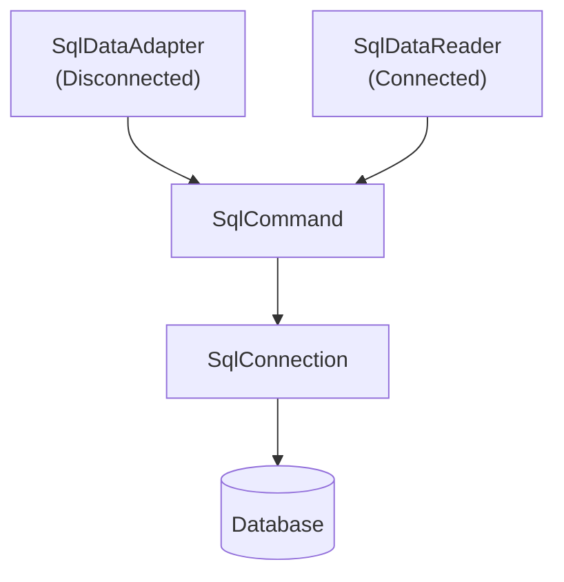
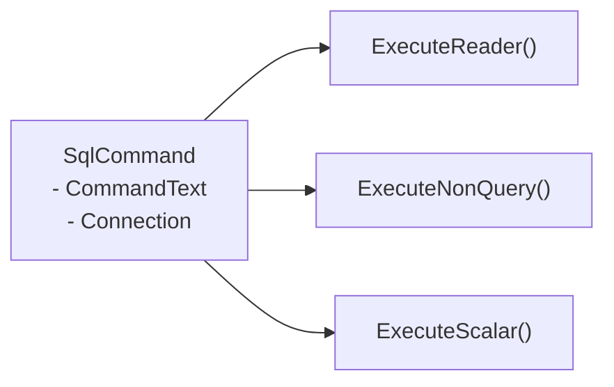

# SQL - C# Database Access

---

# ADO.NET Architecture



---

# SqlCommand



---
layout: two-cols
---

# Installation

- Visual Studio 2022
- Create Console Project in C#
- Nuget: MySql.Data

::right::


---
layout: two-cols
---

# Installation

- Visual Studio 2022
- Create Console Project in C#
- Nuget: MySql.Data

::right::


---


- In C# 9.0 (released with .NET 5), Microsoft introduced top-level statements, which allow you to write a C# program without explicitly defining a Program class or a Main method. https://learn.microsoft.com/en-us/dotnet/csharp/fundamentals/program-structure/top-level-statements

- Traditional

```csharp
using System;

class Program
{
    static void Main(string[] args)
    {
        Console.WriteLine("Hello, World!");
    }
}
```

- New way suitable for simple apps, demos, scripting, minimal APIs (like ASP.NET Core 6+).

```csharp
using System;

Console.WriteLine("Hello, World!");

```

---

# Connection String

- SERVER
- PORT
- USER
- PASSWORD
- DATABASE (Optional for create database and tables)

```csharp
AllowPublicKeyRetrieval=True;SslMode=none;server={0};port={1};user id={2};password={3}; database={4};
```

- MySQL 8 uses SSL/TLS in connection so it required public key for authentication
- For local development, you can ignore by `AllowPublicKeyRetrieval=True;SslMode=none;` but production it required SSL you can ignore `AllowPublicKeyRetrieval` but `SslMode=Required`

---


# Example 1

```csharp
using MySql.Data.MySqlClient;
using System.Data;
using System.Data.SqlClient;

String server = "127.0.0.1";
String database = "classicmodels";


String user = "root";
String password = "root";

String port = "3306";

String connectionString = String.Format("AllowPublicKeyRetrieval=True;SslMode=none;server={0};port={1};user id={2};" 
+ "password={3}; database={4} ;", server, port, user, password, database);
MySqlConnection conn = new MySqlConnection(connectionString);
conn.StateChange += (s, e) =>
{
    Console.WriteLine(e.CurrentState);
};
conn.Open();
conn.Close();

```

---

# Example 2

```csharp
MySqlConnection conn = new MySqlConnection(connectionString);
conn.Open();
String sql = "SELECT * FROM  classicmodels.orderdetails as o LIMIT 5";
MySqlCommand cmd = new MySqlCommand(sql, conn);
MySqlDataReader reader = cmd.ExecuteReader();
Console.WriteLine("OrderNumber\tProductCode\tQuantity Ordered\tPrice Each\tOrder Line Number");
while (reader.Read())
{
    Console.WriteLine($"{reader["orderNumber"]}\t\t{reader["productCode"]}\t\t{reader["quantityOrdered"]}" +
        $"\t\t{reader["priceEach"]}\t\t{reader["orderLineNumber"]}");
}
conn.Close();

```

---

# Example 3

```csharp
String database = "shop_db";
String connectionString = String.Format("AllowPublicKeyRetrieval=True;SslMode=none;server={0};port={1};user id={2};" +
    " password={3}; database={4}", server, port, user, password, database);
MySqlConnection conn = new MySqlConnection(connectionString);
conn.Open();
String sql = @"INSERT IGNORE INTO users (name, email) VALUES('Krit Chomaitong','krit.c@rumail.ru.ac.th')";
MySqlCommand cmd = new MySqlCommand(sql, conn);
cmd.ExecuteNonQuery();
conn.Close();

```

---

# Example 4

```csharp
String database = "shop_db";
String connectionString = String.Format("AllowPublicKeyRetrieval=True;SslMode=none;server={0};port={1};user id={2};" +
    " password={3}; database={4}", server, port, user, password, database);
MySqlConnection conn = new MySqlConnection(connectionString);
conn.Open();
String sql = @"UPDATE users SET email = 'krit.c@ru.ac.th' WHERE id = 1;";
MySqlCommand cmd = new MySqlCommand(sql, conn);
cmd.ExecuteNonQuery();
conn.Close();
```

---

# Example 5

```csharp
String database = "shop_db";
String connectionString = String.Format("AllowPublicKeyRetrieval=True;SslMode=none;server={0};port={1};user id={2};" +
    " password={3}; database={4}", server, port, user, password, database);
MySqlConnection conn = new MySqlConnection(connectionString);
conn.Open();
String sql = @"DELETE FROM users WHERE id = 1;";
MySqlCommand cmd = new MySqlCommand(sql, conn);
cmd.ExecuteNonQuery();
conn.Close();
```

---

# Example Projects

[Download](https://luckkrit.github.io/cos3103/DemoApp.zip)
