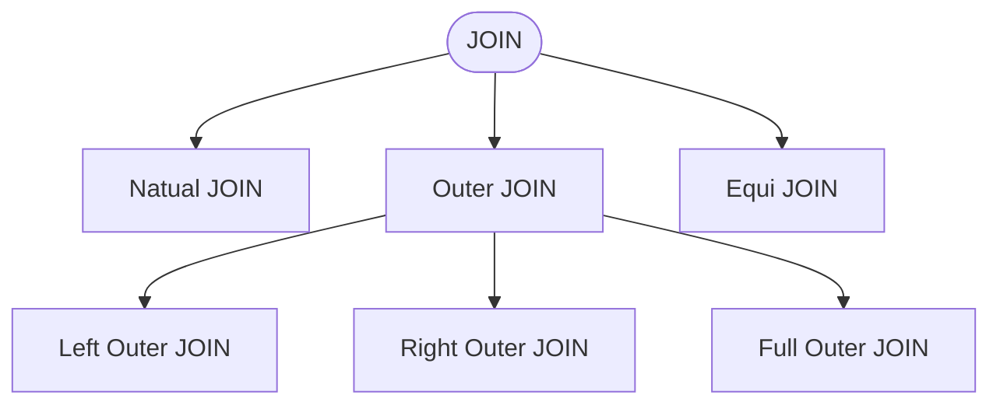

# JOIN

---

# Cartesian R x S

- ถ้ามีตาราง R x S

<div class="w-[400px]">


</div>

- สมการ Relational Algebra

<div class="w-[400px]">


</div>

---

# JOIN

- สมการ Relational Algebra

<div class="w-[400px]">


</div>

- SQL ที่ได้จะเป็นดังรูป

<div class="w-[400px]">


</div>

---

# JOIN

- OUTPUT

<div class="w-[400px]">


</div>

---
layout: two-cols
---

# FROM

- จากรูป ถ้าเราใช้ FROM มากกว่า 2 ตาราง เราตีความได้ว่า Finding all order details of  each order
```sql
select  r.orderNumber, s.orderNumber, 
            r.customerNumber, r.orderDate ,
            s.productCode, s.quantityOrdered 
from   orders as r , orderdetails as s
where r.orderNumber =  s.orderNumber
```


::right::

<div class="w-[150px] mx-auto">


</div>

---

# เพิ่มเงื่อนไข

- เพิ่มเงื่อนไข Name ลงไป


---

- OUTPUT

<div class="w-[400px]">


</div>


---
layout: two-cols
---

# FROM

- จากรูป ถ้าเราใช้ FROM มากกว่า 2 ตาราง เราตีความได้ว่า Finding all order details of orderNumber = 10100

```sql
select  r.orderNumber, s.orderNumber, 
            r.customerNumber, r.orderDate ,
            s.productCode, s.quantityOrdered 
from   orders as r , orderdetails as s
where r.orderNumber =  s.orderNumber and 
            r.orderNumber = 10100;

```


::right::

<div class="w-[150px] mx-auto">


</div>

---
layout: two-cols
---

# FROM

- จากรูป ถ้าเราใช้ FROM มากกว่า 2 ตาราง เราตีความได้ว่า Finding all order details of customerNumber = 103

```sql
Select  r.customerNumber, r.ordernumber, r.orderdate ,
            s.productCode, s.quantityOrdered 
from orders as r , orderdetails as s
where r.ordernumber =  s.orderNumber and 
r.customerNumber = 103

```


::right::

<div class="w-[150px] mx-auto">


</div>

---

# โจทย์

- ถ้าต้องการทราบชื่อของลูกค้าที่เป็นเจ้าใบสั่งซื้อสินค้า order หมายเลข10123 

<div class="w-[400px]">


</div>

<v-clicks>

```sql
select r.customerName from customers r, orders s 
WHERE r.customerNumber = s.customerNumber and s.orderNumber = 10123

```
</v-clicks>

---



<div class="w-[700px]">


</div>

- [ที่มา : https://stackoverflow.com/questions/42265203/difference-between-natural-full-outer-join-and-full-outer-join](https://stackoverflow.com/questions/42265203/difference-between-natural-full-outer-join-and-full-outer-join)

---

# EQUI JOIN

- Equi Join
  - เป็น join ที่มีเงื่อนไขเปรียบเทียบแบบ "="
  - เป็น ส่วนหนึ่งของ Inner Join 
  - ใช้เพื่อจับคู่แถวที่มีค่าคอลัมน์ เท่ากัน

- ความแตกต่างจาก Natural Join
  - Equi Join: ต้องระบุชื่อคอลัมน์ที่ใช้เปรียบเทียบ
  - Natural Join: ไม่ต้องระบุ — ระบบจะใช้คอลัมน์ที่ชื่อเหมือนกันอัตโนมัติ

---

# INNER/OUTER JOIN

<div class="w-[350px] mx-auto">


</div>

---

# JOIN vs. SUB QUERY

<div class="font-bold text-blue-500">

- JOINs are faster than a subquery and it is very rare that the opposite.
</div>

- In <span class="font-bold text-blue-500">JOINs the RDBMS calculates an execution plan, that can predict, what data should be loaded and how much it will take to processed and as a result this process save some times,</span> unlike the subquery there is no pre-process calculation and run all the queries and load all their data to do the processing.

- A JOIN is checked conditions first and then put it into table and displays; <span class="font-bold text-blue-500">where as a subquery take separate temp table internally and checking condition.</span>

- When joins are using, there should be connection between two or more than two tables and each table has a relation with other while subquery means query inside another query, has no need to relation, it works on columns and conditions.


---


# จากตัวอย่างก่อนหน้า ถ้าเพิ่ม column Name เข้าไป

- tab1 and tab2

```sql
CREATE TABLE tab1 (     numid INT PRIMARY KEY,     NAME varchar(255) );

INSERT INTO tab1 (numid,NAME) VALUES  (12,'twelve'),(14,'fourteen'),(10,'ten'),(11,'eleven');

CREATE TABLE tab2 (     numid INT PRIMARY KEY,     NAME varchar(255) );

INSERT INTO tab2 (numid,NAME) VALUES  (13,'thirteen'),(15,'fifteen'),(11,'eleven'),(12,'twelve');

```

---

# Cartesians vs JOIN vs Cross JOIN


- Cartesians

```sql
SELECT * FROM tab1, tab2; 
```

- JOIN

```sql
SELECT * FROM tab1 JOIN tab2;
```

- CROSS JOIN

```sql
SELECT * FROM tab1 CROSS JOIN tab2;
```

- ผลลัพธ์ทั้ง 3 ถือว่า Equivalent กัน (เฉพาะ JOIN ที่ไม่มี ON)

---
layout: two-cols
---

# Natural JOIN vs INNER JOIN

- Natural JOIN จะแสดงเฉพาะ column และข้อมูลที่ตรงกันเท่านั้น (ตัดข้อมูลที่ซ้ำกันออก)

```sql
SELECT * FROM tab1 NATURAL JOIN tab2;
```

<div class="w-[350px] mx-auto">


</div>

::right::

# &nbsp;

- INNER JOIN จะแสดง column ของทั้ง 2 ตาราง แต่ข้อมูลจะถูกกรองด้วยเงื่อนไข

```sql
SELECT * FROM tab1 INNER JOIN tab2 
ON tab1.numid = tab2.numid; 
```

<div class="w-[350px] mx-auto">


</div>

---

# Equi JOIN 


- EQUI JOIN - Uses only = operator:

```sql
SELECT * FROM tab1 INNER JOIN tab2 ON tab1.numid = tab2.numid;
SELECT * FROM tab1 LEFT JOIN tab2 ON tab1.numid = tab2.numid;
```