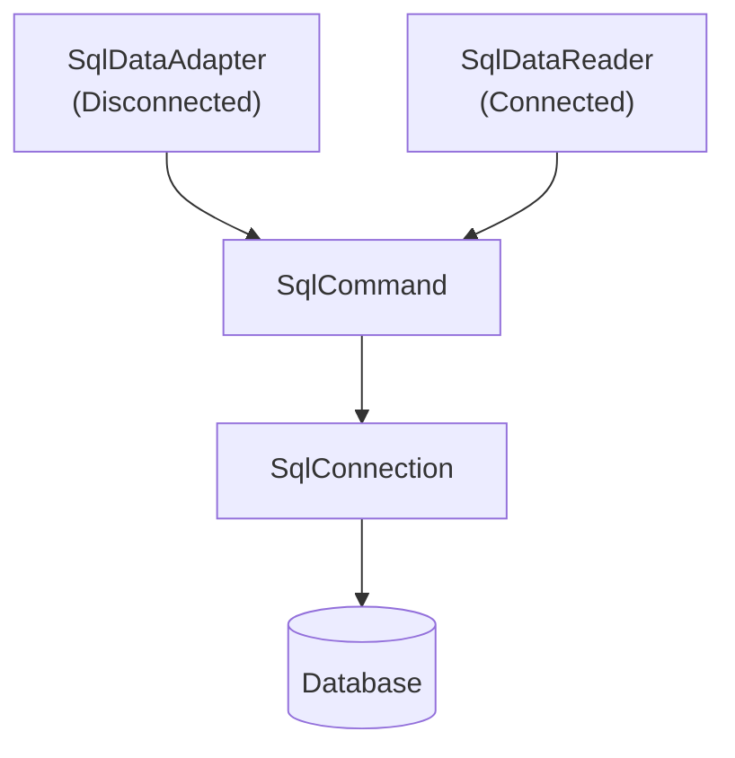
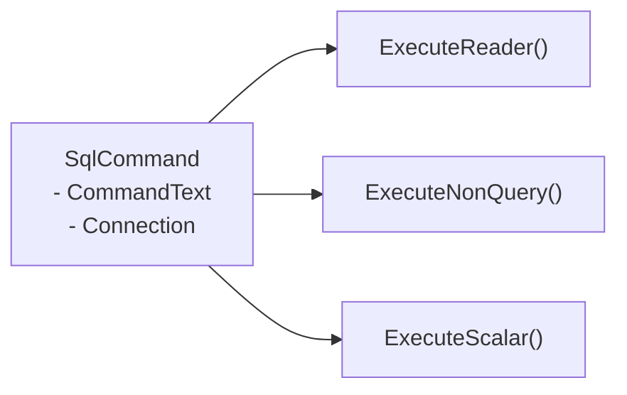

# SQL - Python Database Access

---

# SCHEMA & DATA

- ER Diagram

<div class="w-[400px] mx-auto">


</div>

[DOWNLOAD SQL](https://luckkrit.github.io/cos3103/sql/mysqlsampledatabase-classicmodels.sql)

[DOWNLOAD SQL2](https://luckkrit.github.io/cos3103/sql/sub_query-db-aco_db.sql)

---

# Requirements

- Python: >= 3.7
- MySQL: >= 5.7

---

# Why Access Databases from Python?

- Store and retrieve large amounts of structured data

- Automate repetitive database tasks

- Integrate data with applications

- Python needs a common way to talk to any SQL database → PEP 249

---

# What is PEP 249?

- PEP 249 = Python Database API Specification v2.0

- An official standard for how Python code interacts with SQL databases

- Defines:
    - How to connect
    - How to execute SQL
    - How to fetch results
    - Standard exceptions and types

- Purpose: Portability — write once, run on any database driver

---

# PEP 249: Key Concepts

- Connection Object

    - `.cursor(), .commit(), .rollback()`

- Cursor Object

    - `.execute(sql, params), .fetchone(), .fetchall()`

- Parameter Style

    - Placeholders like `%s` (for most drivers)

- Exceptions

    - `DatabaseError, OperationalError`, etc.

- https://peps.python.org/pep-0249/

---
layout: two-cols
---

# MySQL

```python
import pymysql

conn = pymysql.connect(host="localhost", user="root",
 password="1234", database="testdb")
cur = conn.cursor()
cur.execute("SELECT * FROM users WHERE id=%s", (1,))
print(cur.fetchall())
cur.close()
conn.close()
```

::right::

# SQLite3

```python
import sqlite3

conn = sqlite3.connect("test.db")
cur = conn.cursor()
cur.execute("SELECT * FROM users WHERE id=?", (1,))
print(cur.fetchall())
cur.close()
conn.close()

```

# PostgreSQL

```python
import psycopg2

conn = psycopg2.connect(
    host="localhost",database="testdb",
    user="postgres", password="1234"
)
cur = conn.cursor()
cur.execute("SELECT * FROM users WHERE id=%s", (1,))
print(cur.fetchall())
cur.close()
conn.close()

```


---

# Installation

- Use PyMySQL to connect to MySQL which is easier to understand than mysql-connector-python. 

```bash
python3 -m pip install PyMySQL cryptography
```
---

# How to connect to MySQL

- Provides
    - MySQL Server IP
    - PORT
    - USER
    - PASSWORD
    - DATABASE

```python
import pymysql
connection = pymysql.connect(
    host='localhost',
    port=3306,
    user='root',
    password='root',
    database='classicmodels',
    cursorclass=pymysql.cursors.DictCursor  # Return dictionary of row that access by column name
)
print(connection) # <pymysql.connections.Connection object at 0x0000027C68615EE0>
connection.close() # Close connection
```

---

# Create Database

```python
import pymysql
connection = pymysql.connect(
    host='localhost',
    port=3306,
    user='root',
    password='root',
    # database='classicmodels',
    cursorclass=pymysql.cursors.DictCursor  # Return dictionary of row that access by column name
)
cursor = connection.cursor()
cursor.execute("CREATE DATABASE IF NOT EXISTS shop_db")
cursor.close()
connection.close() # Close connection
```

---

# Not specify database name during connection

````md magic-move

```python
import pymysql

# Connect without specifying database
connection = pymysql.connect(
    host='localhost',
    user='username',
    password='password'
    # No database specified
)

cursor = connection.cursor()

# Select database using SQL command
cursor.execute("USE shop_db")

# Now you can run queries on tables in shop_db
cursor.execute("SELECT * FROM products")
results = cursor.fetchall()
```

```python
import pymysql

connection = pymysql.connect(
    host='localhost',
    user='username',
    password='password'
)

# Select database using PyMySQL method
connection.select_db('shop_db')

cursor = connection.cursor()
cursor.execute("SELECT * FROM products")
results = cursor.fetchall()
```

```python
# You can also use fully qualified table names without USE
cursor.execute("SELECT * FROM shop_db.products")
cursor.execute("SELECT * FROM shop_db.orders")
```

````

---

# Create Table

```python
import pymysql
connection = pymysql.connect(
    host='localhost',
    port=3306,
    user='root',
    password='root',
    database='shop_db',
    cursorclass=pymysql.cursors.DictCursor  # Return dictionary of row that access by column name
)
cursor = connection.cursor()
create_users_table = """
            CREATE TABLE IF NOT EXISTS users (id INT AUTO_INCREMENT PRIMARY KEY,name VARCHAR(100) NOT NULL,
                email VARCHAR(100) UNIQUE NOT NULL,created_at TIMESTAMP DEFAULT CURRENT_TIMESTAMP
            )
            """
create_products_table = """
            CREATE TABLE IF NOT EXISTS products (id INT AUTO_INCREMENT PRIMARY KEY,name VARCHAR(200) NOT NULL,
                price DECIMAL(10, 2) NOT NULL,stock INT DEFAULT 0,created_at TIMESTAMP DEFAULT CURRENT_TIMESTAMP
            )
            """
cursor.execute(create_users_table)
cursor.execute(create_products_table)
cursor.close()
connection.close() # Close connection
```


---


# Select

````md magic-move
```python
import pymysql
connection = pymysql.connect(
    host='localhost',
    port=3306,
    user='root',
    password='root',
    database='classicmodels',
    cursorclass=pymysql.cursors.DictCursor  # Return dictionary of row that access by column name
)

cursor = connection.cursor()
cursor.execute('select * from customers')
results = cursor.fetchall()

print(results[0]) # row 0

cursor.close()
connection.close()
```

```python
import pymysql
connection = pymysql.connect(
    host='localhost',
    port=3306,
    user='root',
    password='root',
    database='classicmodels',
    cursorclass=pymysql.cursors.DictCursor  # Return dictionary of row that access by column name
)

cursor = connection.cursor()
cursor.execute('select * from customers')
results = cursor.fetchall()

for key, value in results[0].items():
    print(f"Key = {key}, Value = {value}")

cursor.close()
connection.close()
```

```python

import pymysql
connection = pymysql.connect(
    host='localhost',
    port=3306,
    user='root',
    password='root',
    database='classicmodels',
    cursorclass=pymysql.cursors.DictCursor  # Return dictionary of row that access by column name
)

cursor = connection.cursor()
cursor.execute('select * from customers')
results = cursor.fetchall()

for row in results: # print all rows
    print(row)

cursor.close()
connection.close()
```

```python
import pymysql
connection = pymysql.connect(
    host='localhost',
    port=3306,
    user='root',
    password='root',
    database='classicmodels',
    cursorclass=pymysql.cursors.DictCursor  # Return dictionary of row that access by column name
)

cursor = connection.cursor()
cursor.execute('select * from customers')
results = cursor.fetchall()

for row in results: # print all rows
    for key, value in row.items():
        print(f"Key = {key}, Value = {value}\n")


cursor.close()
connection.close()
```

````

---

# Select 

```python
import pymysql
connection = pymysql.connect(
    host='localhost',
    port=3306,
    user='root',
    password='root',
    database='classicmodels',
    cursorclass=pymysql.cursors.DictCursor  # Return dictionary of row that access by column name
)

cursor = connection.cursor()
cursor.execute('select * from customers where creditLimit between %s and %s', [100000, 110000])
results = cursor.fetchall()

for row in results: # print all rows
    for key, value in row.items():
        print(f"Key = {key}, Value = {value}\n")


cursor.close()
connection.close()
```

---

# Select 

```python
import pymysql
connection = pymysql.connect(
    host='localhost',
    port=3306,
    user='root',
    password='root',
    database='classicmodels',
    cursorclass=pymysql.cursors.DictCursor  # Return dictionary of row that access by column name
)

cursor = connection.cursor()
cursor.execute('select sum(creditLimit) from customers where creditLimit between %s and %s', [100000, 110000])
results = cursor.fetchone()

results = cursor.fetchone()
print(results)


cursor.close()
connection.close()
```

---

# Questions

1. Find all payments made in 2004 with amounts greater than $10,000.
2. List all offices located in the USA, showing city, state, and territory information.
3. Show all products with their product line descriptions and images.
4. List all customers with their total payment amounts, including customers who haven't made any payments.

---

# Answers

```sql
SELECT customerNumber, checkNumber, paymentDate, amount
FROM payments 
WHERE YEAR(paymentDate) = 2004 AND amount > 10000;
```

```sql
SELECT officeCode, city, state, territory, phone
FROM offices 
WHERE country = 'USA'
ORDER BY state, city;
```

```sql
SELECT p.productName, p.productCode, pl.textDescription, pl.htmlDescription, pl.image
FROM products p
INNER JOIN productlines pl ON p.productLine = pl.productLine
ORDER BY pl.productLine, p.productName;
```

```sql
SELECT c.customerName, c.customerNumber, 
       COALESCE(SUM(pay.amount), 0) as totalPaid
FROM customers c
LEFT JOIN payments pay ON c.customerNumber = pay.customerNumber
GROUP BY c.customerNumber, c.customerName
ORDER BY totalPaid DESC;
```

---

# Insert

```python
import pymysql
connection = pymysql.connect(
    host='localhost',
    port=3306,
    user='root',
    password='root',
    database='shop_db',
    cursorclass=pymysql.cursors.DictCursor  # Return dictionary of row that access by column name
)
cursor = connection.cursor()
users_data = [
            ('John Smith', 'john.smith@email.com'),
            ('Sarah Johnson', 'sarah.johnson@email.com'),
            ('Mike Davis', 'mike.davis@email.com'),
            ('Emily Brown', 'emily.brown@email.com'),
            ('David Wilson', 'david.wilson@email.com')
        ]
sql = "INSERT INTO users (name, email) VALUES (%s, %s)"
for name, email in users_data:
    cursor.execute(sql, (name, email))
            
cursor.close()
connection.commit() # Commit to save changes
connection.close() 
```

---

# Update

```python
import pymysql
connection = pymysql.connect(
    host='localhost',
    port=3306,
    user='root',
    password='root',
    database='shop_db',
    cursorclass=pymysql.cursors.DictCursor  # Return dictionary of row that access by column name
)
cursor = connection.cursor()

        
sql = "UPDATE users SET name = %s WHERE id = 5"
name = "Krit Chomaitong" 
cursor.execute(sql, (name))
            
cursor.close()
connection.commit() # Commit to save changes
connection.close() 
```


---

# Delete

```python
import pymysql
connection = pymysql.connect(
    host='localhost',
    port=3306,
    user='root',
    password='root',
    database='shop_db',
    cursorclass=pymysql.cursors.DictCursor  # Return dictionary of row that access by column name
)
cursor = connection.cursor()

        
sql = "DELETE FROM users WHERE id = %s"
cursor.execute(sql, ( 5))
            
cursor.close()
connection.commit() # Commit to save changes
connection.close() 
```

---

# Questions

- From shop_db database:
1. Insert 5 products to table products with name = '', stock = 0 and price = 0
2. Update name of products to non empty string by random name
3. Update stock and price by random, the price range are between 5 and 100 and not be zero
4. Delete some of products by id that are even numbers
5. Delete some of products by price that less than 10

---
layout: two-cols
---

# Example of Active Record Pattern

```python
import pymysql
class Database:
    def __init__(self, host='localhost', user='root', 
    password='root', database='shop_db'):
        try:
            self.connection = pymysql.connect(
                host=host, user=user, password=password,
                database=database, 
                cursorclass=pymysql.cursors.DictCursor
            )
            print(f"Connected to database: {database}")
        except Exception as e:
            print(f"Failed to connect to database: {e}")
            raise
    
    def execute_non_query(self, sql, params=None):
        cursor = self.connection.cursor()
        try:
            affected_rows = cursor.execute(sql, params)
            self.connection.commit()
            return affected_rows
```
::right::
```python
        except:
            self.connection.rollback()
        finally:
            cursor.close()

    def execute_query(self, sql, params=None):
        cursor = self.connection.cursor()
        try:
            cursor.execute(sql, params)
            return cursor.fetchall()
        finally:
            cursor.close() 

    def execute_single(self, sql, params=None):
        cursor = self.connection.cursor()
        try:
            cursor.execute(sql, params)
            result = cursor.fetchone()
            return result
        except Exception as e:
            print(f"Error executing single query: {e}")
            raise
        finally:
            cursor.close()
    
    def close(self):
        self.connection.close()

```

---
layout: two-cols
---

```python
class User:
    def __init__(self,db: Database):
        self.db = db

    def add_user(self,name, email):
        affected_rows = self.db.execute_non_query("INSERT INTO users (name, email) VALUES (%s, %s)",(name, email))
        return affected_rows

    def update_user(self, id, name, email):
        affected_rows = self.db.execute_non_query("UPDATE users SET name = %s, email = %s WHERE id = %s",(name, email, id))
        return affected_rows

    def delete_user(self, id):
        affected_rows = self.db.execute_non_query("DELETE FROM users WHERE id = %s",(id))
        return affected_rows

```

::right::

```python
    def get_user_by_email(self, email):
        user = self.db.execute_single("SELECT * FROM users WHERE email = %s",(email))
        return user

    def get_user_by_name(self, name):
        user = self.db.execute_query("SELECT * FROM users WHERE name LIKE %s",(f"%{name}%"))
        return user

    def get_user_by_id(self, id):
        user = self.db.execute_single("SELECT * FROM users WHERE id = %s",(id))
        return user

    def get_users(self):
        users = self.db.execute_query("SELECT * FROM users ")
        return users
```

---
layout: section
---

# SQL - C# Database Access

---

# ADO.NET Architecture



---

# SqlCommand



---
layout: two-cols
---

# Installation

- Visual Studio 2022
- Create Console Project in C#
- Nuget: MySql.Data

::right::


---
layout: two-cols
---

# Installation

- Visual Studio 2022
- Create Console Project in C#
- Nuget: MySql.Data

::right::


---


- In C# 9.0 (released with .NET 5), Microsoft introduced top-level statements, which allow you to write a C# program without explicitly defining a Program class or a Main method. https://learn.microsoft.com/en-us/dotnet/csharp/fundamentals/program-structure/top-level-statements

- Traditional

```csharp
using System;

class Program
{
    static void Main(string[] args)
    {
        Console.WriteLine("Hello, World!");
    }
}
```

- New way suitable for simple apps, demos, scripting, minimal APIs (like ASP.NET Core 6+).

```csharp
using System;

Console.WriteLine("Hello, World!");

```

---

# Connection String

- SERVER
- PORT
- USER
- PASSWORD
- DATABASE (Optional for create database and tables)

```csharp
AllowPublicKeyRetrieval=True;SslMode=none;server={0};port={1};user id={2};password={3}; database={4};
```

- MySQL 8 uses SSL/TLS in connection so it required public key for authentication
- For local development, you can ignore by `AllowPublicKeyRetrieval=True;SslMode=none;` but production it required SSL you can ignore `AllowPublicKeyRetrieval` but `SslMode=Required`

---


# Example 1

```csharp
using MySql.Data.MySqlClient;
using System.Data;
using System.Data.SqlClient;

String server = "127.0.0.1";
String database = "classicmodels";


String user = "root";
String password = "root";

String port = "3306";

String connectionString = String.Format("AllowPublicKeyRetrieval=True;SslMode=none;server={0};port={1};user id={2};" 
+ "password={3}; database={4} ;", server, port, user, password, database);
MySqlConnection conn = new MySqlConnection(connectionString);
conn.StateChange += (s, e) =>
{
    Console.WriteLine(e.CurrentState);
};
conn.Open();
conn.Close();

```

---

# Example 2

```csharp
MySqlConnection conn = new MySqlConnection(connectionString);
conn.Open();
String sql = "SELECT * FROM  classicmodels.orderdetails as o LIMIT 5";
MySqlCommand cmd = new MySqlCommand(sql, conn);
MySqlDataReader reader = cmd.ExecuteReader();
Console.WriteLine("OrderNumber\tProductCode\tQuantity Ordered\tPrice Each\tOrder Line Number");
while (reader.Read())
{
    Console.WriteLine($"{reader["orderNumber"]}\t\t{reader["productCode"]}\t\t{reader["quantityOrdered"]}" +
        $"\t\t{reader["priceEach"]}\t\t{reader["orderLineNumber"]}");
}
conn.Close();

```

---

# Example 3

```csharp
String database = "shop_db";
String connectionString = String.Format("AllowPublicKeyRetrieval=True;SslMode=none;server={0};port={1};user id={2};" +
    " password={3}; database={4}", server, port, user, password, database);
MySqlConnection conn = new MySqlConnection(connectionString);
conn.Open();
String sql = @"INSERT IGNORE INTO users (name, email) VALUES('Krit Chomaitong','krit.c@rumail.ru.ac.th')";
MySqlCommand cmd = new MySqlCommand(sql, conn);
cmd.ExecuteNonQuery();
conn.Close();

```

---

# Example 4

```csharp
String database = "shop_db";
String connectionString = String.Format("AllowPublicKeyRetrieval=True;SslMode=none;server={0};port={1};user id={2};" +
    " password={3}; database={4}", server, port, user, password, database);
MySqlConnection conn = new MySqlConnection(connectionString);
conn.Open();
String sql = @"UPDATE users SET email = 'krit.c@ru.ac.th' WHERE id = 1;";
MySqlCommand cmd = new MySqlCommand(sql, conn);
cmd.ExecuteNonQuery();
conn.Close();
```

---

# Example 5

```csharp
String database = "shop_db";
String connectionString = String.Format("AllowPublicKeyRetrieval=True;SslMode=none;server={0};port={1};user id={2};" +
    " password={3}; database={4}", server, port, user, password, database);
MySqlConnection conn = new MySqlConnection(connectionString);
conn.Open();
String sql = @"DELETE FROM users WHERE id = 1;";
MySqlCommand cmd = new MySqlCommand(sql, conn);
cmd.ExecuteNonQuery();
conn.Close();
```

---

# Example Projects

[Download](https://luckkrit.github.io/cos3103/DemoApp.zip)
