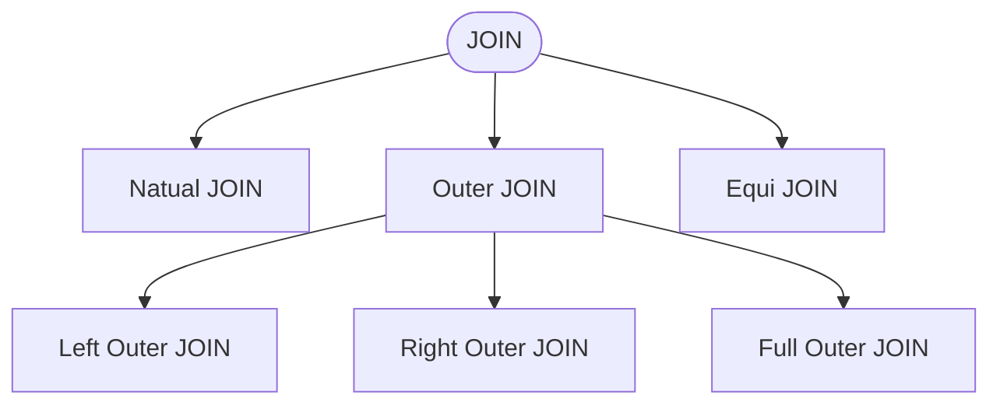

# SQL - SELECT

---

# SCHEMA & DATA

[DOWNLOAD](https://luckkrit.github.io/cos3103/sql/mysqlsampledatabase-classicmodels.sql)

---
layout: section
---

# IS NULL OPERATOR

---
layout: two-cols
---

# IS NULL Operator

1. If the value is NULL, the expression returns true. Otherwise, it returns false. 
2. Cannot use equality (=) comparison to check for null values

- กรณี salesRepEmployeeNumber IS NULL

```sql
SELECT customerName, country, salesRepEmployeeNumber 
FROM customers 
WHERE salesRepEmployeeNumber IS NULL; 
```

- กรณี salesRepEmployeeNumber IS NOT NULL

```sql
SELECT customerName, country, salesRepEmployeeNumber 
FROM  customers 
WHERE salesRepEmployeeNumber IS NOT NULL; 
```

::right::

<div class="w-[300px] mx-auto">


</div>

---
layout: section
---

# Arithmetic Expression

---

# BETWEEN

```sql
SELECT * 
FROM classicmodels.orderdetails
where priceEach between 150 and 200
```


---

- 2 SQL นี้ให้ผลลัพธ์เหมือนกัน

- อันที่ 1
```sql
SELECT quantityOrdered , 
              priceEach ,  
             (priceEach*quantityOrdered)-(priceEach*quantityOrdered)*0.1 
FROM  classicmodels.orderdetails
where  (priceEach*quantityOrdered) < 800 and
            (priceEach*quantityOrdered) > 700 ;
```

- อันที่ 2
```sql
SELECT quantityOrdered , 
              priceEach ,  
             (priceEach*quantityOrdered) * 0.9
FROM  classicmodels.orderdetails
where  (priceEach*quantityOrdered) < 800 and
            (priceEach*quantityOrdered) > 700 ;
```

---

- เขียนให้เข้าใจง่ายขึ้น
```sql
SELECT quantityOrdered , 
              priceEach ,  
             quantityOrdered,
             (priceEach * quantityOrdered) as total_price,
             (priceEach * quantityOrdered) * 0.9 as discounted_price
FROM  classicmodels.orderdetails
where  (priceEach*quantityOrdered) < 800 and
            (priceEach*quantityOrdered) > 700 ;
```

---
layout: section
---

# Aggregate Function

---

# AVG - FUNCTION AVERAGE

- จากตัวอย่างที่แล้ว ถ้าจะคำนวณค่าเฉลี่ยของราคา

```sql
SELECT quantityOrdered , 
       priceEach
             -- ,avg(priceEach) as avgPrice
FROM  classicmodels.orderdetails
where  (priceEach*quantityOrdered) < 800 and
            (priceEach*quantityOrdered) > 700 ;

```

- ถ้าเราทำการ uncomment ออกจะเกิดอะไรขึ้น

```sql

SELECT quantityOrdered , 
       priceEach
             ,avg(priceEach) as avgPrice
FROM  classicmodels.orderdetails
where  (priceEach*quantityOrdered) < 800 and
            (priceEach*quantityOrdered) > 700 ;
```

---

- มันจะแสดงบรรทัดเดียว เพราะว่า

1. AVG(priceEach) is an aggregate function, which summarizes all rows into a single value.

"Aggregate = การรวมข้อมูลหลายแถวให้เป็นค่าผลลัพธ์เดียว"

2. But you're also selecting quantityOrdered and priceEach, which are non-aggregated columns.

3. Most databases will return an error like "not a GROUP BY expression", but some SQL engines (e.g., MySQL in certain modes) may just return 1 row with arbitrary values for non-aggregated columns and the correct AVG.

- เราจะพูดถึง GROUP BY ในภายหลัง
- ดังนั้น Aggregate ฟังก์ชั่นจะประกอบด้วย MIN, MAX, COUNT, SUM, AVG

---

- ผลลัพธ์ของ AVG คือค่าเฉลี่ย

|quantityOrdered|priceEach|
|---------------|---------|
|22             |36.29    |
|22             |33.19    |
|20             |39.80    |
|20             |39.02    |

- วิธีที่ 1

```sql
SELECT avg(priceEach) as avgPrice
FROM  classicmodels.orderdetails
where  (priceEach*quantityOrdered) < 800 and
            (priceEach*quantityOrdered) > 700 ;
```

- วิธีที่ 2

```sql
SELECT (36.29+33.19+39.80+39.02)/4 as avgPrice
```
---

# SUM

```sql
SELECT SUM(priceEach) as totalPrice
FROM  classicmodels.orderdetails
where  (priceEach*quantityOrdered) < 800 and
            (priceEach*quantityOrdered) > 700 ;
```

- ผลลัพธ์ที่ได้คือ 148.30

---

# MIN

```sql
SELECT MIN(priceEach) as minPrice
FROM  classicmodels.orderdetails
where  (priceEach*quantityOrdered) < 800 and
            (priceEach*quantityOrdered) > 700 ;
```

- ผลลัพธ์ที่ได้คือ 33.19

---

# MAX

```sql
SELECT MAX(priceEach) as maxPrice
FROM  classicmodels.orderdetails
where  (priceEach*quantityOrdered) < 800 and
            (priceEach*quantityOrdered) > 700 ;
```

- ผลลัพธ์ที่ได้คือ 39.80


---

# COUNT Function

- นับจำนวนแถว

```sql

SELECT  
        count(*)
FROM    classicmodels.customers
```

- แล้วถ้าเป็นแบบนี้

```sql
SELECT  
        count(salesRepEmployeeNumber)
FROM    classicmodels.customers

```

- ผลลัพธ์ที่ได้จำนวนไม่เท่ากัน เพราะว่า COUNT(*) includes NULLs, but COUNT(column) does not.

---

# IF Function

- จากตัวอย่างก่อนหน้าสามารถเขียนโดยใช้ IF ช่วยได้

- IF(condition, ถ้าจริง return อะไร, ถ้าเท็จ return อะไร)

    
```sql
SELECT COUNT(IF(salesRepEmployeeNumber IS NULL, 1, 1)) AS null_count
FROM classicmodels.customers;

```

- จากกรณีนี้ ถ้า salesRepEmployeeNumber IS NULL ก็ให้คืนค่า 1 ถ้าไม่ใช่ ก็คือให้คืนค่า 1


---
layout: section
---

# IN OPERATOR

---
layout: two-cols
---

# IN OPERATOR

- Query: Retrieve the contact of all employees who work on salesRepEmployeeNumber 1370, 1501, or 1504 

```sql
SELECT contactLastName,   
        salesRepEmployeeNumber
FROM    classicmodels.customers
where   salesRepEmployeeNumber 
			in (1370 ,1501 ,1504 )
```

::right::


---

# NOT IN OPERATOR

- Query: Retrieve the contact of all employees who not work on salesRepEmployeeNumber 1370, 1501, or 1504

```sql
SELECT contactLastName,   
        salesRepEmployeeNumber
FROM    classicmodels.customers
where   salesRepEmployeeNumber 
        not in (1370 ,1501 ,1504 )
```

- ให้ผลลัพธ์ที่ตรงข้ามกัน


- จากรูปข้างบน ถ้า 2 จำนวนมาบวกกันจะได้ 100 แถว แล้วถ้าเลือกข้อมูลทั้งหมดออกมา

<div>


</div>

- อีก 22 แถวที่เหลือคือ ?

<v-clicks>

- อีก 22 แถวคือแถวที่มี salesRepEmployeeNumber เป็น NULL ดังนั้น NOT IN ไม่ได้รวม NULL ไปด้วย
</v-clicks>

---

- ถ้าต้องการให้รวมแถวที่มี salesRepEmployeeNumber ที่เป็น NULL ไปด้วยควรจะทำยังไง

````md magic-move
```sql {*}
SELECT contactLastName,   
        salesRepEmployeeNumber
FROM    classicmodels.customers
where   salesRepEmployeeNumber 
        not in (1370 ,1501 ,1504 ) 
```

```sql {5}
SELECT contactLastName,   
        salesRepEmployeeNumber
FROM    classicmodels.customers
where   salesRepEmployeeNumber 
        not in (1370 ,1501 ,1504, NULL )
```

```sql {5}
SELECT contactLastName,   
        salesRepEmployeeNumber
FROM    classicmodels.customers
where   salesRepEmployeeNumber 
        not in (1370 ,1501 ,1504 ) OR salesRepEmployeeNumber IS NULL
```

````

---

- จากตัวอย่างก่อนหน้า ใน IN (1370, 1501, 1504, NULL) จะไม่แสดงผลลัพธ์อะไรออกมา เพราะ SQL ไม่รู้จะเปรียบเทียบ NULL ยังไง

---

IN กับ OR สามารถเขียนให้ผลลัพธ์ได้เหมือนกัน

- ตัวอย่างที่ 1
```sql

SELECT contactLastName,   
        salesRepEmployeeNumber
FROM    classicmodels.customers
where   salesRepEmployeeNumber 
        in (1370 ,1501 ,1504 ) 

```

- ตัวอย่างที่ 2

```sql

SELECT contactLastName,   
        salesRepEmployeeNumber
FROM    classicmodels.customers
where   salesRepEmployeeNumber = 1370 or salesRepEmployeeNumber = 1501 or salesRepEmployeeNumber = 1504 

```


---
layout: section
---

# Cartesian Products

---

# FROM Clause (Multiple Tables)

```sql
SELECT 	<attribute list>
	FROM 	<table list>

```

- Table list may include
    - Names of 1 or more tables
    - Subquery for joined tables

---
layout: two-cols
---

# จากการดึงค่า 2 ตาราง

- ตัวอย่างที่ 1

```sql
SELECT * FROM classicmodels.offices;

```


::right::

# &nbsp;

- ตัวอย่างที่ 2

```sql

SELECT * FROM classicmodels.productlines;
```


---

- ถ้าเขียนแบบนี้

```sql
SELECT *  FROM offices , productlines
```


- จะได้ 7 x 7 = 49 rows และมีการซ้ำกัน


---

- ถ้าจะให้อธิบายการทำงานในลักษณะของ Algorithm


---

# Types of JOIN



<div class="w-[400px] mx-auto">


</div>

- [ที่มา : https://stackoverflow.com/questions/42265203/difference-between-natural-full-outer-join-and-full-outer-join](https://stackoverflow.com/questions/42265203/difference-between-natural-full-outer-join-and-full-outer-join)

---


# JOIN Example

- tab1 and tab2

```sql
-- Create tab1 table
CREATE TABLE tab1 (
    numid INT PRIMARY KEY
);

-- Insert data into tab1
INSERT INTO tab1 (numid) VALUES 
(12),(14),(10),(11);

-- Create tab2 table
CREATE TABLE tab2 (
    numid INT PRIMARY KEY
);

-- Insert data into tab2
INSERT INTO tab2 (numid) VALUES 
(13),(15),(11),(12);
```

---

# INNER JOIN/JOIN

<div class="w-[350px] mx-auto">


</div>

- แบบ 1
```sql
SELECT * FROM tab1
INNER JOIN tab2
ON tab1.NUMID=tab2.NUMID;
```

- แบบ 2
```sql
SELECT * FROM tab1
JOIN tab2
ON tab1.NUMID=tab2.NUMID;
```

---

# LEFT OUTER JOIN/LEFT JOIN

<div class="w-[350px] mx-auto">


</div>

- แบบ 1
```sql
SELECT * FROM tab1
LEFT OUTER JOIN tab2
ON tab1.NUMID=tab2.NUMID;
```

- แบบ 2
```sql
SELECT * FROM tab1
LEFT JOIN tab2
ON tab1.NUMID=tab2.NUMID;
```

---

# RIGHT OUTER JOIN/RIGHT JOIN

<div class="w-[350px] mx-auto">


</div>

- แบบ 1

```sql
SELECT * FROM tab1
RIGHT OUTER JOIN tab2
ON tab1.NUMID=tab2.NUMID;
```

- แบบ 2

```sql
SELECT * FROM tab1
RIGHT JOIN tab2
ON tab1.NUMID=tab2.NUMID;
```

---

# FULL OUTER JOIN

<div class="w-[350px] mx-auto">


</div>

- **MySQL does not support!**

```sql
SELECT * FROM tab1
FULL OUTER JOIN tab2
ON tab1.NUMID=tab2.NUMID;

```

---

# LEFT EXCLUSIVE JOIN

- ทำยังไงให้ได้เฉพาะ tab1 แม้จะยัง join กันอยู่

<div class="w-[350px] mx-auto">


</div>

<v-clicks>

```sql
SELECT * FROM tab1
LEFT OUTER JOIN tab2
ON tab1.NUMID=tab2.NUMID
WHERE tab2.NUMID IS NULL;
```

</v-clicks>

---

# RIGHT EXCLUSIVE JOIN

- ทำยังไงให้ได้เฉพาะ tab2 แม้จะยัง join กันอยู่

<div class="w-[350px] mx-auto">


</div>

<v-clicks>

```sql
SELECT * FROM tab1
RIGHT OUTER JOIN tab2
ON tab1.NUMID=tab2.NUMID
WHERE tab1.NUMID IS NULL;
```

</v-clicks>

---

# จากตัวอย่างก่อนหน้า ถ้าเพิ่ม column Name เข้าไป

- tab1 and tab2

```sql
CREATE TABLE tab1 (     numid INT PRIMARY KEY,     NAME varchar(255) );

INSERT INTO tab1 (numid,NAME) VALUES  (12,'twelve'),(14,'fourteen'),(10,'ten'),(11,'eleven');

CREATE TABLE tab2 (     numid INT PRIMARY KEY,     NAME varchar(255) );

INSERT INTO tab2 (numid,NAME) VALUES  (13,'thirteen'),(15,'fifteen'),(11,'eleven'),(12,'twelve');

```

---

# Cartesians vs JOIN vs Cross JOIN


- Cartesians

```sql
SELECT * FROM tab1, tab2; 
```

- JOIN

```sql
SELECT * FROM tab1 JOIN tab2;
```

- CROSS JOIN

```sql
SELECT * FROM tab1 CROSS JOIN tab2;
```

- ผลลัพธ์ทั้ง 3 ถือว่า Equivalent กัน (เฉพาะ JOIN ที่ไม่มี ON)

---
layout: two-cols
---

# Natural JOIN vs INNER JOIN

- Natural JOIN จะแสดงเฉพาะ column และข้อมูลที่ตรงกันเท่านั้น (ตัดข้อมูลที่ซ้ำกันออก)

```sql
SELECT * FROM tab1 NATURAL JOIN tab2;
```

<div class="w-[350px] mx-auto">


</div>

::right::

# &nbsp;

- INNER JOIN จะแสดง column ของทั้ง 2 ตาราง แต่ข้อมูลจะถูกกรองด้วยเงื่อนไข

```sql
SELECT * FROM tab1 INNER JOIN tab2 
ON tab1.numid = tab2.numid; 
```

<div class="w-[350px] mx-auto">


</div>

---

# Equi JOIN 


- EQUI JOIN - Uses only = operator:

```sql
SELECT * FROM tab1 INNER JOIN tab2 ON tab1.numid = tab2.numid;
SELECT * FROM tab1 LEFT JOIN tab2 ON tab1.numid = tab2.numid;
```

---
layout: two-cols
---

# ตัวอย่างข้อมูล

```sql
-- Create Department table
CREATE TABLE departments (
    dept_name VARCHAR(50) PRIMARY KEY,
    manager INT,
    budget DECIMAL(10,2)
);

-- Create Employee table
CREATE TABLE employees (
    employee_id INT PRIMARY KEY,
    first_name VARCHAR(50) NOT NULL,
    last_name VARCHAR(50) NOT NULL,
    salary DECIMAL(10,2),
    department VARCHAR(50)
);

```

::right::

# &nbsp;

```sql

-- Insert data into departments table
INSERT INTO departments (dept_name, manager, budget) 
VALUES
('ACCOUNTING', 100, 300000.00),
('IT', 101, 250000.00),
('SALES', 104, 700000.00);

-- Insert data into employees table
INSERT INTO employees (employee_id, first_name, 
last_name, salary, department) VALUES
(100, 'James', 'Smith', 78000.00, 'ACCOUNTING'),
(101, 'Mary', 'Sexton', 82000.00, 'IT'),
(102, 'Chun', 'Yen', 80500.00, 'ACCOUNTING'),
(103, 'Agnes', 'Miller', 95000.00, 'IT'),
(104, 'Dmitry', 'Komer', 120000.00, 'SALES');
```

---

# SQL Order of Operations (JOIN)

- จาก SQL นี้กระบวนการทำงานจะเป็นอย่างไร

```sql
SELECT e.employee_id, e.last_name 
FROM employees e 
JOIN departments d ON e.department = d.dept_name 
WHERE d.budget > 275000;
```

---

# SQL Order of Operations (JOIN)

- ใช้ข้อมูลจากตัวอย่างก่อนหน้า เริ่มด้วย FROM

```sql {2}
SELECT * 
FROM employees e 
JOIN departments d ON e.department = d.dept_name 
 WHERE BUDGET > 275000
```

<div class="w-[400px] mx-auto">


</div>

<Precedence :steps="['FROM',]" />

---

# SQL Order of Operations (JOIN)

- ตามด้วย JOIN

```sql {2,3}
SELECT * 
FROM employees e 
JOIN departments d ON e.department = d.dept_name 
 WHERE BUDGET > 275000
```

<div class="w-[400px] mx-auto">


</div>

<div class="flex">
<div class="w-[250px] mx-auto">


</div>

<div class="w-[400px] mx-auto">


</div>
</div>

<Precedence :steps="['FROM','JOIN']" />

---

# SQL Order of Operations (JOIN)

- ตามด้วย WHERE 

```sql {2-4}
SELECT * 
FROM employees e 
JOIN departments d ON e.department = d.dept_name 
 WHERE BUDGET > 275000
```


<div class="w-[400px] mx-auto">


</div>

<Precedence :steps="['FROM','JOIN', 'WHERE']" />

---

# SQL Order of Operations (JOIN)

- ตามด้วย WHERE 

```sql
SELECT e.employee_id, e.last_name  
FROM employees e 
JOIN departments d ON e.department = d.dept_name 
 WHERE BUDGET > 275000
```


<div class="w-[400px] mx-auto">


</div>

<Precedence :steps="['FROM','JOIN', 'WHERE', 'SELECT']" />

---

# SQL Order of Operations (JOIN)

- Find the orders and its details

<div class="w-[100px] mx-auto">


</div>

---
layout: two-cols
---

# SQL Order of Operations (JOIN)

- Find the orders and its details

<div class="w-[150px] mx-auto">


</div>

::right::

# &nbsp;

- เราสามารถเขียน SQL ได้ดังนี้

- แบบที่ 1

```sql
select a.customerNumber, a.ordernumber, a.orderdate 
, b.productCode, b.quantityOrdered 
from orders as a  
join  orderdetails as b on a.ordernumber =  b.orderNumber
```

- แบบที่ 2


```sql
select a.customerNumber, a.ordernumber, 
a.orderdate , b.productCode, b.quantityOrdered 
from orders as a , orderdetails as b
where a.ordernumber =  b.orderNumber;
```

- จาก SQL ทั้ง 2 มีข้อดี - ข้อเสียอย่างไร? โดยถ้าวัดจาก 
  1. แบบไหนทำงานได้เร็วกว่า
  2. แบบไหนอ่านง่ายกว่า

---

# SQL Order of Operations (JOIN)

- Find the orders and its details of customerNumber is 103.

- เราสามารถเขียน SQL ได้ดังนี้

- แบบที่ 1

```sql
select a.customerNumber, a.ordernumber, a.orderdate , b.productCode, b.quantityOrdered 
from orders as a  
join  orderdetails as b on a.ordernumber =  b.orderNumber 
where a.customerNumber = 103

```

- แบบที่ 2

```sql
select a.customerNumber, a.ordernumber, a.orderdate , b.productCode, b.quantityOrdered 
from orders as a , orderdetails as b
where a.ordernumber =  b.orderNumber and a.customerNumber = 103

```


- จาก SQL ทั้ง 2 มีข้อดี - ข้อเสียอย่างไร? โดยถ้าวัดจาก 
  1. แบบไหนทำงานได้เร็วกว่า
  2. แบบไหนอ่านง่ายกว่า