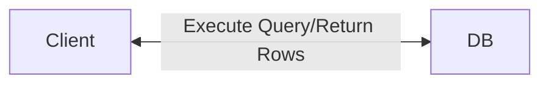
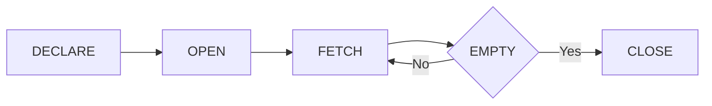

# SQL - Views, Stored Procedure

---

# SCHEMA & DATA

- ER Diagram

<div class="w-[400px] mx-auto">


</div>

[DOWNLOAD SQL](https://luckkrit.github.io/cos3103/sql/mysqlsampledatabase-classicmodels.sql)

[DOWNLOAD SQL2](https://luckkrit.github.io/cos3103/sql/sub_query-db-aco_db.sql)

---
layout: section
---

# Three Schema Architecture of DBMS

---
layout: two-cols
---
# Three Schema Architecture

- Used in modern web applications and enterprises system
- <span v-mark.highlight.red>It’s designed to separate the user's view of the data from the physical storage</span>
    - Scalability
    - Flexibility
    - Security

::right::


---
layout: two-cols
---

# Three Schema Architecture

1. VIEW LEVEL
2. LOGICAL LEVEL
3. PHYSICAL LEVEL

::right::


---
layout: two-cols
---

# Three Schema Architecture

1. VIEW LEVEL
    - Different users may see different views (V1, V2, ... Vm) of the same data. 
    - <span v-mark.highlight.red>Protects users from seeing irrelevant or sensitive data.</span>

2. LOGICAL LEVEL
3. PHYSICAL LEVEL

::right::


---
layout: two-cols
---

# Three Schema Architecture


1. VIEW LEVEL
2. LOGICAL LEVEL
    - Describes the structure of the whole database using tables (relations) like R1, R2, ..., Rn.
    - <span v-mark.highlight.red>Provides a complete logical design of the database.</span>
3. PHYSICAL LEVEL

::right::


---
layout: two-cols
---

# Three Schema Architecture


1. VIEW LEVEL
2. LOGICAL LEVEL
3. PHYSICAL LEVEL
    - The actual storage – how data is saved in files, indexes (F1, F2, ..., Fp) on the hard disk.
    - <span v-mark.highlight.red>Optimizes performance and space usage.</span>

::right::


---
layout: two-cols
---

# Three Schema Architecture

- VL–LL Mapping: 
    - This shows how each view maps to the logical data.
    - <span v-mark.highlight.red>Ensures Logical Data Independence: </span>
        - Can change the logical structure (like adding a column) without changing user views.

- LL–PL Mapping:
    - Shows how the logical schema maps to the physical storage.
    - <span v-mark.highlight.red>Ensures Physical Data Independence:</span>
        - Can change how data is stored (e.g., use indexing or different files) without changing the logical structure.

::right::


---

# Example of Logical Data Independence

- Logical Data Independence


---

# Example of Logical Data Independence

- Logical Data Independence


---

# Example of Physical Data Independence

- Physical Data Independence


---

# Example of Physical Data Independence

- Physical Data Independence


---
layout: section
---

# View

<!-- # Views in SQL

- A view is a “virtual” table that is derived from other tables

## Rules

- Allows for limited update operations 
    - Since the table may not physically be stored

- Allows full query operations 


-->


---

# Views in SQL

- What is views?
    - View Logically represents subsets of data from one or more tables

- View = External View in Three schema architecture

<div class="w-[400px] mx-auto">


</div>

---

# Querying a View

- How view works?

<div class="w-[500px] mx-auto">


</div>

--- 

# Why use Views?

- To restrict data access
- To make complex queries easy
- To provide data independence
- To present different views of the same data

---
layout: two-cols
---

# DML Limitations on Views

- You can perform `INSERT`, `UPDATE`, and `DELETE` on a view only if it is a simple view:
    - Based on a single table (no `JOIN`)

    - Has no `GROUP BY`, `HAVING`, or `DISTINCT`

    - Has no aggregate functions
        - `AVG()`, `SUM()`, `COUNT()`, etc.

    - Has no calculated/derived columns
        - `salary * 12`

    - Includes all `NOT NULL` columns from the base table (for `INSERT`)

::right::


 **DML (Data Manipulation Language)** : `SELECT`, `INSERT`, `UPDATE`, `DELETE`


---

# How to create a View

```sql
CREATE [OR REPLACE] VIEW [db_name.]view_name [(column_list)]
AS
    select-statement;
```

- `CREATE VIEW` specify the name of the view that you want to create after the keywords
- `REPLACE` option if you want to replace an existing view if the view already exists. If the view does not exist, the `OR REPLACE` has no effect.

---
layout: two-cols-header
---

# Example 1

::left::
```sql
CREATE VIEW salePerOrder AS
    SELECT 
        orderNumber, 
        SUM(quantityOrdered * priceEach) total
    FROM
        orderDetails
    GROUP by orderNumber
    ORDER BY total DESC;
```

<div class="w-[150px] mx-auto">


</div>
::right::

<div class="flex mx-auto gap-3">


</div>


<div class="w-[350px] mx-auto">


</div>

---

# Example 1

- Check information schema


```sql
SELECT *
FROM information_schema.TABLES
WHERE TABLE_SCHEMA = 'classicmodels'
```

<div class="w-[350px] mx-auto">


</div>

---

# Example 1

```sql
SELECT `saleperorder`.`orderNumber`,
    `saleperorder`.`total`
FROM `classicmodels`.`saleperorder`;
```

<div class="w-[350px] mx-auto">


</div>

---
layout: two-cols
---

# Example 2

- Creating a view based on another view

```sql
CREATE VIEW bigSalesOrder AS
    SELECT 
        orderNumber, 
        ROUND(total,2) as total
    FROM
        salePerOrder
    WHERE
        total > 60000;


```

- Select from `bigsalesorder`

```sql
SELECT orderNumber, total FROM bigSalesOrder;
```

::right::


---
layout: two-cols
---

# Example 3

- Creating a view with `JOIN`

```sql
CREATE OR REPLACE VIEW customerOrders AS 
	SELECT orderNumber, customerName, 
               	SUM(quantityOrdered * priceEach) total 
	FROM orderDetails 
	INNER JOIN orders o USING (orderNumber) 
	INNER JOIN customers USING (customerNumber) 
	GROUP BY orderNumber;
```

- Select from `customerOrders`

```sql
SELECT `customerorders`.`orderNumber`,
    `customerorders`.`customerName`,
    `customerorders`.`total`
FROM `classicmodels`.`customerorders`;
```

::right::


---
layout: two-cols
---

# Example 4

- Creating a view with a subquery 

```sql
CREATE OR REPLACE VIEW aboveAvgProducts 
(vproductCode,vproductName,vbuyPrice)
AS
    SELECT 
        productCode, 
        productName, 
        buyPrice
    FROM
        products
    WHERE
        buyPrice > (
            SELECT AVG(buyPrice)
            FROM products)
    ORDER BY buyPrice DESC;

```

- Select from `aboveAvgProducts`

```sql
SELECT `aboveavgproducts`.`vproductCode`,
    `aboveavgproducts`.`vproductName`,
    `aboveavgproducts`.`vbuyPrice`
FROM `classicmodels`.`aboveavgproducts`;

```

::right::


---
layout: two-cols
---

# Update a view with a subquery

```sql
UPDATE aboveavgproducts
SET  vproductName = "11111 LanciaA Delta 16V" 
WHERE vproductcode = 'S10_1949';
```

- OUTPUT?

<div v-click class="text-red-500">

Error Code: 1288. The target table aboveavgproducts of the UPDATE is not updatable
</div>

::right::

<div v-click>


- You can perform `INSERT`, `UPDATE`, and `DELETE` on a view only if it is a simple view:
    - Based on a single table (no `JOIN`)

    - Has no `GROUP BY`, `HAVING`, or `DISTINCT`

    - Has no aggregate functions
        - `AVG()`, `SUM()`, `COUNT()`, etc.

    - Has no calculated/derived columns
        - `salary * 12`

    - Includes all `NOT NULL` columns from the base table (for `INSERT`)

</div>

---
layout: two-cols
---

# Update a view with a subquery

- Solution create another view

```sql
 CREATE OR REPLACE VIEW aboveProducts      
    (vproductCode,vproductName)AS    
	SELECT     productCode,         productName     
	FROM products;
```

- Update via `aboveProducts` view

```sql
UPDATE aboveProducts
SET  vproductName = "22222 LanciaA Delta 16V" 
WHERE vproductcode = 'S10_1949';
```

::right::


---
layout: two-cols
---

# Drop View

```sql
DROP VIEW aboveavgproducts;
```

::right::


---
layout: section
---

# Stored Procedure

---
layout: two-cols
---

# Without Stored Procedure

- Use `SELECT` statement

```sql
SELECT 
    customerName, 
    city, 
    state, 
    postalCode, 
    country
FROM
    customers
ORDER BY customerName;
```

::right::



- Disadvantage
    - High network traffic usage
    - Less secure
    - Harder to maintain
        - `SELECT` queries are scattered in code.
    - and more

---

# What is Stored Procedure in MySQL?

- <span v-mark.highlight.red>A stored procedure contains a sequence of SQL commands stored in the database catalog so that it can be invoked later by a program</span>

<!-- - Stored procedures are declared using the following syntax:
```sql
Create Procedure <proc-name> 
		(param_spec1, param_spec2, …, param_specn ) 
begin
	-- execution code	
end;
```

- where each param_spec is of the form:
		 `[in | out | inout]  <param_name>  <param_type>`
    - `in` mode: allows you to pass values into the procedure,
    - `out` mode: allows you to pass value back from procedure to the calling program -->
---

# Advantages of Stored Procedure

- Reduce network traffic
    - Stored procedures help reduce the network traffic between applications and MySQL Server. Because instead of sending multiple lengthy SQL statements, applications have to send only the name and parameters of stored procedures.
- Centralize business logic in the database
    - You can use the stored procedures to implement business logic that is reusable by multiple applications. The stored procedures help reduce the efforts of duplicating the same logic in many applications and make your database more consistent.
- Make database more secure
    - The database administrator can grant appropriate privileges to applications that only access specific stored procedures without giving any privileges on the underlying tables.

---

# Disadvantages of Stored Procedure

- Resource usages
    - If you use many stored procedures, the memory usage of every connection will increase substantially.
    - Besides, overusing a large number of logical operations in the stored procedures will increase the CPU usage because the MySQL is not well-designed for logical operations.
- Troubleshooting
    - It’s difficult to debug stored procedures. Unfortunately, MySQL does not provide any facilities to debug stored procedures like other enterprise database products such as Oracle and SQL Server.
- Maintenances
    - Developing and maintaining stored procedures often requires a specialized skill set that not all application developers possess. This may lead to problems in both application development and maintenance.


---
layout: two-cols
---

# Create Stored Procedure

````md magic-move

```sql
-- For MySQL Workbench

CREATE PROCEDURE GetCustomers()
BEGIN
	SELECT 
		customerName, 
		city, 
		state, 
		postalCode, 
		country
	FROM
		customers
	ORDER BY customerName;    
END
```

```sql
-- For MySQL CLI

DELIMITER $$

CREATE PROCEDURE GetCustomers()
BEGIN
	SELECT 
		customerName, 
		city, 
		state, 
		postalCode, 
		country
	FROM
		customers
	ORDER BY customerName;    
END$$
DELIMITER ;

```
````

::right::

<div v-click>

- WHY is `DELIMITER` used?
    - MySQL uses `;` as the default statement terminator.
    - But inside `BEGIN...END`, you also use `;` to end `SQL` lines.

    - So the `DELIMITER` command temporarily changes the terminator (like to `$$`) to avoid confusion.

</div>

---

# Create Stored Procedure in MySQL Workbench

- Using MySQL Workbench

<div class="w-[500px] mx-auto">


</div>
---
layout: two-cols
---

# Call Stored Procedure

- Call `GetCustomers`

```sql
CALL `classicmodels`.`GetCustomers`();
```

::right::


---
layout: two-cols
---

# Drop Stored Procedure

```sql
DROP PROCEDURE IF EXISTS GetCustomers;

```

::right::


---

# Parameters

```sql {*|2,3}
CREATE PROCEDURE GetCustomerShipping (
	IN    pCustomerNUmber INT, 
	OUT pShipping  VARCHAR(50) 
 )
BEGIN
    DECLARE   customerCountry VARCHAR(100);
    SELECT      country
     INTO           customerCountry 
    FROM  customers
    WHERE      customerNumber = pCustomerNUmber;

     CASE customerCountry
	   WHEN  'USA' THEN
	            SET pShipping = '2-day Shipping';
	   WHEN 'Canada' THEN
	            SET pShipping = '3-day Shipping';
	    ELSE
	            SET pShipping = '5-day Shipping';
     END CASE;
END


```

--- 

# Type of Variables

```sql
-- System Variables
SELECT @@version;            -- MySQL version
SELECT @@hostname;           -- Server hostname
SELECT @@port;              -- Server port
SELECT @@datadir;           -- Data directory path

-- Session variable (outside procedure)
SET @shipping = 100;
SELECT @shipping;

-- Local variable (inside procedure)
DELIMITER $$
CREATE PROCEDURE TestProc()
BEGIN
    DECLARE shipping INT;  -- Local variable, no @
    SET shipping = 100;
    SELECT shipping;
END$$
DELIMITER ;

```
---

# Local Variable

````md magic-move

```sql {*|5-6}
-- แบบที่ 1

CREATE PROCEDURE GetTotalOrder()
BEGIN
    DECLARE totalOrder INT;
    SET totalOrder = 0;
    SELECT COUNT(*) 
    INTO totalOrder
    FROM orders;
    SELECT totalOrder;
END
```

```sql {*|5}
-- แบบที่ 2

CREATE PROCEDURE GetTotalOrder()
BEGIN
    DECLARE totalOrder INT DEFAULT 0;
    SELECT COUNT(*) 
    INTO totalOrder
    FROM orders;
    SELECT totalOrder;
END
```

````


---
layout: two-cols
---

# IF - THEN


```sql {*|11-14}
CREATE PROCEDURE GetCustomerLevel(
    IN  pCustomerNumber INT, 
    OUT pCustomerLevel  VARCHAR(20))
BEGIN
    DECLARE credit DECIMAL(10,2) DEFAULT 0;

    SELECT creditLimit 
    INTO credit
    FROM customers
    WHERE customerNumber = pCustomerNumber;

    IF credit > 50000 THEN
        SET pCustomerLevel = 'PLATINUM';
    END IF;
END
```

::right::

- IF - ELSEIF - ELSE

```sql
IF expression THEN
   statements;
ELSEIF elseif-expression THEN
   elseif-statements;
ELSE
  else-statements;
END IF;
```

---

# WHILE Loop

```sql {*|10,14}
CREATE PROCEDURE LoadCalendars(
    startDate DATE,
    day INT
)
BEGIN

    DECLARE counter INT DEFAULT 1;
    DECLARE dt DATE DEFAULT startDate;
    
    WHILE counter <= day DO
        CALL InsertCalendar(dt);
        SET counter = counter + 1;
        SET dt = DATE_ADD(dt,INTERVAL 1 day);
    END WHILE;

END
```
---

# Repeat (DO - WHILE Loop)

```sql {*|6,9,10}
CREATE PROCEDURE RepeatDemo()
BEGIN
    DECLARE counter INT DEFAULT 1;
    DECLARE result VARCHAR(100) DEFAULT '';
    
    REPEAT
        SET result = CONCAT(result,counter,',');
        SET counter = counter + 1;
    UNTIL counter >= 10
    END REPEAT;
    
    -- display result
    SELECT result;
END
```

---

# LOOP 

```sql {*|9,11,16,20}
CREATE PROCEDURE LoopDemo()
BEGIN
    DECLARE x INT;
    DECLARE str VARCHAR(255);
    
    SET x = 1;
    SET str = '';
    
    loop_label: LOOP
        IF x > 10 THEN
            LEAVE loop_label;
        END IF;
        
        SET x = x + 1;
        IF (x mod 2) THEN
            ITERATE loop_label;
        ELSE
            SET str = CONCAT(str,x,',');
        END IF;
    END LOOP;
    SELECT str;
END
```

---
layout: two-cols
---

# CASE

```sql {*|12,13,15,17,19}
CREATE PROCEDURE GetCustomerShipping (
	IN    pCustomerNUmber INT, 
	OUT pShipping  VARCHAR(50) 
 )
BEGIN
    DECLARE   customerCountry VARCHAR(100);
    SELECT      country
     INTO           customerCountry 
    FROM  customers
    WHERE      customerNumber = pCustomerNUmber;

     CASE customerCountry
	   WHEN  'USA' THEN
	            SET pShipping = '2-day Shipping';
	   WHEN 'Canada' THEN
	            SET pShipping = '3-day Shipping';
	    ELSE
	            SET pShipping = '5-day Shipping';
     END CASE;
END


```

::right::

- NOTE
    - MySQL uses @variable for session variables - no DECLARE needed outside procedures
    - In MySQL, session variables (with @) are automatically created when first used
```sql
CALL GetCustomerShipping(
           112,
           @shipping );
SELECT @shipping;
```

---

# Example

````md magic-move

```sql {*}
CREATE  PROCEDURE get_order_by_cust(
    IN cust_no INT,
    OUT shipped INT,
    OUT canceled INT,
    OUT resolved INT,
    OUT disputed INT)
BEGIN
        -- shipped
        SELECT count(*) INTO shipped FROM orders WHERE customerNumber = cust_no AND status = 'Shipped';
        -- canceled
        SELECT count(*) INTO canceled FROM orders WHERE customerNumber = cust_no AND status = 'Canceled';
        -- resolved
        SELECT count(*) INTO resolved FROM orders WHERE customerNumber = cust_no AND status = 'Resolved';
        -- disputed
        SELECT count(*) INTO disputed FROM orders WHERE customerNumber = cust_no AND status = 'Disputed';
END
```

```sql {*}
-- single query
CREATE PROCEDURE `get_order_by_cust`(
    IN cust_no INT,
    OUT shipped INT,
    OUT canceled INT,
    OUT resolved INT,
    OUT disputed INT)
BEGIN
    SELECT
        SUM(CASE WHEN status = 'Shipped' THEN 1 ELSE 0 END),
        SUM(CASE WHEN status = 'Canceled' THEN 1 ELSE 0 END),
        SUM(CASE WHEN status = 'Resolved' THEN 1 ELSE 0 END),
        SUM(CASE WHEN status = 'Disputed' THEN 1 ELSE 0 END)
    INTO shipped, canceled, resolved, disputed
    FROM orders
    WHERE customerNumber = cust_no
        AND status IN ('Shipped', 'Canceled', 'Resolved', 'Disputed');
END
```

```sql {*}
-- Alternative using COUNT with IF:
CREATE PROCEDURE `get_order_by_cust`(
    IN cust_no INT,
    OUT shipped INT,
    OUT canceled INT,
    OUT resolved INT,
    OUT disputed INT)
BEGIN
    SELECT
        COUNT(IF(status = 'Shipped', 1, NULL)),
        COUNT(IF(status = 'Canceled', 1, NULL)),
        COUNT(IF(status = 'Resolved', 1, NULL)),
        COUNT(IF(status = 'Disputed', 1, NULL))
    INTO shipped, canceled, resolved, disputed
    FROM orders
    WHERE customerNumber = cust_no;
END
```

```sql {*}
-- To handle NULL values safely:
CREATE PROCEDURE `get_order_by_cust`(
    IN cust_no INT,
    OUT shipped INT,
    OUT canceled INT,
    OUT resolved INT,
    OUT disputed INT)
BEGIN
    -- Initialize to 0 to avoid NULL
    SET shipped = 0, canceled = 0, resolved = 0, disputed = 0;
    
    SELECT
        COALESCE(SUM(status = 'Shipped'), 0),
        COALESCE(SUM(status = 'Canceled'), 0),
        COALESCE(SUM(status = 'Resolved'), 0),
        COALESCE(SUM(status = 'Disputed'), 0)
    INTO shipped, canceled, resolved, disputed
    FROM orders
    WHERE customerNumber = cust_no;
END
```

````

```sql
CALL get_order_by_cust(141,@shipped,@canceled,@resolved,@disputed);
SELECT @shipped,@canceled,@resolved,@disputed;
```

- https://www.geeksforgeeks.org/sql/ifnull-vs-coalesce/

---

# Handle NULL

- `COALESCE` comes from the English word meaning "to come together" or "to merge/unite into one".

```sql
SELECT COALESCE(NULL, NULL, 'Hello', 'World');  
-- Returns: 'Hello' (first non-NULL value)

SELECT COALESCE(NULL, 5, 10);  
-- Returns: 5

SELECT COALESCE(NULL, NULL, NULL);  
-- Returns: NULL (all values are NULL)
```


---
layout: two-cols
---

# SUBROUTINE

````md magic-move

```sql
-- Create table calendars
CREATE TABLE calendars( id INT AUTO_INCREMENT, 
fulldate DATE UNIQUE, 
day TINYINT NOT NULL, 
month TINYINT NOT NULL, 
quarter TINYINT NOT NULL, 
year INT NOT NULL, 
PRIMARY KEY(id) );
```

```sql
-- Insert date into table calendars
CREATE PROCEDURE InsertCalendar(dt DATE)
BEGIN
    INSERT INTO calendars(
        fulldate,
        day,
        month,
        quarter,
        year
    )
    VALUES(
        dt, 
        EXTRACT(DAY FROM dt),
        EXTRACT(MONTH FROM dt),
        EXTRACT(QUARTER FROM dt),
        EXTRACT(YEAR FROM dt)
    );
END
```

```sql
-- Loop insert from start date for n days
CREATE PROCEDURE LoadCalendars(
    startDate DATE, 
    day INT
)
BEGIN
    
    DECLARE counter INT DEFAULT 1;
    DECLARE dt DATE DEFAULT startDate;

    WHILE counter <= day DO
        CALL InsertCalendar(dt);
        SET counter = counter + 1;
        SET dt = DATE_ADD(dt,INTERVAL 1 day);
    END WHILE;
END
```

````

::right::


<div v-show="$slidev.nav.clicks === 1">

- Extract Date

```sql
    select  EXTRACT(DAY FROM 
    '2019-01-01'); -- 1
    select  EXTRACT(MONTH FROM 
    '2019-02-01'); -- 2
    select  EXTRACT(QUARTER FROM 
    '2019-11-01'); -- 4
    select  EXTRACT(Year FROM 
    '2019-01-01'); -- 2019
```
</div>

<div v-show="$slidev.nav.clicks === 2">

- Call

```sql
CALL LoadCalendars('2019-01-01',31);
```
</div>

<div v-click.at="2" class="w-[200px] mx-auto">


</div>

---

# Cursor

<!-- - A cursor allows you to iterate a set of rows returned by a query and process each row individually.
- MySQL cursor is read-only, non-scrollable and asensitive.
    1. Read-only: you cannot update data in the underlying table through the cursor.
    2. Non-scrollable: you can only fetch rows in the order determined by the SELECT statement. You cannot fetch rows in the reversed order. In addition, you cannot skip rows or jump to a specific row in the result set.
    3. Asensitive: there are two kinds of cursors: 
        - asensitive cursor and insensitive cursor. An asensitive cursor points to the actual data
        - an insensitive cursor uses a temporary copy of the data. 
    - <span v-mark.highlight.red>An asensitive cursor performs faster than an insensitive cursor because it does not have to make a temporary copy of data. However, any change that made to the data from other connections will affect the data that is being used by an asensitive cursor, therefore, it is safer if you do not update the data that is being used by an asensitive cursor. MySQL cursor is asensitive.</span> -->
- A cursor is a database pointer that lets you process a query result row-by-row in procedural SQL code.
    - Cursors give looping capability in SQL procedures.


---

# Cursor Lifecycle



```sql
DECLARE cursor_name CURSOR FOR SELECT_statement; -- Define the cursor and the query it runs.

OPEN cursor_name; -- Run the query and store the result set.

FETCH cursor_name INTO variables_list; -- Retrieve one row into variables.

CLOSE cursor_name; -- Free the resources.
```

---

# Cursor Types

- Variants:

    - By movement:
        - Non-scrollable (forward only) — simplest, least memory use.
        - Scrollable — can fetch previous/absolute/relative rows.
    - By update ability:
        - Read-only — cannot change rows through the cursor.
        - Updatable — allows UPDATE/DELETE WHERE CURRENT OF.
    - By sensitivity to changes:
        - SENSITIVE — sees table changes while fetching.
        - INSENSITIVE — snapshot at open time.
        - ASENSITIVE — DB chooses best option.

---

# Cursor: Advantages & Disadvantages

- Advantages

    - Lets you do complex row-by-row logic.
    - Works when set-based SQL alone isn’t enough.

- Disadvantages

    - Slower than set-based queries.
    - Higher memory and locking overhead.
    - Not supported equally in all DBMS (e.g., MySQL’s limitations).

---

# Cursor: When to Use / Avoid

- Use when:

    - You need procedural row-by-row operations.

    - Business logic per row is unavoidable.

- Avoid when:

    - You can rewrite the operation in pure SQL set-based form (faster, more scalable).

---

# Cursor: MySQL

- <span v-mark.highlight.red>MySQL cursor is read-only, non-scrollable and asensitive.</span>

---
layout: two-cols
---

# Example

```sql
DELIMITER $$

CREATE PROCEDURE createEmailList (
    INOUT emaillist varchar(4000)
)

BEGIN
    DECLARE finished INTEGER DEFAULT 0;
    DECLARE emailAddress varchar(100) DEFAULT "";
    
    -- declare cursor for employee email
    DECLARE curEmail
        CURSOR FOR
            SELECT email FROM employees;
    
```

::right::

```sql
    -- declare NOT FOUND handler
    DECLARE CONTINUE HANDLER
    FOR NOT FOUND SET finished = 1;
    
    OPEN curEmail;
    
    getEmail: LOOP
        FETCH curEmail INTO emailAddress;
        IF finished = 1 THEN
            LEAVE getEmail;
        END IF;
        -- build email list
        SET emaillist = CONCAT(emailAddress,
        ";",emaillist);
    END LOOP getEmail;
    
    CLOSE curEmail;

END$$

DELIMITER ;
```

- CALL

```sql
SET @emaillist = "";
CALL createEmailList(@emaillist);
SELECT @emaillist;
```

---
layout: two-cols
---

# Example 2

- use schema `aco_db`

```sql
DELIMITER $$
CREATE PROCEDURE `sumCommission`( IN lowB decimal(10,2), 
IN upperB decimal(10,2) )
BEGIN
    DECLARE finished INTEGER DEFAULT 0;
    DECLARE agent_codeV varchar(100) default "";
    DECLARE AGENT_NAMEV varchar(100) default "";
    DECLARE COMMISSIONV decimal(10,2) DEFAULT 0.0;
    DECLARE sumCOMMISSIONV decimal(10,2) DEFAULT 0.0;
    
    DECLARE agent_code_L varchar(1000) default "";
    DECLARE AGENT_NAME_L varchar(1000) default "";
    DECLARE COMMISSION_L varchar(1000) default "";
    
    -- declare cursor for employee email
    DECLARE curAgents CURSOR FOR SELECT agent_code,
        AGENT_NAME,COMMISSION FROM agents;
    -- declare NOT FOUND handler
    DECLARE CONTINUE HANDLER 
            FOR NOT FOUND SET finished = 1;
    
    OPEN curAgents;

```

::right::

```sql
    getAgent: LOOP
        FETCH curAgents INTO agent_codeV,AGENT_NAMEV,
        COMMISSIONV;
        IF finished = 1 THEN 
            LEAVE getAgent;
        END IF;
        
        IF (COMMISSIONV > lowB AND COMMISSIONV < upperB) 
        THEN 
            SET agent_code_L = CONCAT(agent_code_L,";",
                agent_codeV);
            SET AGENT_NAME_L = CONCAT(AGENT_NAME_L,";",
                AGENT_NAMEV);
            SET COMMISSION_L = CONCAT(COMMISSION_L,";",
                CAST(COMMISSIONV AS CHAR));
            SET sumCOMMISSIONV = sumCOMMISSIONV + 
                COMMISSIONV;
        END IF;
    END LOOP getAgent;
    
    CLOSE curAgents;

    SELECT sumCOMMISSIONV, agent_code_L;  -- table 1
    SELECT AGENT_NAME_L, COMMISSION_L;    -- table 2
END$$
DELIMITER ;
```

---

- Call `sumCommission`

```sql
CALL sumCommission( 0.1 , 0.4);
```


---

- Use `group_concat`

```sql
select (select sum(commission)  from agents where commission > 0.1 and commission < 0.4) as sumCOMMISSIONV, 
group_concat(';',agent_code) as agent_code_L from agents where commission > 0.1 and commission < 0.4 ;

SELECT  group_concat(';',agent_name SEPARATOR '') as AGENT_NAME_L,group_concat(';',commission SEPARATOR '') 
as COMMISSION_L FROM agents where commission > 0.1 and commission < 0.4;


```


---
layout: two-cols
---

# Example 3

```sql
-- Create database
CREATE DATABASE IF NOT EXISTS aod_company;

-- Use the database
USE aod_company;

-- Drop the table if it exists
DROP TABLE IF EXISTS employee;

-- Create employee table
CREATE TABLE employee (
    id INT PRIMARY KEY,
    name VARCHAR(50) NOT NULL,
    superid INT NULL,
    salary DECIMAL(10,2) NULL,
    bdate DATE NOT NULL,
    dno INT NOT NULL
);

```

::right::

```sql
-- Create deptsal table
CREATE TABLE IF NOT EXISTS deptsal (
    dnumber INT PRIMARY KEY,
    totalsalary DECIMAL(10,2)
);

-- Insert data into deptsal table
INSERT INTO deptsal (dnumber, totalsalary) VALUES
(1, 100000.00),
(2, 50000.00),
(3, 130000.00);

-- Insert data 
INSERT INTO employee (id, name, superid, 
salary, bdate, dno) VALUES
(1, 'john', 3, 100000.00, '1960-01-01', 1), 
(2, 'mary', 3,  50000.00, '1964-12-01', 3), 
(3, 'bob', NULL, 80000.00, '1974-02-07', 3), 
(4, 'tom', 1,  50000.00, '1978-01-17', 2),  
(5, 'bill', NULL, NULL, '1985-01-20', 1);   

```

---

# Example 3

```sql
DELIMITER |

CREATE PROCEDURE giveRaise (IN amount DOUBLE)
BEGIN
    DECLARE done INT DEFAULT 0;
    DECLARE eid INT;
    DECLARE sal INT;
    DECLARE emprec CURSOR FOR SELECT id, salary FROM employee;
    DECLARE CONTINUE HANDLER FOR NOT FOUND SET done = 1;
    
    OPEN emprec;
    REPEAT
        FETCH emprec INTO eid, sal;
        UPDATE employee 
        SET salary = sal + ROUND(sal * amount)
        WHERE id = eid;
    UNTIL done
    END REPEAT;
END |

```

```sql
call giveRaise(0.1)
```

---

# Functions

- Functions are declared using the following syntax:

```sql
function <function-name> (param_spec1, …, param_speck) 
		returns <return_type>  
		[not] deterministic             allow optimization if same output 
                          for the same input (use RAND not deterministic )
Begin                                  
	-- execution code	
end;

```

- where param_spec is:
		 [in | out | in out] <param_name> <param_type>

- <span v-mark.highlight.red>To update function, need to drop it first.</span>
- Function must return a single value


---

# Example 4

- Revert employee data first

```sql
DELIMITER |

DROP FUNCTION IF EXISTS giveRaise2;

CREATE FUNCTION giveRaise2 (oldval DECIMAL(10,2), amount DECIMAL(10,2))
RETURNS DECIMAL(10,2)
DETERMINISTIC
BEGIN
    DECLARE newval DECIMAL(10,2);
    SET newval = oldval * (1 + amount);
    RETURN newval;
END |

DELIMITER ;
```

- Query

```sql
SELECT name, salary, giveRaise2(salary,0.1) as newsal FROM aod_company.employee;
```
---

# SQL Triggers

- To monitor a database and take a corrective action when a condition occurs
    - Examples: 
        - Charge $10 overdraft fee if the balance of an account after a withdrawal transaction is less than $500
        - Limit the salary increase of an employee to no more than 5% raise

```sql
CREATE TRIGGER trigger-name	
    trigger-time trigger-event 
ON table-name
FOR EACH ROW
    trigger-action; 

```

- trigger-time  ∈{BEFORE, AFTER}
- trigger-event  ∈{INSERT,DELETE,UPDATE}

---

# Example 5

- Create a trigger to update the total salary of a department when a new employee is hired:


```sql {*|8,11}
-- Create trigger for updating department salary totals
DELIMITER !

CREATE TRIGGER update_salary
AFTER INSERT ON employee
FOR EACH ROW
BEGIN
    IF NEW.dno IS NOT NULL THEN
        UPDATE deptsal
        SET totalsalary = totalsalary + NEW.salary
        WHERE dnumber = NEW.dno;
    END IF;
END !

DELIMITER ;
```

- <span v-mark.highlight.red>The keyword “NEW” refers to the new row inserted</span>

---
layout: two-cols
---

# Example 5

- Result

````md magic-move

```sql
SELECT * FROM aod_company.deptsal;
```

```sql
INSERT INTO employee VALUES (6, 'lucy', null, 90000,
 '1981-01-01', 1);

```

```sql
SELECT * FROM aod_company.deptsal;
```

```sql

INSERT INTO employee VALUES (7, 'george', null, 45000,
 '1971-11-11', 
 null -- dno is null
 );
```

```sql
SELECT * FROM aod_company.deptsal;
```

````

::right::

<div v-show="$slidev.nav.clicks === 0">


</div>

<div v-show="$slidev.nav.clicks === 2">

- totalsalary increases by 90000 


</div>

<div v-show="$slidev.nav.clicks === 4">

- Not change


</div>

---

# Example 6

- A trigger to update the total salary of a department when an employee tuple is modified:


```sql {*|7|8|9|10|11|12|13|14|15|16}

DELIMITER !
CREATE TRIGGER update_salary2
AFTER UPDATE ON employee
FOR EACH ROW
BEGIN
    IF OLD.dno IS NOT NULL THEN
        UPDATE deptsal
        SET totalsalary = totalsalary - OLD.salary
        WHERE dnumber = OLD.dno;
    END IF;
    IF NEW.dno IS NOT NULL THEN
        UPDATE deptsal
        SET totalsalary = totalsalary + NEW.salary
        WHERE dnumber = NEW.dno;
    END IF;
END !

DELIMITER ;
```

---
layout: two-cols
---

# Example 6

````md magic-move

```sql
SELECT * FROM aod_company.employee;
```

```sql
SELECT * FROM aod_company.deptsal; 
```

```sql
UPDATE employee SET salary = 100000 WHERE id = 6;
```

```sql
SELECT * FROM aod_company.deptsal; 
```

````


::right::

<div v-show="$slidev.nav.clicks === 0">


</div>


<div v-show="$slidev.nav.clicks === 1">


</div>


<div v-show="$slidev.nav.clicks === 3">


</div>

---

# Example 7

- A trigger to update the total salary of a department when an employee tuple is deleted:

```sql {*|7|8|9|10|11}
DELIMITER !

CREATE TRIGGER update_salary3
BEFORE DELETE ON employee
FOR EACH ROW
BEGIN
    IF (OLD.dno IS NOT NULL) THEN
        UPDATE deptsal
        SET totalsalary = totalsalary - OLD.salary
        WHERE dnumber = OLD.dno;
    END IF;
END !

DELIMITER ;
```

---
layout: two-cols
---

# Example 7


````md magic-move

```sql
SELECT * FROM aod_company.employee;
```

```sql
SELECT * FROM aod_company.deptsal; 
```

```sql
DELETE FROM employee WHERE id = 6;
```

```sql
SELECT * FROM aod_company.deptsal; 
```

````


::right::


<div v-show="$slidev.nav.clicks === 0">


</div>


<div v-show="$slidev.nav.clicks === 1">


</div>


<div v-show="$slidev.nav.clicks === 3">

- Subtract by 90000 then 110000


</div>


---

# Show Triggers

```sql

-- SHOW Triggers
SHOW triggers;
```

---

# Drop Triggers

```sql
-- Drop triggers
DROP TRIGGER IF EXISTS update_salary;
DROP TRIGGER IF EXISTS update_salary2; 
DROP TRIGGER IF EXISTS update_salary3;
```

---

# What happens to triggers when you drop a table?

- Triggers remain in the database but become "orphaned"
- The triggers will cause errors if you try to use them

---

# What is Raising Errors?

- Raising errors means stopping the program and showing an error message when something goes wrong.

```sql
DELIMITER !
CREATE FUNCTION checkAge(age INT)
RETURNS VARCHAR(20)
DETERMINISTIC
BEGIN
    IF age < 18 THEN
        SIGNAL SQLSTATE '45000' 
        SET MESSAGE_TEXT = 'Age must be 18 or older';
    END IF;
    
    RETURN 'Age is valid';
END !
DELIMITER ;
```

- `SIGNAL` = "Show error"
- `SQLSTATE '45000'` = "Custom error code"
- `MESSAGE_TEXT` = "Your error message"

---

# Output

```sql
SELECT checkAge(16);  -- ❌ Error: "Age must be 18 or older"
SELECT checkAge(25);  -- ✅ Success: "Age is valid"
```

---
layout: two-cols
---

# Python Example

<<< @/snippets/python/check_age.py

::right::

```bat
Error: (1644, 'Age must be 18 or older')
```

---
layout: two-cols
---

# Example 2 using Python

```python
import pymysql

connection = pymysql.connect(
    host='localhost',
    user='root',
    password='root', # change to your root password
    database='aco_db'
)

with connection.cursor() as cursor:
    # Call sumCommission - it only SELECTs data
    cursor.callproc('sumCommission', (0.1, 0.4))
    
    # Get first result set (sumCOMMISSIONV, agent_code_L)
    result1 = cursor.fetchone()
    print("Total and codes:", result1)
    
    # Get second result set (AGENT_NAME_L, COMMISSION_L)
    if cursor.nextset():
        result2 = cursor.fetchone()
        print("Names and commissions:", result2)
    

connection.close()
```

::right::

**OUTPUT**

```bat
Total and codes: (Decimal('1.72'), ';A001;A002;A003;A004;A005;A006;A007;A008;A009;A010;A011;A012;A013')
Names and commissions: (';Subbarao;Mukesh;Alex;Ivan;Anderson;McDen;Ramasundar;Alford;Benjamin;Santakumar;Ravi Kumar;Lucida;Rob', ';0.14;0.11;0.13;0.15;0.13;0.15;0.15;0.12;0.11;0.14;0.15;0.12;0.12')
```

- NOTE: `pip install pymysql` before run

- [DOWNLOAD](https://luckkrit.github.io/cos3103/python.zip)


---

# Question

1. Create a function called calculateBonus that takes salary and bonus percentage, returns the bonus amount (raises an error if salary or bonus is NULL, 0 or negative)
2. Write a function getEmployeeAge that calculates age from birth date
3. Create a function that determines if a salary is "High" (>80k), "Medium" (40k-80k), or "Low" (<40k), or "Unknown" (NULL) from table employee in aod_company database
4. Create a procedure getDepartmentStats that shows count and average salary for each department
5. Write a trigger that prevents salary decreases (raises an error if new salary < old salary)

<!-- 
- Stored procedure
    4. Create a procedure promoteEmployee that increases an employee's salary by 15%
    5. Write a procedure that transfers an employee from one department to another
    6. Create a procedure getDepartmentStats that shows count and average salary for each department

- Triggers
    7. Create a trigger that automatically updates a last_modified timestamp when employee data changes
    8. Write a trigger that prevents salary decreases (raises an error if new salary < old salary)
    9. Create a trigger that logs all employee deletions to an audit table -->

---

# Answer 1

<<< @/snippets/sql/checkBonus.sql

---

# Answer 2

<<< @/snippets/sql/calculateAge.sql

---

# Answer 3

<<< @/snippets/sql/determineSalary.sql